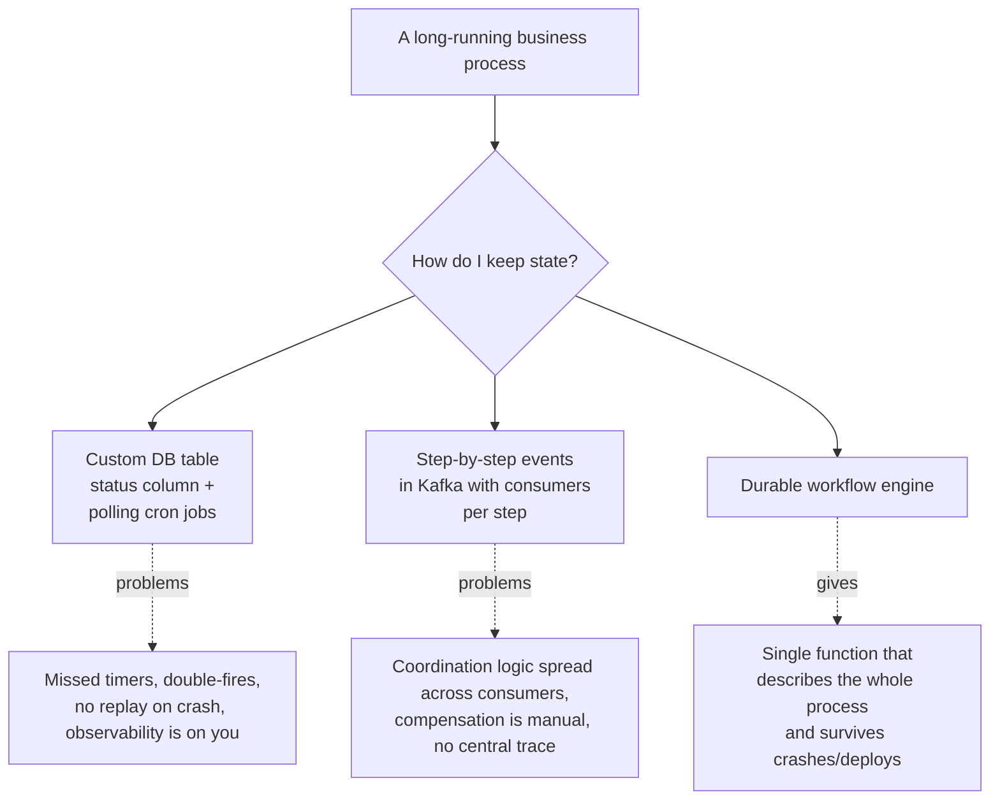
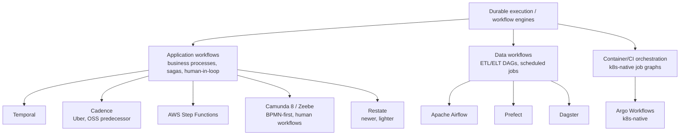
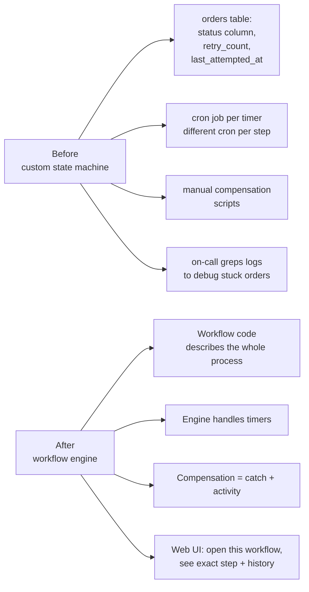

---
tags:
  - applied
  - interview-critical
---

# Durable Workflows

## You'll see this when...

- A business process spans **days or weeks**: "if seller doesn't reply in 48h, escalate"
- A saga has many steps, each with its own retry / compensation logic, and tracking state in your own DB has become a tangle of cron jobs, status columns, and missing edge cases
- You need to **survive a deploy** mid-process without losing the work
- "Retry forever with backoff" or "wait until X happens, but no longer than 7 days" keeps showing up
- You're building human-in-the-loop flows: approvals, KYC reviews, refund cases
- Order processing, onboarding, subscription lifecycle, payment recovery, fraud review

These are problems regular request/response services handle badly. Workflow engines exist for exactly this shape.

## The problem they solve



The "custom DB + cron" approach **works** at small scale. The cost surfaces later: every new branch is another column, every timer is another cron, every retry is another bug, and the only way to debug an in-flight workflow is to grep logs.

## The durable execution model

The single most important concept. Once you understand this, every workflow engine choice falls out of it.

**Idea**: the engine records every **decision** the workflow makes (each step, each timer, each signal received). If the worker process dies, a new worker can rebuild state by **replaying the recorded history** through the same function — re-deriving local variables — and continue from the next un-executed step.

```
Workflow function (your code):
    res1 = activity.charge_card(amount)
    sleep(48h)
    if not seller_responded:
        res2 = activity.send_reminder(seller_id)
    res3 = activity.complete()

Engine's view as it runs:
    Event 1: WorkflowStarted
    Event 2: ActivityScheduled(charge_card)
    Event 3: ActivityCompleted(charge_card, result="ok")
    Event 4: TimerStarted(48h)
    --- worker dies, deploy happens, new worker picks up ---
    Replay events 1-4 → local vars reconstructed
    Event 5: TimerFired
    Event 6: ActivityScheduled(send_reminder)
    ...
```

The user-facing illusion: you wrote a normal function that "sleeps for 48 hours." The reality: the engine persists every decision; the function can be torn down and brought back any number of times.

### The determinism constraint (this trips everyone up)

Workflow code must be **deterministic**: given the same event history, it must take the same path. Otherwise replay diverges.

```python
# ❌ FORBIDDEN inside a workflow:
now = datetime.now()         # changes each replay
uid = uuid.uuid4()           # different every call
res = requests.get(...)      # network is non-deterministic
random.choice([a, b, c])     # need engine-provided random
threading.Thread(...)        # concurrency must use engine primitives

# ✅ ALL non-determinism goes through "activities":
now = workflow.execute_activity(get_current_time)
uid = workflow.execute_activity(generate_id)
res = workflow.execute_activity(http_get, url)
```

Activities are *normal* code — they can call APIs, generate IDs, hit databases. The engine records their result. On replay, the engine returns the recorded result instead of re-running the activity.

This is why durable workflows feel like magic and also why they have sharp edges.

## The tools (and which category each belongs to)



These are **not interchangeable** — they're tuned for different shapes. The mistake to avoid: using Airflow for application workflows or Temporal for data pipelines.

| Tool | Sweet spot | Avoid for |
|---|---|---|
| **Temporal** | Long-running app workflows, sagas, signals, human-in-loop, code-as-workflow | Pure ETL DAGs (overkill, no scheduling UX) |
| **AWS Step Functions** | AWS-native orchestration of Lambdas / SDK calls, low-volume to mid | Heavy code logic inside workflow (verbose ASL), need for local dev |
| **Cadence** | Older Temporal — same model | New projects (use Temporal) |
| **Camunda 8 / Zeebe** | BPMN diagrams, human-task-heavy business workflows, regulated industries | Pure code workflows (verbose) |
| **Restate** | Lightweight workflows + RPC + virtual objects | Mature ecosystem needs |
| **Airflow** | Daily/hourly batch ETL DAGs, data engineering | Long-running app workflows, sub-minute latency, signals |
| **Prefect** | Modern Airflow alternative, Pythonic | Same as Airflow |
| **Dagster** | Asset-centric data pipelines, lineage-first | Application workflows |
| **Argo Workflows** | k8s-native containerized job graphs, ML pipelines | App workflows, non-k8s envs |

## Temporal vs AWS Step Functions head-to-head

The two real choices for application workflows on most modern teams.

### Temporal

- **Code-as-workflow**: write workflows in Go, Java, Python, TypeScript, .NET. Your IDE, your tests, your existing code patterns.
- **Self-host or Temporal Cloud**. Self-hosting means operating a Cassandra/Postgres + history service + matching service cluster.
- **Signals, queries, child workflows** as first-class primitives.
- **Local dev**: `temporal server start-dev` — one binary, you can step through workflows locally.
- **History size limit**: ~50K events / 50 MB per workflow execution. Long workflows use "continue-as-new" to start fresh.
- **Cost model**: self-host (infra cost only) or Temporal Cloud (per-action pricing).

### AWS Step Functions

- **Workflows defined in ASL** (Amazon States Language — JSON). Or via CDK / SAM / Workflow Studio (drag-and-drop).
- **Two flavors**:
  - **Standard**: durable up to 1 year, at-most-once, exactly-once via idempotency; charged per state transition (~$25 per 1M).
  - **Express**: up to 5 minutes, at-least-once, charged per request + duration; ~100x cheaper at high volume.
- **Native AWS SDK integrations**: call DynamoDB, SQS, SNS, Lambda directly from a state without writing wrapper code.
- **Visual UI** for inspection — non-engineers can follow a workflow's progress.
- **No local dev story** (LocalStack helps, imperfectly). Workflows are JSON, not your language.

### Side-by-side

| Concern | Temporal | Step Functions |
|---|---|---|
| **Workflow definition** | Native code | ASL (JSON) / CDK |
| **Max workflow duration** | Effectively unbounded (continue-as-new) | Standard: 1 year, Express: 5 min |
| **Long sleeps / timers** | First-class (`workflow.sleep(30d)`) | First-class (`Wait` state) |
| **Signals from outside** | `workflow.signal(...)` | `SendTaskSuccess` or via API |
| **Human-in-loop** | Signals + queries | Task token pattern |
| **Local development** | Excellent | Poor (no native local) |
| **Code reuse with services** | Direct (same repo) | Through Lambda boundaries |
| **AWS-native integrations** | Through SDK calls in activities | First-class state types |
| **Observability** | Web UI + workflow history | CloudWatch + visual UI |
| **Cost at low volume** | Cloud has free tier; self-host minimum | Pay-per-state-transition |
| **Cost at high volume** | Scales linearly with workers | Standard gets expensive; Express stays cheap |
| **Vendor lock-in** | None (OSS) | AWS |
| **Team learning curve** | Steep — durable execution mental model | Moderate — ASL is verbose but constrained |
| **Best for** | Complex business logic, signal-heavy, multi-language | AWS-centric stacks, simpler flows, infrequent runs |

### Pick Temporal when

- The workflow is **code-heavy** (lots of branching, computation, complex business rules)
- You want **the same language** as the rest of your services
- **Multi-cloud or on-prem** is a constraint
- Workflow patterns include **child workflows, signals, queries** in non-trivial ways
- The team can absorb operating it (or pays for Temporal Cloud)

### Pick Step Functions when

- You're **already deep in AWS** and want minimal infra to operate
- Workflows are **state-machine-shaped**: linear or branching, modest complexity
- Heavy reliance on **AWS service integrations** (DynamoDB, SQS, Lambda, ECS task)
- The workflow author may be a non-engineer (Workflow Studio)
- You want a **visual diagram** as the source of truth (compliance, audit)

### A useful test

> If you can draw the workflow on a whiteboard as a state diagram and it fits → Step Functions is probably fine.
> If you find yourself writing pseudo-code with loops, conditions, and dynamic step counts → Temporal will fit better.

## When NOT to use a workflow engine

| Situation | Why not | Use instead |
|---|---|---|
| Sub-second request handling | Workflow engines have per-step overhead | Regular service code |
| Pure synchronous CRUD | No durable state across time | API + DB |
| One-step "fire and forget" | Overkill | Background job / queue |
| Pure data ETL DAGs | Wrong tool category | Airflow / Dagster / Prefect |
| Sub-process inside a single API request | Latency cost too high | In-process logic + retry library |
| Stateless event consumers | Don't need replay | Kafka consumer + idempotency |
| Tiny org, three crontabs | Operating Temporal is a project | Cron + DB table (graduate later) |

**Rule of thumb**: if the longest "wait" in your process is **< 5 seconds**, you don't need a workflow engine. If it's **> 5 minutes**, you probably do.

## Replacing the custom approach — what improves



The big wins are **observability** and **resilience to deploy**. The custom approach pays you back every day in incidents; the engine pays you back the first time an on-call engineer opens the workflow UI and sees the exact step that failed.

## Operational concerns

### Versioning long-running workflows

A workflow started two weeks ago is running v1 of your code. Today you deploy v2. The engine will replay the v1 history through your v2 code — if v2 has a different sequence of activity calls, replay fails.

```python
# Temporal: workflow.patched() / GetVersion API
if workflow.patched("v2-add-fraud-check"):
    await workflow.execute_activity(fraud_check, order)
await workflow.execute_activity(charge_card, order)
```

This says: workflows that already passed this point use the old path; new workflows take the new path. Critical for any non-trivial change.

**Strategies:**

| Strategy | When |
|---|---|
| **Patched / GetVersion** | Code changes mid-flight workflows |
| **Drain and re-deploy** | Short workflows (minutes); just wait for them to finish |
| **Start new workflow with new name** | Breaking changes; old workflow type keeps running until done |
| **Continue-as-new** | Long-lived workflows that need to pick up code changes routinely |

### History size and continue-as-new

Each workflow execution has a bounded history (Temporal: ~50K events, ~50 MB). Long-running workflows (a subscription that lasts years) need **continue-as-new**: the workflow finishes itself and starts a fresh execution with the carried-forward state.

```python
@workflow.defn
class SubscriptionWorkflow:
    @workflow.run
    async def run(self, state: SubscriptionState):
        for _ in range(12):  # 12 monthly cycles per execution
            await workflow.sleep(timedelta(days=30))
            await workflow.execute_activity(charge_renewal, state)
        # restart with carried-over state
        workflow.continue_as_new(state)
```

Step Functions has the same constraint baked in via the 1-year max for Standard; for longer flows you start a new execution.

### Signal vs query vs update

- **Signal**: external event delivered to a running workflow ("the seller responded"). Async, durable.
- **Query**: read current workflow state without affecting it ("what step is this order on?"). Sync, side-effect-free.
- **Update** (Temporal): synchronous signal — caller gets a response. Use for human-in-loop "approve this" actions.

### Schedule storms

A scheduled workflow firing every minute across 10K tenants → 10K simultaneous starts. The engine survives, your downstream activities may not. Add jitter at the schedule level, or stagger via the activity layer (concurrency control / token bucket).

### History too large = workflow death

Avoid:

- Putting large payloads (full PDFs, images) into workflow inputs/outputs — pass references (S3 keys) instead
- Returning large lists from activities — pass them via storage
- Looping for thousands of iterations inside one execution — break with continue-as-new

### Local replay debugging

A great Temporal feature: download the history of a failed workflow, run the current code against it locally, step through to the failure point. Step Functions doesn't have an equivalent — debugging is via CloudWatch Logs.

### Failure modes — what the engine doesn't fix

Workflow engines move state-tracking and timer reliability to the engine. They do **not** make your activities reliable:

- Activities can still time out, throw, or be slow — the engine retries them according to a policy *you* configure
- Side effects in activities (DB writes, API calls) must still be **idempotent** — replays and retries are guaranteed
- The engine itself can go down; pick a managed tier or treat it as a tier-0 dependency

## AWS-specific notes

| Service | When |
|---|---|
| **Step Functions Standard** | Workflows up to 1 year, low-to-mid volume, audit-grade history |
| **Step Functions Express** | Short-lived (<5 min), high-volume, async or sync, ~100x cheaper |
| **EventBridge Scheduler** | Cron/one-shot timers ("run this at T+N hours") — *not* a workflow engine, but pairs well |
| **SWF (Simple Workflow Service)** | Older, predecessor to Step Functions. **Don't pick this for new work.** |
| **MWAA** | Managed Apache Airflow — for data pipelines, not app workflows |

A common AWS pattern: **Step Functions Standard for the business process; Express for the inner hot-path step**. Standard's per-transition pricing hurts at high request rates; an Express child workflow keeps that volume off the Standard bill.

## Designing a workflow that doesn't fight the engine

| Principle | Why |
|---|---|
| Keep workflow code **small and deterministic** — orchestration only | Replay relies on determinism; business logic in activities |
| Push side effects into activities, ensure they're **idempotent** | Retries are guaranteed; non-idempotent = duplicates |
| Use **continue-as-new** for anything that runs > weeks | History size kills long executions |
| Pass references (S3 keys, IDs) not blobs | History size |
| Use **timeouts** on every activity | Without them, a stuck dependency hangs the workflow |
| **Compensation** is just another activity in a `try/except` | Don't invent a separate framework |
| Use **child workflows** for sub-processes with their own state | History stays small; sub-process can be retried independently |
| **Don't query workflow state from the workflow** — use queries from outside | Determinism |

## Anti-patterns

| Anti-pattern | Why it hurts | Better |
|---|---|---|
| `time.sleep(...)` or `datetime.now()` inside workflow code | Breaks determinism; replays diverge | `workflow.sleep(...)`, activity for current time |
| HTTP / DB calls inside workflow function | Same — non-deterministic | Wrap in an activity |
| Putting an entire JSON document in a signal | History size + memory | Pass an ID, fetch in an activity |
| Workflow loops over thousands of items | History blow-up | Batch activity that processes N at a time, paginate via continue-as-new |
| Treating Step Functions Standard as cheap | $25 per 1M state transitions adds up | Express for the hot loop |
| Using Airflow for application workflows | Wrong tool category — scheduler-shaped | Temporal / Step Functions |
| Using Temporal for daily data ETL | Operational overhead with no benefit | Airflow / Prefect / Dagster |
| Workflow code with business rules + side effects mixed | Hard to test, replay-fragile | Workflow = orchestration only, activities = behavior |
| "Just retry forever" without backoff | Stuck workflow hammers a dependency | Retry policy with exponential backoff + max attempts |
| No version markers when changing workflow code | Crashes in-flight workflows on deploy | `workflow.patched()` / equivalent |
| Long-running workflow that never `continue_as_new`s | History grows unbounded → engine refuses | Continue-as-new on a schedule (per month, per N iterations) |

## Quick reference

| Need | Reach for |
|---|---|
| Long sleep across deploys | Temporal `workflow.sleep` or Step Functions `Wait` |
| Many-step saga with compensation | Workflow engine (try/except + compensating activities) |
| Wait for external event indefinitely | Signal (Temporal) or Task Token (Step Functions) |
| Human approval step | Signal + query (Temporal), Task Token (Step Functions), Camunda for BPMN |
| AWS-native orchestration with minimal infra | Step Functions |
| Multi-language / multi-cloud | Temporal |
| BPMN / diagram-first / audit-heavy | Camunda 8 |
| Scheduled batch data pipeline | Airflow / Prefect / Dagster |
| k8s job graph (containers as steps) | Argo Workflows |
| Cron-like timer without workflow | EventBridge Scheduler (or just cron) |
| 5-second sub-process inside a request | Don't — just do it inline |

## Interview angle

!!! tip "What interviewers are testing"
    They want to see you reach for a workflow engine for the right reasons — long sleeps, durable state, multi-step compensation, human-in-loop — and *not* for the wrong ones (sub-second logic, simple async jobs). They also want to see you know there's a category distinction between application workflow engines and data-pipeline schedulers.

**Strong answer pattern:**

1. Recognize the **shape** of the problem — long-running, multi-step, must survive crashes, signals from outside
2. Justify why a regular service + DB + cron isn't enough (observability, missed timers, replay on crash, deploy survival)
3. Pick **Temporal** (code-as-workflow, complex logic, multi-language) or **Step Functions** (AWS-native, simpler, less infra) with a reason
4. Mention the **determinism constraint** — orchestration in workflow code, side effects in activities, both with idempotency
5. Plan for **versioning** (patched / continue-as-new) and **history size** if the workflow is long
6. Acknowledge data-pipeline tools (Airflow/Dagster) are a different category

**Common follow-ups:**

- "Why not just a status column + cron?" — works at small scale; breaks on observability, missed fires, retries, deploy-time crashes, branching logic
- "What happens if the worker dies mid-workflow?" — engine replays history on another worker; activities that completed return their recorded results; in-flight activity gets retried per policy
- "How do you change workflow code while workflows are still running?" — patched/GetVersion API: gate new behavior so in-flight workflows take the old path
- "Temporal vs Step Functions?" — code complexity, AWS-native or not, infra-operate-or-not, local-dev-needed-or-not
- "When would you NOT use a workflow engine?" — sub-second flows, no state across time, pure data ETL (use Airflow/Dagster instead)
- "How do you handle a workflow that needs to run for 5 years?" — continue-as-new (Temporal) or chained executions (Step Functions); persist long-term state in a regular DB you read on each execution start

## Test yourself

Answers are hidden — commit to an answer before expanding.

??? question "Why must workflow code be deterministic, while activity code can do anything?"

    The engine recovers a crashed workflow by replaying its recorded event history through the workflow function to re-derive local variables. If the code takes a different path on replay (e.g., `datetime.now()` or `random.choice` returns something new), replay diverges from history and fails. Activities are exempt because the engine records their results and returns the recorded value on replay instead of re-running them — so all non-determinism (HTTP calls, IDs, current time) belongs in activities.

??? question "Why does a workflow that 'sleeps for 48 hours' survive a deploy or worker crash mid-sleep?"

    The sleep isn't a thread blocking in memory — the engine persists a TimerStarted event in the workflow's history and tears the function down. When the timer fires (even days later, on a different worker after a deploy), the engine replays events 1-N to reconstruct local variables and continues from the next un-executed step. The 'normal function that sleeps' is an illusion built on durable, replayable history.

??? question "You deploy v2 of a workflow that adds a fraud-check activity before the charge step. In-flight workflows started under v1 begin failing. What happened and what's the fix?"

    Replay of the v1 history through the v2 code diverges: the history says 'charge_card was the first activity' but the new code schedules fraud_check first. The fix is version markers — `workflow.patched("v2-add-fraud-check")` / the GetVersion API — so workflows that already passed that point take the old path while new workflows take the new one. Alternatives per the versioning table: drain-and-redeploy for short workflows, or a new workflow type for breaking changes.

??? question "A subscription workflow designed to run for years dies after months with the engine refusing to continue. What limit did it hit and how should it have been designed?"

    It hit the history size limit — Temporal allows roughly 50K events / 50 MB per workflow execution, and an unbounded loop of monthly charges grows history forever. The design fix is continue-as-new: the workflow processes a bounded number of iterations (e.g., 12 monthly cycles), then restarts itself as a fresh execution carrying forward its state. Step Functions Standard has the analogous constraint via its 1-year max duration.

??? question "An interviewer asks: how do you choose between Temporal and AWS Step Functions?"

    Temporal when the workflow is code-heavy (complex branching, loops, dynamic step counts), you want workflows in the same language as your services, you need signals/queries/child workflows, or multi-cloud is a constraint — accepting you must operate it or pay for Temporal Cloud. Step Functions when you're already deep in AWS, the flow is state-machine-shaped, you lean on native AWS integrations, or you want the visual diagram for audit. The whiteboard test: if it fits as a state diagram, Step Functions is probably fine; if it's pseudo-code with loops and conditions, Temporal fits better.

## Related

- [Saga Pattern](saga-pattern.md) — workflow engines are one way to implement sagas
- [Choreography vs Orchestration](../architecture/choreography-vs-orchestration.md) — durable workflows are the orchestration option in practice
- [Idempotency](idempotency.md) — every activity must be idempotent
- [Outbox Pattern](outbox.md) — alternative when you mostly need reliable event publishing, not orchestration
- [Event Sourcing](event-sourcing.md) — adjacent concept; the workflow's event history *is* event-sourced
- [Event Streaming Maturity](../messaging/event-streaming-maturity.md) — schema and ordering concerns shared with workflow-driven systems
- [Proptech Chat Case Study](../case-studies/proptech-chat.md) — uses Temporal for seller SLA workflows
