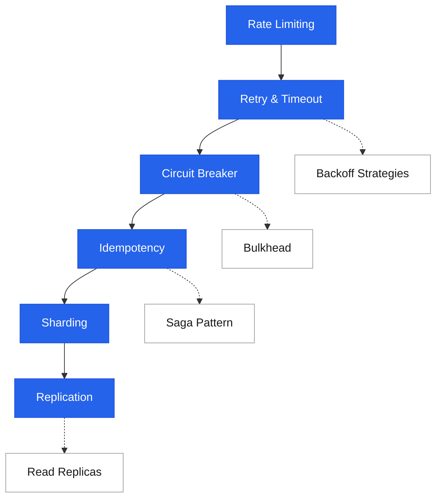

# Patterns

<div class="sec-hero" markdown>
<span class="ey">Reliability & Operations · building blocks</span>
Reusable solutions to recurring distributed systems problems. Unlike algorithms or data structures, these patterns address the messy realities of networked systems: partial failures, retries, consistency, and scale. Understanding them lets you compose complex systems from well-understood building blocks — and communicate design decisions with precision.
</div>

These split into two families, reflected in the navigation:

- **Resilience patterns** — keeping a system *up* under failure and load: rate limiting, circuit breaker, retry/timeout, backoff, bulkhead, idempotency, saga, outbox, durable workflows.
- **Data & scaling patterns** — making *data* scale and stay correct: CQRS, event sourcing, consistent hashing, sharding (and its tooling), replication, read replicas, connection pooling.

## Roadmap

Follow the spine top-to-bottom your first time. Dashed branches hang off the topic they support — grab them when you need them.

<div class="sd-mermaid-links" data-links='{
  "Rate Limiting": "rate-limiting/",
  "Retry & Timeout": "retry-timeout/",
  "Circuit Breaker": "circuit-breaker/",
  "Idempotency": "idempotency/",
  "Sharding": "sharding/",
  "Replication": "replication/",
  "Backoff Strategies": "backoff/",
  "Bulkhead": "bulkhead/",
  "Saga Pattern": "saga-pattern/",
  "Read Replicas": "read-replicas/"
}'></div>



## Suggested reading order

New to this topic? Read these in order — each builds on the previous:

1. [Rate Limiting](rate-limiting.md) — the first line of defense; introduces protecting services under load
2. [Retry & Timeout](retry-timeout.md) — how to handle transient failures without making them worse
3. [Circuit Breaker](circuit-breaker.md) — builds on retries: when to stop retrying and fail fast
4. [Idempotency](idempotency.md) — retries create duplicates; this makes them safe
5. [Sharding](sharding.md) — the core scale pattern: splitting data across nodes
6. [Replication](replication.md) — sharding's complement: copying data for durability and read scale

**Then, as needed (reference):** [Backoff Strategies](backoff.md), [Bulkhead](bulkhead.md), [Connection Pooling](connection-pooling.md), [Read Replicas](read-replicas.md), [Sharding Best Practices](sharding-best-practices.md), [Querying Sharded Data](querying-sharded-data.md), [Boring Tech](boring-tech.md)

**Advanced — come back later:** [Saga Pattern](saga-pattern.md), [Outbox Pattern](outbox.md), [CQRS](cqrs.md), [Event Sourcing](event-sourcing.md), [Consistent Hashing](consistent-hashing.md), [Sharding Tooling](sharding-tooling.md), [Unhappy-Path Engineering](unhappy-path-engineering.md), [Durable Workflows](durable-workflows.md)

---

## Pattern categories

```
Reliability patterns              Data patterns
  ├── Rate Limiting                 ├── CQRS
  ├── Circuit Breaker               ├── Event Sourcing
  ├── Retry & Timeout               ├── Outbox Pattern
  ├── Backoff Strategies            └── Idempotency
  └── Bulkhead

Scale patterns                    Consistency patterns
  ├── Consistent Hashing            ├── Saga Pattern
  ├── Sharding                      ├── Replication
  ├── Read Replicas                 └── Connection Pooling
  └── (Caching — see Caching section)
```

---

## Resilience Patterns

Keeping a system *up* under failure and load — protecting services, surviving transient faults, and making retries safe.

<div class="pcards">
<a class="pcard" href="rate-limiting/"><span class="t">Rate Limiting</span><span class="d">Token bucket, leaky bucket, sliding window — and where to enforce</span></a>
<a class="pcard" href="circuit-breaker/"><span class="t">Circuit Breaker</span><span class="d">Fail fast to prevent cascade failures, half-open probe</span></a>
<a class="pcard" href="retry-timeout/"><span class="t">Retry & Timeout</span><span class="d">When to retry, timeout budgets, transient vs permanent</span></a>
<a class="pcard" href="backoff/"><span class="t">Backoff Strategies</span><span class="d">Exponential backoff, jitter, avoiding thundering herd</span></a>
<a class="pcard" href="bulkhead/"><span class="t">Bulkhead</span><span class="d">Thread pool / semaphore isolation to contain failures</span></a>
<a class="pcard" href="idempotency/"><span class="t">Idempotency</span><span class="d">Safe retries — operations that can run multiple times</span></a>
<a class="pcard" href="saga-pattern/"><span class="t">Saga Pattern</span><span class="d">Distributed transactions without 2PC via compensating actions</span></a>
<a class="pcard" href="outbox/"><span class="t">Outbox Pattern</span><span class="d">Reliable event publishing atomic with state change</span></a>
<a class="pcard" href="durable-workflows/"><span class="t">Durable Workflows</span><span class="d">Temporal vs Step Functions — durable execution and replay</span></a>
<a class="pcard" href="unhappy-path-engineering/"><span class="t">Unhappy-Path Engineering</span><span class="d">Designing deliberately for the failure cases</span></a>
<a class="pcard" href="boring-tech/"><span class="t">Boring Tech</span><span class="d">Why the proven, dull option is usually the right default</span></a>
</div>

## Data & Scaling Patterns

Making *data* scale and stay correct — splitting it across nodes, copying it for reads and durability, and keeping read/write models honest.

<div class="pcards">
<a class="pcard" href="cqrs/"><span class="t">CQRS</span><span class="d">Separate read and write models for scale and clarity</span></a>
<a class="pcard" href="event-sourcing/"><span class="t">Event Sourcing</span><span class="d">Store events, not state — audit log as the source of truth</span></a>
<a class="pcard" href="consistent-hashing/"><span class="t">Consistent Hashing</span><span class="d">Distribute load with minimal reshuffling on node changes</span></a>
<a class="pcard" href="sharding/"><span class="t">Sharding</span><span class="d">Horizontal partitioning strategies and their tradeoffs</span></a>
<a class="pcard" href="querying-sharded-data/"><span class="t">Querying Sharded Data</span><span class="d">Cross-shard queries, scatter-gather, fan-out reads</span></a>
<a class="pcard" href="sharding-best-practices/"><span class="t">Sharding Best Practices</span><span class="d">Picking a shard key and avoiding hot shards</span></a>
<a class="pcard" href="sharding-tooling/"><span class="t">Sharding Tooling</span><span class="d">Vitess, Citus, and managed sharding options</span></a>
<a class="pcard" href="replication/"><span class="t">Replication</span><span class="d">Leader-follower, multi-leader, leaderless — tradeoffs</span></a>
<a class="pcard" href="read-replicas/"><span class="t">Read Replicas</span><span class="d">Scaling reads, replication lag, read-after-write</span></a>
<a class="pcard" href="connection-pooling/"><span class="t">Connection Pooling</span><span class="d">PgBouncer, pool sizing, exhaustion prevention</span></a>
</div>

---

## Reliability patterns: how they compose

```
Request arrives
  │
  ├─ [Rate Limiter]      → reject if over limit (before spending resources)
  │
  ├─ [Circuit Breaker]   → fail fast if downstream is degraded
  │    ├── CLOSED  → pass through, count failures
  │    ├── OPEN    → fail immediately, no downstream calls
  │    └── HALF-OPEN → probe with one request, re-close if OK
  │
  ├─ [Bulkhead]          → separate thread pool per downstream
  │                        → one slow dependency can't block all workers
  │
  └─ [Retry + Backoff]   → retry transient failures
       ├── Exponential backoff: 1s, 2s, 4s, 8s...
       └── Jitter: randomize to avoid synchronized thundering herd
```

---

## Data consistency patterns: how they compose

```
User places order (write)
  │
  ├─ [CQRS]        → write model (command) updates the aggregate
  │                   read model (query) updated asynchronously
  │
  ├─ [Event Sourcing] → instead of UPDATE orders SET status='paid'
  │                     append OrderPaid event to event log
  │                     → derive current state by replaying events
  │
  └─ [Outbox]      → write + publish atomically
       ┌──────────────────────────────────────────┐
       │ BEGIN TRANSACTION                         │
       │   UPDATE orders SET status='paid'         │
       │   INSERT INTO outbox (event='OrderPaid')  │
       │ COMMIT                                    │
       └──────────────────────────────────────────┘
       Outbox relay: SELECT unpublished → publish to Kafka

Multi-service write (Saga)
  OrderService → PaymentService → InventoryService → ShippingService
  Each step: local transaction + event
  On failure: compensating transactions in reverse
  → Eventual consistency without distributed 2PC
```

---

## Interview shortlist

| Question | Key answer |
|---|---|
| *"How do you prevent a slow dependency from taking down your service?"* | Circuit breaker (fail fast after threshold) + bulkhead (isolated thread pool). |
| *"How do you handle distributed transactions across services?"* | Saga pattern: choreography (events) or orchestration (saga orchestrator). Each step is local + compensating action on failure. |
| *"CQRS — why split reads and writes?"* | Writes need consistency + constraints. Reads need performance + flexibility. Separate models let each optimize independently. Common in event-sourced systems. |
| *"What's the Outbox Pattern and why is it needed?"* | Atomically writing state AND publishing an event is impossible without it (two separate systems). Outbox: write event to the same DB in same transaction, relay publishes separately. |
| *"How does consistent hashing minimize reshuffling?"* | Keys and nodes on a ring. Adding a node only moves keys from its successor. vs modulo hashing: every key potentially remaps. |

---

## Related topics

- [Distributed Systems](../distributed/index.md) — the theory behind these patterns
- [Architecture: Event-Driven Architecture](../architecture/event-driven.md) — system-level view
- [Caching](../caching/index.md) — the most impactful performance pattern
- [Case Studies](../case-studies/index.md) — see these patterns applied to real systems
