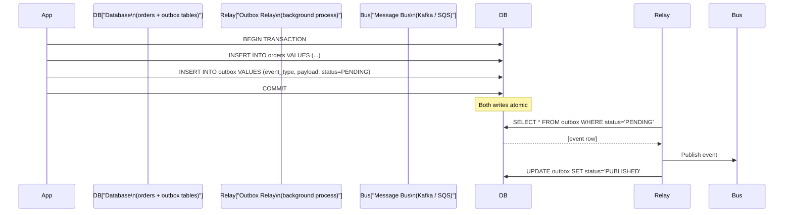

# Outbox Pattern

## What it is

The Outbox pattern guarantees that a database write and a message publish happen atomically — either both succeed or neither does. It solves the dual-write problem in event-driven systems.

## The dual-write problem

```python
# WRONG — not atomic
def create_order(order):
    db.insert('orders', order)             # step 1: DB write
    event_bus.publish('OrderCreated', order)  # step 2: event publish
    
# What if step 1 succeeds but step 2 fails?
# → Order exists in DB but no OrderCreated event published
# → Downstream services never process this order
# → Inconsistency

# What if step 2 happens before step 1 commits?
# → Event consumed, downstream processes, then DB rolls back
# → Ghost order in downstream, nothing in source
```

## The solution

Write the event to an **outbox table** in the **same database transaction** as the primary write. A separate process reads from the outbox and publishes to the message bus.



## Implementation

### Outbox table schema

```sql
CREATE TABLE outbox (
    id              UUID PRIMARY KEY DEFAULT gen_random_uuid(),
    aggregate_id    TEXT NOT NULL,
    aggregate_type  TEXT NOT NULL,
    event_type      TEXT NOT NULL,
    payload         JSONB NOT NULL,
    status          TEXT DEFAULT 'PENDING',  -- PENDING, PUBLISHED, FAILED
    created_at      TIMESTAMP DEFAULT NOW(),
    published_at    TIMESTAMP,
    retry_count     INT DEFAULT 0
);

CREATE INDEX idx_outbox_pending ON outbox(status, created_at) 
WHERE status = 'PENDING';
```

### Application code (transactional write)

```python
def create_order(order: Order, db_session):
    with db_session.begin():
        # Primary write
        db_session.execute(
            "INSERT INTO orders (id, user_id, total, status) VALUES (:id, :uid, :total, :status)",
            {"id": order.id, "uid": order.user_id, "total": order.total, "status": "pending"}
        )
        
        # Outbox write (same transaction)
        db_session.execute(
            "INSERT INTO outbox (aggregate_id, aggregate_type, event_type, payload) "
            "VALUES (:agg_id, :agg_type, :evt_type, :payload)",
            {
                "agg_id": order.id,
                "agg_type": "Order",
                "evt_type": "OrderCreated",
                "payload": json.dumps({"order_id": order.id, "user_id": order.user_id, "total": order.total})
            }
        )
    # Transaction commits — both rows saved or both rolled back
```

### Outbox relay (polling approach)

```python
def outbox_relay():
    while True:
        # Pick up pending events (with row lock to prevent duplicate processing)
        events = db.execute(
            "SELECT * FROM outbox WHERE status = 'PENDING' "
            "ORDER BY created_at ASC LIMIT 100 "
            "FOR UPDATE SKIP LOCKED"  # skip rows locked by other relay instances
        )
        
        for event in events:
            try:
                kafka.produce(
                    topic=event.event_type,
                    key=event.aggregate_id,
                    value=event.payload
                )
                db.execute(
                    "UPDATE outbox SET status='PUBLISHED', published_at=NOW() WHERE id=?",
                    [event.id]
                )
            except Exception as e:
                db.execute(
                    "UPDATE outbox SET retry_count=retry_count+1, "
                    "status=CASE WHEN retry_count >= 5 THEN 'FAILED' ELSE 'PENDING' END "
                    "WHERE id=?",
                    [event.id]
                )
        
        time.sleep(0.1)  # poll every 100ms
```

### CDC-based relay (better for production)

Instead of polling, use database CDC (Change Data Capture) to detect outbox inserts:

```
PostgreSQL WAL → Debezium → Kafka connector → publishes outbox events to Kafka topics

Advantages:
  - No polling overhead
  - Events published as soon as transaction commits
  - Lower latency (ms vs polling interval)
  - No extra query load on DB
```

**Debezium outbox transform:** Routes outbox events to correct Kafka topics automatically based on `aggregate_type` and `event_type` columns.

## Idempotency requirement

The relay publishes with at-least-once semantics — if it crashes after publishing but before marking as PUBLISHED, it will republish on recovery.

**Consumers must be idempotent:**
```python
def handle_order_created(event):
    # Check if already processed
    if processed_events.exists(event['id']):
        return  # duplicate, skip
    
    # Process
    create_confirmation_email(event)
    
    # Mark as processed
    processed_events.insert(event['id'])
```

## Outbox cleanup

Old published events accumulate. Archive or delete periodically:

```sql
-- Delete events published more than 7 days ago
DELETE FROM outbox 
WHERE status = 'PUBLISHED' AND published_at < NOW() - INTERVAL '7 days';

-- Or archive to cold storage
INSERT INTO outbox_archive SELECT * FROM outbox WHERE ...;
```

## Transactional outbox vs Dual publish

| Approach | Consistency | Complexity |
|---|---|---|
| Dual publish (no outbox) | Inconsistent | Low |
| Transactional outbox (polling) | Consistent | Medium |
| Transactional outbox (CDC) | Consistent | Medium-High |
| Exactly-once Kafka transactions | Consistent | High |

## AWS implementation

```
PostgreSQL (RDS) outbox table
→ DMS (AWS Database Migration Service) for CDC
→ Kinesis Data Streams
→ Lambda consumer
→ downstream services

Or:
→ Debezium on MSK Connect
→ Kafka topic
→ downstream services
```

## Interview angle

!!! tip "When to mention the outbox pattern"
    Whenever a design publishes events after a DB write — order creation, payment processing, user registration.

**Strong answer pattern:**
1. Identify the dual-write risk: "If we write to DB and publish to Kafka separately, a crash between them causes inconsistency"
2. Solution: outbox table written in same DB transaction
3. Relay: polling (simple) or CDC (production-grade)
4. Consumers must be idempotent (relay publishes at-least-once)

## Related topics

- [Saga Pattern](saga-pattern.md) — outbox is used for reliable saga event publishing
- [Event Sourcing](event-sourcing.md) — events and outbox are complementary
- [Idempotency](idempotency.md) — required for outbox consumers
- [Event Streaming](../messaging/event-streaming.md) — Kafka as the target of outbox relay
