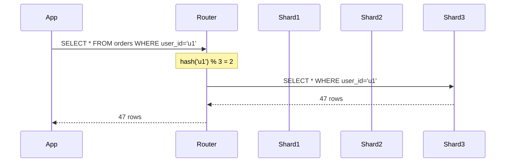
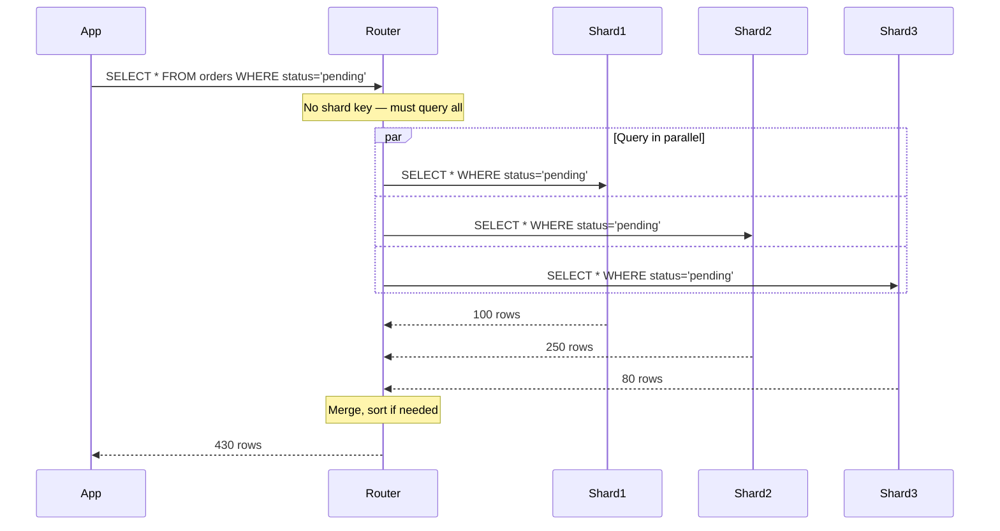
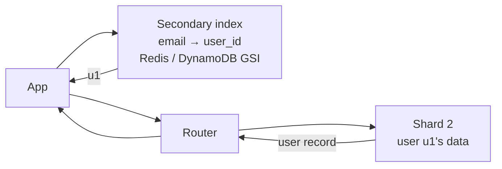
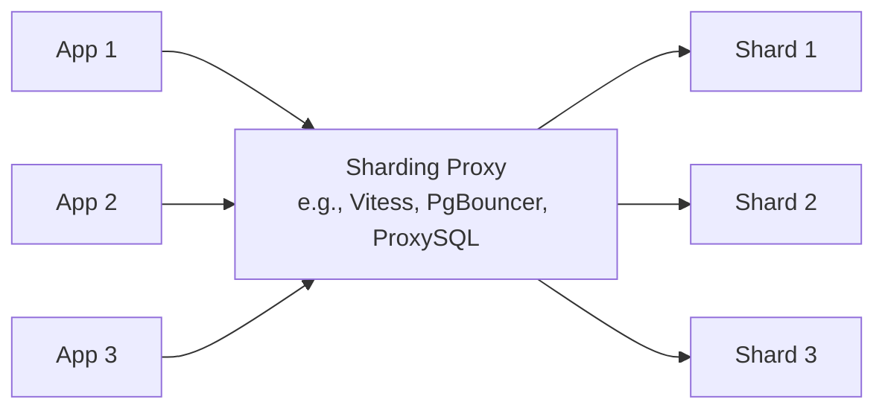
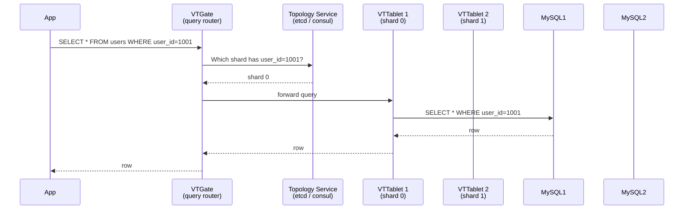

---
tags:
  - for-scale
  - applied
---

# Querying Sharded Data

You sharded the database. Now what? **How you query data after sharding** is the hardest practical problem. This page covers the routing layer, the four query patterns (single-shard, scatter-gather, secondary index, global aggregate), and the techniques real systems use to make sharded queries fast.

For the *concept* of sharding, see [Sharding](sharding.md). This is the **applied** companion.

---

## The fundamental shift

Before sharding:

```sql
SELECT * FROM orders WHERE user_id = 'u1';
-- Database knows where to find it. Done.
```

After sharding:

```
SELECT * FROM orders WHERE user_id = 'u1';
                                    ↓
                          ┌─────────┴─────────┐
                          │                   │
                          ▼                   ▼
                   "Which shard has         "Or do I need
                    user u1's orders?"       all shards?"
```

**Every query now has a routing question first.** Sometimes the answer is obvious (the shard key is in the WHERE). Sometimes it's not (query filters by a non-shard column). The four patterns below cover the cases.

---

## Pattern 1: Single-shard query (the fast path)

The shard key is in the query. Router knows exactly which shard to hit.

```python
# Sharded by user_id
def get_user_orders(user_id):
    shard_id = hash(user_id) % NUM_SHARDS
    shard = shards[shard_id]
    return shard.execute(
        "SELECT * FROM orders WHERE user_id = %s",
        (user_id,)
    )

# This is fast — one shard, one query, no cross-shard coordination
```

### Diagram



**Properties**:
- Single network call
- Database does normal index lookup within the shard
- Latency: ~same as unsharded

**Make this work**: design your shard key so the most common queries hit one shard.

---

## Pattern 2: Scatter-gather (the slow path)

The shard key is NOT in the query. Have to ask every shard.

```python
# Sharded by user_id; query is by status (not shard key)
def get_all_pending_orders():
    results = []
    for shard in shards:
        rows = shard.execute("SELECT * FROM orders WHERE status = 'pending'")
        results.extend(rows)
    return results
```

### Diagram



**Properties**:
- Network calls × num_shards (10 shards = 10 parallel queries)
- Latency: limited by the slowest shard (tail latency!)
- Each shard does a full scan (no index on status) OR an index lookup on a smaller table
- Memory: client / router must hold all results

**When it's acceptable**:
- Low-frequency queries (admin pages, reports)
- Small result sets (each shard returns ~10 rows)
- Acceptable to wait 100-500ms

**When it's not acceptable**:
- High-frequency user-facing queries
- Large result sets
- Mid-tier or larger scale

### Optimisation: limit + sort

For paginated results, scatter-gather needs care:

```python
def get_pending_orders_page(limit=20):
    # Naive: get 20 from each shard, take top 20 by date
    # Problem: might miss rows that should be in top 20
    
    # Correct: get LIMIT from each shard, merge-sort, take top LIMIT
    per_shard_limit = limit  # NOT limit / num_shards
    rows = []
    for shard in shards:
        rows.extend(shard.execute(
            "SELECT * FROM orders WHERE status='pending' "
            "ORDER BY created_at DESC LIMIT %s",
            (per_shard_limit,)
        ))
    rows.sort(key=lambda r: r['created_at'], reverse=True)
    return rows[:limit]
```

Each shard returns its top N; you merge and take the global top N. Pagination across shards needs careful design (cursor-based, not offset-based).

---

## Pattern 3: Secondary index (lookup table)

When you frequently query by a non-shard column, maintain a separate lookup.

### The problem

```sql
-- Users sharded by user_id
-- Need to find user by email regularly
SELECT * FROM users WHERE email = 'alice@example.com';
-- Scatter-gather across all shards: too slow at scale
```

### Solution: secondary index in a separate datastore

```python
# Maintained alongside primary writes
def create_user(user_id, email, name, ...):
    shard = get_shard(user_id)
    
    # Write to primary (sharded) storage
    shard.execute(
        "INSERT INTO users (user_id, email, name) VALUES (%s, %s, %s)",
        (user_id, email, name)
    )
    
    # Write to secondary index
    email_index.put(email, user_id)  # Redis, DynamoDB GSI, or separate Postgres

def get_user_by_email(email):
    # Two-step lookup
    user_id = email_index.get(email)
    if not user_id:
        return None
    return get_user_by_id(user_id)  # single-shard query
```

### Diagram



**Storage options for the secondary index**:

| Store | When | Notes |
|---|---|---|
| Redis | High QPS, simple key→key | Fast; ensure persistence config |
| DynamoDB | Cross-region, durable | Pay-per-request fits sparse access |
| ElasticSearch | Need fuzzy / partial match | Expensive but flexible |
| Postgres (unsharded) | Small enough | Simple; doesn't scale as primary |
| DynamoDB GSI (if primary is DynamoDB) | Built-in | No extra system |

**Trade-offs**:
- Two writes per insert (primary + index); dual-write problem if one fails
- Use [Outbox Pattern](outbox.md) or CDC to keep them in sync
- Eventual consistency between primary and index (usually fine)

### Multiple secondary indexes

```python
# Sharded by user_id; want lookups by email AND phone
def create_user(user_id, email, phone, name):
    shard = get_shard(user_id)
    shard.execute("INSERT INTO users (user_id, email, phone, name) VALUES (...)", ...)
    
    email_index.put(email, user_id)
    phone_index.put(phone, user_id)

# Updates need to update all indexes
def update_email(user_id, new_email):
    user = get_user_by_id(user_id)
    old_email = user['email']
    
    shard.execute("UPDATE users SET email=%s WHERE user_id=%s", (new_email, user_id))
    
    email_index.delete(old_email)
    email_index.put(new_email, user_id)
```

This is why DynamoDB's Global Secondary Indexes (GSIs) are popular — DynamoDB maintains them automatically, eventual consistency.

---

## Pattern 4: Global aggregates

Counts, sums, max/min that span all shards.

```sql
-- Counts: how many active users total?
SELECT COUNT(*) FROM users WHERE status = 'active';
```

### Option A: Scatter-gather + aggregate

```python
def count_active_users():
    total = 0
    for shard in shards:
        count = shard.execute("SELECT COUNT(*) FROM users WHERE status='active'").scalar()
        total += count
    return total
```

Works but slow for many shards. Each shard does a count.

### Option B: Approximate counts (HyperLogLog)

```python
# Maintain a global HLL counter, updated on writes
def add_active_user(user_id):
    shard.execute("...")
    redis.pfadd('active_users_hll', user_id)  # HyperLogLog

def count_active_users_approx():
    return redis.pfcount('active_users_hll')  # ~1% error
```

For "how many unique users this month" use cases — exact count rarely needed.

### Option C: Materialised aggregates

Maintain pre-computed counts in a separate aggregate table, updated on changes:

```python
# Maintain a count table
def add_user(user_id, status):
    shard.execute("INSERT INTO users (...) VALUES (...)", ...)
    
    # Increment the aggregate atomically
    aggregates.execute(
        "INSERT INTO user_counts (status, count) VALUES (%s, 1) "
        "ON CONFLICT (status) DO UPDATE SET count = user_counts.count + 1",
        (status,)
    )

def count_users_by_status():
    return aggregates.execute("SELECT status, count FROM user_counts").all()
```

Trade-off: write amplification (every write updates the aggregate). Use only for hot aggregates.

### Option D: Stream processing

Events → Kafka → Flink → maintained aggregate.

```
User created event → Kafka topic users
                              ↓
                         Flink job:
                            increment count by status
                            ↓
                          Redis or DB
```

Most flexible; most infrastructure. See [Lambda & Kappa Architectures](../architecture/lambda-kappa-architectures.md).

### Option E: Data warehouse

Replicate every shard's data to a warehouse (S3 + Athena, Redshift, BigQuery). Run analytics there, not on the OLTP shards.

```python
def count_active_users():
    # Query warehouse instead of shards
    return warehouse.execute("SELECT COUNT(*) FROM users WHERE status='active'")
```

OLTP shards stay fast; analytics has its own dedicated infra. Most production systems do this.

---

## Cross-shard JOINs

The hardest case. Two tables on different shards needing to JOIN.

### The problem

```sql
-- Orders sharded by user_id; products sharded by product_id
SELECT o.*, p.name 
FROM orders o JOIN products p ON o.product_id = p.id
WHERE o.user_id = 'u1';
```

If `user_id='u1'` is on shard 2 and the products it references are on shards 1, 3, 5... cross-shard JOIN is impossible in raw SQL.

### Solution 1: Denormalise

Store the product info you need on the order itself:

```sql
-- orders table now includes product fields
CREATE TABLE orders (
    order_id, user_id, product_id, product_name, product_price, ...
);

-- Query is single-shard
SELECT * FROM orders WHERE user_id = 'u1';
```

Trade-off: data duplication; product updates need to propagate (event-driven).

### Solution 2: Application-level JOIN

```python
def get_orders_with_products(user_id):
    orders = orders_shard.execute("SELECT * FROM orders WHERE user_id=%s", (user_id,))
    
    product_ids = list(set(o['product_id'] for o in orders))
    
    # Fetch products (might span shards or be in a separate cached store)
    products = {}
    for pid in product_ids:
        shard = get_product_shard(pid)
        product = shard.execute("SELECT * FROM products WHERE id=%s", (pid,)).first()
        products[pid] = product
    
    # JOIN in application code
    for order in orders:
        order['product'] = products.get(order['product_id'])
    
    return orders
```

Slow if many products. Cache hot product data in Redis to avoid the lookup.

### Solution 3: Replicate one table everywhere

If one table is small and read-heavy, replicate to every shard:

```
orders sharded by user_id  ← big, sharded
products copied to every shard ← small (1000 products), replicate everywhere

Now JOIN is local on every shard.
```

Trade-off: writes to products must propagate to all shards. Works for catalogue / reference data.

### Solution 4: Materialised view in a query store

Pre-compute the joined result and store it in a query-optimised store:

```python
# Background process: on order_created event
def materialise(event):
    order = event.order
    product = products_cache.get(order.product_id)
    
    # Write denormalised view to ElasticSearch
    es.index('orders_with_products', {
        'order_id': order.id,
        'user_id': order.user_id,
        'product_name': product.name,
        'product_price': product.price,
        ...
    })

# Query
def search_orders(filters):
    return es.search('orders_with_products', filters)
```

This is the [CQRS pattern](cqrs.md) — write to normalised stores, read from denormalised views.

---

## The routing layer — three approaches

How does the application know which shard to query?

### Approach A: Client-side routing

```python
# Each app instance knows the shard map
shard_map = {
    'shard1': 'postgres-shard-1.internal',
    'shard2': 'postgres-shard-2.internal',
    'shard3': 'postgres-shard-3.internal',
}

def get_shard(user_id):
    shard_id = hash(user_id) % len(shard_map)
    return shard_map[f'shard{shard_id+1}']

def query_user(user_id):
    shard_addr = get_shard(user_id)
    conn = get_connection(shard_addr)
    return conn.execute("SELECT * FROM users WHERE id=%s", (user_id,))
```

**Pros**: simple, low latency (one fewer hop).
**Cons**: app must know the shard topology; adding shards requires deploying every app.

### Approach B: Proxy / router service



**Pros**: app sees one "logical" database; routing transparent; can add/remove shards without app changes.
**Cons**: extra hop; proxy is a single point of failure (need HA); proxy itself must scale.

**Real-world**: **Vitess** (used by YouTube, Slack, GitHub) is the canonical sharding proxy for MySQL. **Citus** for Postgres. **PlanetScale** (managed Vitess).

### Approach C: Coordinator / dispatcher in the database

The database itself routes. Cassandra, DynamoDB, Cosmos DB do this — any node can be a coordinator; it knows the cluster topology.

```python
# DynamoDB: just call the API
table.get_item(Key={'user_id': 'u1'})  
# DynamoDB internally routes to the right partition
```

**Pros**: zero routing complexity in your code.
**Cons**: you're locked into the database's choices.

---

## Real-world: Vitess query lifecycle

To make this concrete, here's what happens with Vitess (sharded MySQL):



Vitess speaks the MySQL wire protocol — apps think they're talking to a regular MySQL, but VTGate routes transparently. This is what makes it a popular solution.

---

## Connection pooling across shards

A subtle issue with many shards: connection multiplication.

```
Without sharding:
  100 app instances × 20 connections = 2000 connections to 1 Postgres
  (Postgres maxes out around 500-1000 connections)

With 10 shards:
  100 app instances × 20 connections × 10 shards = 20,000 connections
  Each shard sees 2000 connections — same problem 10×
```

**Solution**: connection pooler in front of each shard.

```
App → PgBouncer (per shard) → Postgres shard

PgBouncer holds thousands of app connections, multiplexes onto ~100 backend connections.
```

See [Connection Pooling](connection-pooling.md).

---

## Transaction across shards

Avoid them. A transaction touching multiple shards is a distributed transaction — slow, fragile, often unnecessary.

```python
# DON'T: distributed transaction across shards
with transaction():
    shard1.execute("UPDATE accounts SET balance = balance - 100 WHERE id=...")
    shard2.execute("UPDATE accounts SET balance = balance + 100 WHERE id=...")
# Two-phase commit; failure handling complex; locks held during slow network calls
```

### Better: design the shard key to avoid this

```
If transfers are common, shard accounts by:
  account_group_id  (where related accounts share a group)

Now most transfers are within one shard — single-shard transaction.
```

### When unavoidable: saga pattern

Multi-step with compensating actions. See [Saga Pattern](saga-pattern.md).

```python
def transfer(from_id, to_id, amount):
    # Step 1: debit from shard
    debit_id = shard_for(from_id).execute(
        "INSERT INTO transfers (...) VALUES (...) RETURNING id; "
        "UPDATE accounts SET balance = balance - %s WHERE id = %s",
        (amount, from_id)
    )
    
    try:
        # Step 2: credit to shard
        shard_for(to_id).execute(
            "UPDATE accounts SET balance = balance + %s WHERE id = %s",
            (amount, to_id)
        )
        # Step 3: mark complete
        shard_for(from_id).execute(
            "UPDATE transfers SET status='complete' WHERE id=%s",
            (debit_id,)
        )
    except Exception:
        # Compensating action: refund the debit
        shard_for(from_id).execute(
            "UPDATE accounts SET balance = balance + %s WHERE id = %s; "
            "UPDATE transfers SET status='failed' WHERE id=%s",
            (amount, from_id, debit_id)
        )
        raise
```

This is the application-level transaction for sharded systems.

---

## ORM / framework support

Most ORMs handle sharding poorly. Common patterns:

- **Django**: use `django-sharding` package or manual routing via `using('shard1')`
- **SQLAlchemy**: `horizontal_shard` strategy; manual session-per-shard
- **Rails / ActiveRecord**: ActiveRecord multiple databases; `connected_to(shard:)` API
- **Sequelize / TypeORM**: limited; manual connection routing usually needed

**The reality**: ORM-friendly sharding is hard. Most teams end up writing custom data-access layers or using dedicated tools (Vitess, Citus) that hide sharding from the ORM.

---

## Observability for sharded queries

```
What to monitor:
  ✓ Per-shard query latency (P50, P95, P99)
  ✓ Per-shard error rate
  ✓ Per-shard QPS — is one shard hot?
  ✓ Cross-shard query fraction — too high = wrong shard key
  ✓ Scatter-gather query latency (tail-bound by slowest shard)
  ✓ Connection pool saturation per shard
```

Dashboard pattern: one row per shard, columns for the metrics above. Pattern: outlier shards stick out.

---

## Common mistakes

| Mistake | Better approach |
|---|---|
| Routing logic embedded in 50 places in the codebase | Single routing module; everywhere else uses `query(shard_key, ...)` |
| Scatter-gather on every page load | Cache, denormalise, or rearchitect to single-shard |
| Distributed transactions across shards | Redesign shard key or use saga |
| No connection pooler per shard | App connections × N shards = exhausts every shard |
| Secondary index without sync mechanism | Outbox pattern or CDC |
| Pagination by offset across shards | Use cursor-based with shard-key-aware ordering |
| Treating shards as identical Postgres instances | Schema migrations must run on every shard |

---

## Schema migrations across shards

Every schema change must run on every shard:

```bash
# Manual approach
for shard in shards:
    flyway -url=$shard migrate

# Tools
# - Vitess has built-in online schema changes
# - PlanetScale (managed Vitess) makes this a UI operation
# - For custom sharding: build a migration orchestrator
```

**Online schema migrations** (avoid downtime):

- Add nullable column → safe
- Add NOT NULL column → backfill in batches before adding constraint
- Drop column → two-step (deploy code that doesn't use it; then drop)
- Add index → CONCURRENTLY in Postgres; gh-ost or pt-osc in MySQL

Each migration runs across N shards. Failure on one shard mid-migration is the worst case — needs rollback or shard-by-shard retry.

---

## Interview angle

!!! tip "What interviewers are testing"
    Whether you can reason about post-sharding query patterns — not just "we'll shard the database."

**Strong answer pattern:**
1. Most queries should be single-shard — design the shard key for this
2. Scatter-gather is the slow path; minimise frequency or scope
3. Secondary indexes via separate stores (Redis, GSI, ES) for non-shard-key lookups
4. Denormalise to avoid cross-shard JOINs
5. Avoid distributed transactions; use sagas with compensation
6. Routing layer: client-side (simple), proxy (Vitess/Citus), or DB-coordinator (Cassandra/DynamoDB)

**Common follow-up:** *"How would you handle a query that needs all users sorted by signup date, across shards?"*
> Three options. (1) Scatter-gather: get top N from each shard, merge-sort, take global top N — works for small page sizes. (2) Replicate to a secondary store optimised for the query (ElasticSearch indexed by signup_date). (3) Maintain a separate "all-users-sorted" index in something like Redis sorted sets. The choice depends on query frequency — high-frequency = invest in option 2 or 3; low-frequency admin pages = scatter-gather is fine.

---

## Related

- [Sharding](sharding.md) — the concept
- [Sharding Best Practices](sharding-best-practices.md) — applied details, shard key choice, resharding
- [Partitioning Fundamentals](../fundamentals/partitioning-fundamentals.md) — the broader concept
- [CQRS](cqrs.md) — separate read models avoid the scatter-gather problem
- [Outbox Pattern](outbox.md) — keep secondary indexes in sync
- [Consistent Hashing](consistent-hashing.md) — minimise resharding cost
- [Connection Pooling](connection-pooling.md) — required at shard scale
- [Saga Pattern](saga-pattern.md) — multi-shard transaction replacement
