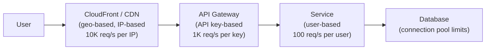

# Rate Limiting

## What it is

Rate limiting controls the rate of requests a client can make to a service, protecting backends from abuse, ensuring fair usage, and maintaining SLOs when traffic spikes.

## You'll see this when...

- API hammered by a single bad client → others slow down
- Bot traffic / scraping needs to be capped
- "We're going to charge per request; need fair-use limits"
- AWS API Gateway throttling, Cloudflare rate-limiting rules
- HTTP 429 (Too Many Requests) responses appearing in client logs
- A token bucket, leaky bucket, or sliding window appears in code
- Redis key like `rate_limit:user:123` with a counter and TTL
- Public APIs documenting "100 requests per minute" or similar
- Need to apply per-user, per-tenant, per-IP limits independently

## Algorithms

### Token Bucket

A bucket holds tokens. Each request consumes one token. Tokens are added at a fixed rate. If the bucket is empty, requests are rejected.

```
Bucket capacity: 100 tokens (burst limit)
Refill rate: 10 tokens/second
Initial state: full (100 tokens)

t=0:  100 tokens | 50 requests → 50 tokens remaining
t=1:  60 tokens  | 80 requests → rejected 20 (only 60 available)
t=2:  10 tokens  | 5 requests  → 5 tokens remaining

Allows bursts up to bucket capacity.
Smooths long-term rate to refill rate.
```

**Redis implementation:**
```lua
-- Lua script (atomic execution)
local key = KEYS[1]
local capacity = tonumber(ARGV[1])
local refill_rate = tonumber(ARGV[2])
local tokens_to_consume = tonumber(ARGV[3])
local now = tonumber(ARGV[4])

local bucket = redis.call('HMGET', key, 'tokens', 'last_refill')
local tokens = tonumber(bucket[1]) or capacity
local last_refill = tonumber(bucket[2]) or now

-- Refill tokens since last request
local elapsed = now - last_refill
local new_tokens = math.min(capacity, tokens + elapsed * refill_rate)

if new_tokens >= tokens_to_consume then
    new_tokens = new_tokens - tokens_to_consume
    redis.call('HMSET', key, 'tokens', new_tokens, 'last_refill', now)
    redis.call('EXPIRE', key, 3600)
    return 1  -- allowed
else
    return 0  -- rejected
end
```

### Leaky Bucket

Requests are processed at a fixed rate, like water leaking from a bucket. Excess requests queue or are dropped.

```
Queue capacity: 100 (max burst)
Processing rate: 10 req/sec (constant "leak")

Incoming 50 req → queue has 50
Incoming 70 more → queue full at 100, 20 dropped
Queue drains at 10 req/sec → 10 req/sec output regardless of input

Output is perfectly smooth (good for rate-limited downstream calls)
Bursts above queue capacity are dropped
```

**Use case:** Outbound API calls to third-party services with strict rate limits. You want to smooth your request rate.

### Fixed Window Counter

Count requests in fixed time windows (e.g., per minute):

```
Window: 2024-04-26 14:03:00 → 14:04:00
Counter: 45 requests

At 14:03:59: counter = 100, request rejected
At 14:04:00: new window, counter = 0, request allowed

Problem: burst at window boundary:
  14:03:59: 100 requests (end of window 1)
  14:04:00: 100 requests (start of window 2)
  = 200 requests in 2 seconds (2x the limit)
```

**Redis:**
```python
key = f"rate:{user_id}:{int(time.time() // 60)}"  # 1-minute window
count = redis.incr(key)
redis.expire(key, 60)
if count > 100:
    raise RateLimitExceeded()
```

### Sliding Window Log

Keep a log of timestamps for each user's requests. Count requests in the last N seconds.

```
Requests: [14:02:10, 14:02:30, 14:03:05, 14:03:20]
Current time: 14:03:25
Window: last 60 seconds

In-window requests: 14:02:30, 14:03:05, 14:03:20 = 3 requests
Limit: 100/minute → allowed
```

**Redis:**
```python
key = f"rate:{user_id}"
now = time.time()
window_start = now - 60

pipe = redis.pipeline()
pipe.zremrangebyscore(key, 0, window_start)  # remove old entries
pipe.zcard(key)                               # count in window
pipe.zadd(key, {str(now): now})              # add current request
pipe.expire(key, 60)
_, count, _, _ = pipe.execute()

if count >= 100:
    raise RateLimitExceeded()
```

**Trade-off:** High memory use (stores every timestamp). Most accurate.

### Sliding Window Counter (hybrid)

Approximation of sliding window with much less memory:

```
Window: 60 seconds, limit: 100
Current window (14:03:00-14:04:00): 40 requests
Previous window (14:02:00-14:03:00): 80 requests
Current time: 14:03:15 (25% into current window)

Estimated count = previous × (1 - 0.25) + current × 1
                = 80 × 0.75 + 40
                = 60 + 40 = 100

Exactly at limit → reject (or allow depending on policy)
```

**Best balance:** Low memory, high accuracy, efficient. This is what Redis uses internally for rate limiting in Redis Cell module.

## Algorithm comparison

| Algorithm | Memory | Burst | Accuracy | Smoothness |
|---|---|---|---|---|
| Token Bucket | Low | Allows up to capacity | High | Good |
| Leaky Bucket | Low | Queues, no burst output | High | Perfect |
| Fixed Window | Lowest | Allows 2x at boundary | Medium | Poor |
| Sliding Log | High | No burst | Perfect | Good |
| Sliding Counter | Low | Approximate | High | Good |

**Default choice: Token Bucket** — allows legitimate bursts, efficient, widely implemented.

## Where to enforce



**Multiple layers:**
- CDN/WAF: coarse IP-based limits (DDoS protection)
- API Gateway: API key and user tier limits (abuse prevention)
- Service: fine-grained per-user, per-endpoint limits (fairness)

## Distributed rate limiting

Single server rate limiting is simple (in-memory counter). With multiple servers:

```
Server 1 sees: 40 requests from user X
Server 2 sees: 40 requests from user X
Server 3 sees: 40 requests from user X
Total: 120 requests — over limit

But each server thinks it's under limit!
```

**Solution: Central Redis store**

All servers check and increment the same Redis key:
```python
count = redis.incr(f"rate:{user_id}:{window}")
redis.expire(key, window_seconds)
if count > limit:
    return 429 Too Many Requests
```

**Redis is fast enough:** Sub-millisecond operations, easily handles millions of rate-limit checks/second.

**Problem at Redis scale:** Single Redis instance becomes a bottleneck for very large systems. Solutions:
- Redis Cluster
- Approximation: each server tracks locally, sync periodically (accept slight over-limit)

## Response headers

Communicate rate limit status to clients:

```http
HTTP/1.1 200 OK
X-RateLimit-Limit: 100
X-RateLimit-Remaining: 47
X-RateLimit-Reset: 1714138800    (Unix timestamp when limit resets)
Retry-After: 30                  (seconds until retry allowed, on 429)
```

## AWS implementation

**API Gateway throttling:**
```
Account-level: 10,000 req/sec (default)
Per-stage: custom
Per-method: custom
Usage plan: per API key
```

**WAF rate-based rule:**
```
Rule: "rate-limit-per-ip"
  Rate: 2000 requests per 5 minutes per IP
  Action: Block
```

**Custom (Lambda + DynamoDB/ElastiCache):**
- Use ElastiCache Redis with Lua scripts for low-latency rate limiting
- Use DynamoDB with `ConditionExpression` for atomic counters (lower throughput, higher durability)

## Interview angle

!!! tip "What interviewers are testing"
    They want you to choose the right algorithm AND understand distributed implementation.

**Strong answer pattern:**
1. Choose token bucket for APIs (allows burst, enforces steady-state rate)
2. Use sliding window counter for high-accuracy needs
3. Centralize in Redis — single source of truth for distributed systems
4. Layer limits: CDN → API Gateway → service level
5. Return proper 429 with `Retry-After` header

## Related topics

- [API Gateway](../networking/api-gateway.md) — where rate limiting is enforced
- [Key-Value Stores](../storage/key-value-stores.md) — Redis as the counter store
- [Circuit Breaker](circuit-breaker.md) — rate limiting from the client side
- [Rate Limiter case study](../case-studies/rate-limiter.md) — full system design
