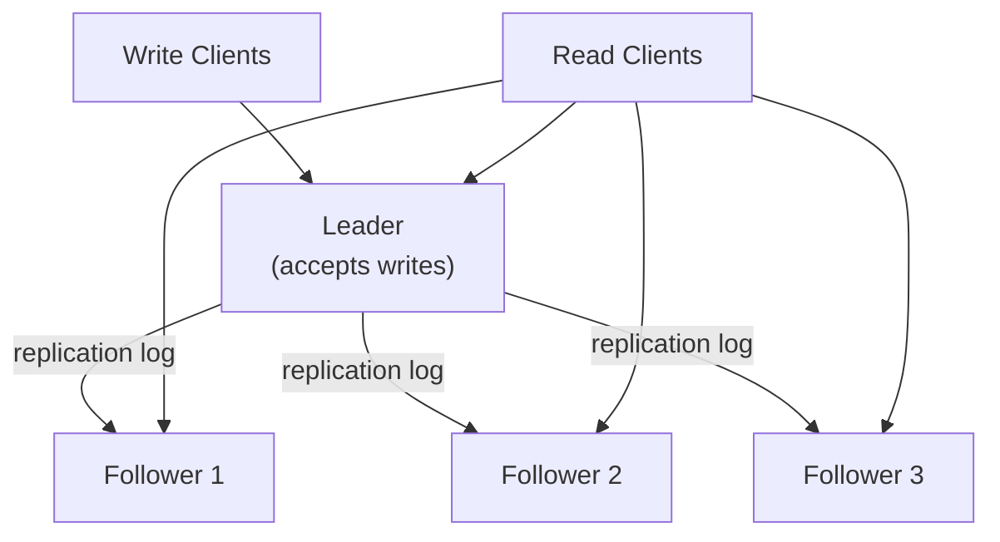
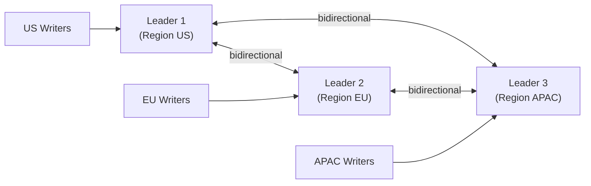
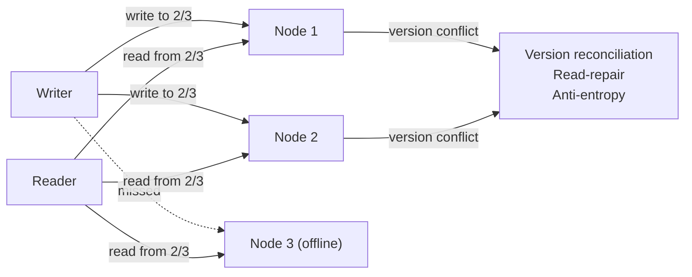
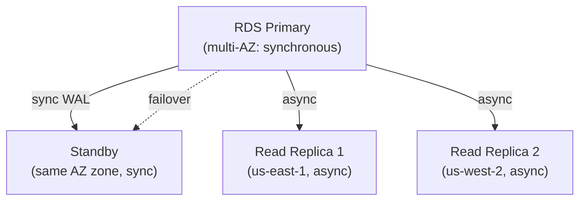

# Replication

## What it is

Replication maintains copies of the same data on multiple nodes. It serves two goals:
1. **Availability:** If one node fails, others can serve
2. **Read scale:** Multiple nodes can serve reads in parallel

## Replication topologies

### Single-Leader (Leader-Follower)

All writes go to the leader. Leader propagates changes to followers. Reads can go to leader or any follower.



**Failover:** If leader fails, a follower is promoted (manual or automatic via consensus).

**Used by:** PostgreSQL, MySQL, MongoDB (replica set), Redis (master-replica)

### Multi-Leader

Multiple nodes accept writes and replicate to each other. Each leader is also a follower of the others.



**Use case:** Multi-region active-active — users write to their nearest region.

**Challenge:** Write conflicts — two leaders accept concurrent writes to the same key. Must be resolved:
- Last-Write-Wins (LWW) — risk: data loss from clock skew
- Operational Transformation — complex merge logic
- CRDTs — automatic conflict-free merge for certain data types

**Used by:** CouchDB, MySQL Group Replication, Google Docs (OT), DynamoDB Global Tables

### Leaderless

Any node accepts writes. Clients write to multiple nodes concurrently and read from multiple nodes.



**Quorum:** `W + R > N` for strong consistency. With N=3, W=2, R=2: any read will see the latest write.

**Read repair:** On read, if nodes return conflicting versions, the most recent is written back to lagging nodes.

**Anti-entropy:** Background process compares replicas and synchronizes differences.

**Used by:** Cassandra, DynamoDB, Riak, Voldemort

## Synchronous vs Asynchronous Replication

### Synchronous

Leader waits for follower(s) to acknowledge before returning to client:

```
Client → Write to Leader → Leader writes → Wait for Follower ACK → Return to client
```

- **Durability:** Data on both leader and follower before ACK — no data loss if leader fails
- **Latency:** Higher — must wait for follower
- **Availability:** If follower is down → writes block (unless timeout + failback to async)

**Semi-synchronous:** One follower is synchronous, rest are async. Guaranteed one durable copy.

### Asynchronous

Leader returns to client immediately. Replication happens in background:

```
Client → Write to Leader → Return to client
                         ↓ (async)
                     Follower
```

- **Latency:** Low — no waiting
- **Durability:** Data may exist only on leader if leader fails before replication
- **Replication lag:** Followers may be seconds/minutes behind leader

**Replication lag example:**
```
Leader at t=0: user balance = $100
Write at t=1: subtract $50 → balance = $50
Follower lag: 1 second
Read from follower at t=1.5: balance = $100 (stale!)

Solutions:
  - Read your own writes: route reads from same user back to leader (or same follower)
  - Monotonic reads: always read from same follower
  - Consistent reads: route all reads to leader (defeats purpose of read replicas)
```

## Replication methods

### Statement-based (MySQL default historically)

Replicate the SQL statements executed:
```sql
UPDATE accounts SET balance = balance - 50 WHERE id = 123;
```
**Problem:** Non-deterministic functions (`NOW()`, `RAND()`) produce different results on replica.

### Write-Ahead Log (WAL) shipping (PostgreSQL default)

Replicate the raw bytes written to WAL — exact physical changes to data pages:
```
WAL record: "write bytes [0x4f, 0x2a, ...] to page 5 at offset 128"
```
**Tight coupling:** Replica must use same storage engine version. Used for same-version replicas.

### Logical (row-based) replication

Replicate the logical changes — inserted/updated/deleted rows:
```
INSERT INTO accounts VALUES (123, 50)
UPDATE accounts SET balance=50 WHERE id=123
DELETE FROM accounts WHERE id=123
```
**Flexible:** Works across versions, used for CDC (Debezium), DMS.

## Leader election

When the leader fails, a new leader must be elected:

### Manual failover

DBA promotes a follower manually. No automation.
- Safe but slow (minutes to hours)
- Required in high-security environments

### Automated failover (Raft/Paxos)

Consensus algorithm elects a new leader:
```
Leader stops sending heartbeats
Followers wait timeout (election timeout)
Follower becomes candidate, requests votes
Majority votes → new leader
```

**Used by:** etcd (Raft), ZooKeeper (ZAB), PostgreSQL Patroni, Kafka (KRaft)

**Split brain:** Two nodes both think they're the leader → inconsistency. Solved by:
- Fencing tokens: only leader with valid fence token can write
- STONITH (Shoot The Other Node In The Head): force-terminate suspected old leader

## Read replicas

Add read capacity by routing reads to followers:

```
Write: always to leader
Read: distributed across replicas
Read/write ratio 10:1 → 90% of traffic to replicas → 10x read capacity

AWS RDS: up to 5 read replicas (15 for Aurora)
Aurora: shared storage — replicas lag < 100ms (vs seconds for standard RDS)
```

**Replica routing:**
```python
class DBRouter:
    def db_for_read(self, model):
        return 'replica'   # Django ORM router
    
    def db_for_write(self, model):
        return 'primary'
```

## Replication in practice



**Multi-AZ:** Synchronous standby in another AZ for HA failover (~30s automatic)  
**Read Replicas:** Async, in same or different regions, for read scale or DR

## Interview angle

!!! tip "What interviewers are testing"
    They want to see you reason about the consistency/availability tradeoff in replication.

**Strong answer pattern:**
1. Single-leader for most systems — simple, strongly consistent reads from primary
2. Add read replicas for read-heavy workloads — caveat: replication lag
3. Multi-leader for multi-region active-active — acknowledge conflict resolution complexity
4. Leaderless (Cassandra) for maximum write availability — acknowledge eventual consistency
5. Async vs sync: async = faster but risk of data loss; semi-sync = one replica guaranteed

## Related topics

- [CAP Theorem](../fundamentals/cap-theorem.md) — replication is how CP vs AP is implemented
- [Consistency Models](../fundamentals/consistency-models.md) — replication lag = eventual consistency
- [Sharding](sharding.md) — sharding + replication for both scale and availability
- [Distributed Transactions](../distributed/distributed-transactions.md) — cross-replica writes
