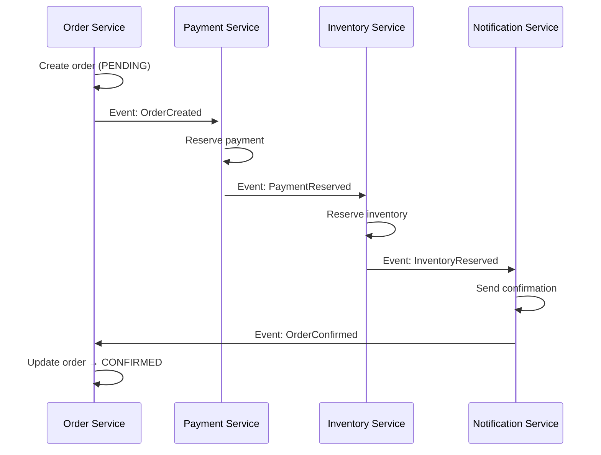
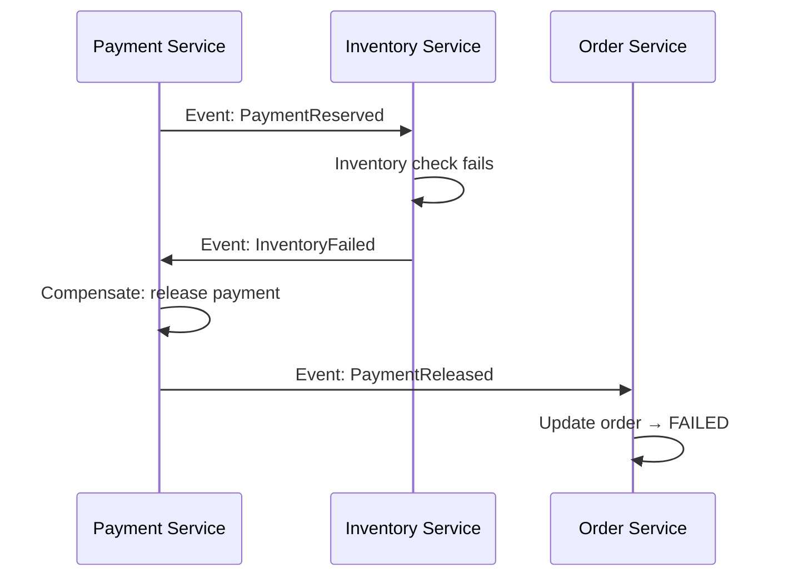
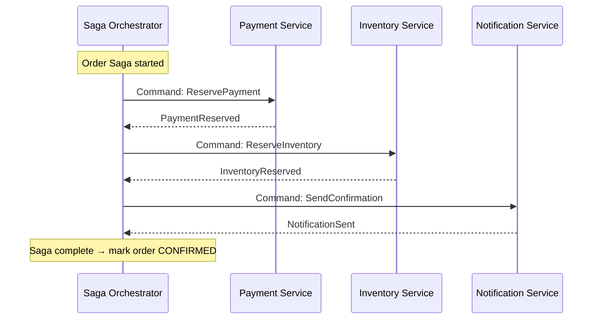
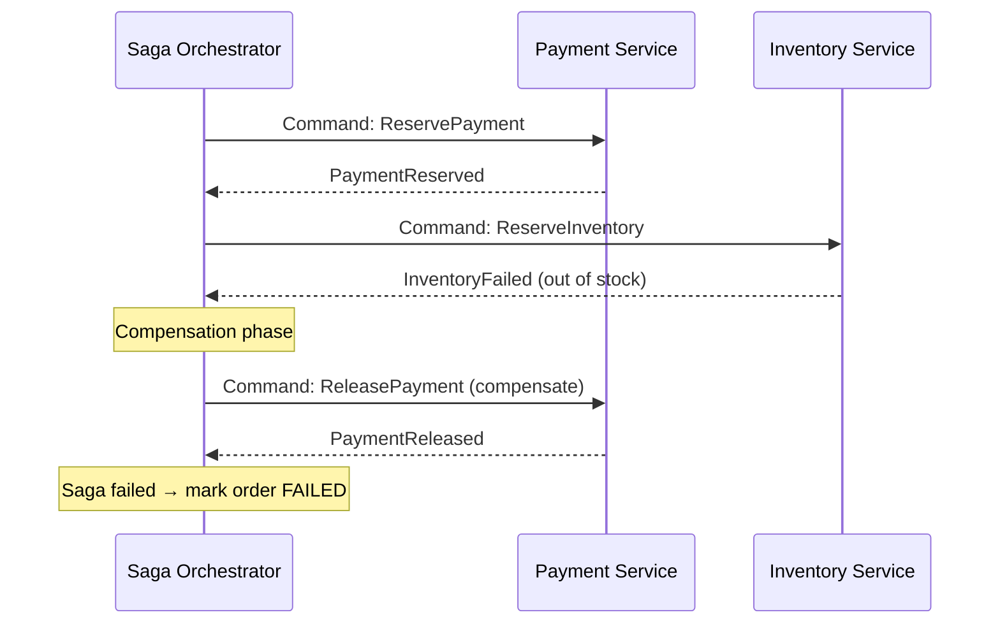

---
tags:
  - interview-critical
  - applied
---

# Saga Pattern

## What it is

The Saga pattern manages distributed transactions across multiple services — each service has its own database, so traditional ACID transactions don't work. A saga is a sequence of local transactions, where each transaction publishes an event or sends a command to trigger the next step. If any step fails, compensating transactions undo the previous steps.

## You'll see this when...

- Order placed but payment never charged (or vice versa) — multi-step transaction fell apart mid-way
- "We need a distributed transaction across services" — usually saga is the answer
- Workflow with reservation → charge → ship steps, each in its own service
- Compensating actions like `refund()`, `cancelReservation()`, `releaseInventory()` exist
- Tools like Temporal, AWS Step Functions, Camunda, Cadence are in the stack
- An orchestrator service drives a multi-step business process across teams
- Code has explicit "rollback" logic that runs forward (not DB rollback)

## The problem it solves

```
Monolith (easy):
  BEGIN TRANSACTION
    deduct_inventory()
    charge_payment()
    create_order()
  COMMIT  ← all or nothing

Microservices (hard):
  Order Service (own DB)
  Payment Service (own DB)
  Inventory Service (own DB)
  
  No single transaction can span all three.
  If payment succeeds but inventory fails → inconsistent state
```

## Saga vs 2PC

| | Saga | 2PC |
|---|---|---|
| Coordination | Choreography or orchestration | Central coordinator |
| Consistency | Eventually consistent with compensation | ACID (blocking) |
| Availability | High (no blocking) | Low (coordinators block) |
| Failure recovery | Compensating transactions | Coordinator restart |
| Coupling | Low (events) | High (coordinator knows all) |
| Performance | Fast (async) | Slow (synchronous rounds) |

Sagas are the preferred approach for microservices. 2PC is appropriate only within a single database or when strict ACID is unavoidable.

## Implementations

### Choreography (event-based)

Each service listens for events from the previous step and publishes events for the next:



**On failure (e.g., inventory fails):**


**Pros:** No central coordinator, services fully decoupled  
**Cons:** Hard to track overall saga state, circular dependencies can emerge, difficult to debug

### Orchestration (command-based)

A central saga orchestrator sends commands to each service and receives responses:



**On failure:**


**Pros:** Clear central view of saga state, easier to debug, single place for business logic  
**Cons:** Orchestrator is a central coupling point, can become a god class

## Compensating transactions

Compensation undoes the effect of a previous step — not a rollback (which is impossible across services), but a semantic undo:

| Step | Forward transaction | Compensating transaction |
|---|---|---|
| Reserve payment | Deduct from available balance | Release back to available balance |
| Reserve inventory | Mark units as reserved | Release reservation |
| Create shipment | Create shipment record | Cancel shipment |
| Send email | Send email | (Cannot undo — idempotency instead) |

**Some operations are non-compensatable** (email sent, push notification). For these, design for idempotency and accept they may be sent even if the saga ultimately fails. The order may fail, but the "order received" email was already sent — design the email to not commit to success.

## Saga state persistence

The orchestrator must persist its state so it can resume after crash:

```python
class OrderSaga:
    def __init__(self, order_id):
        self.order_id = order_id
        self.state = 'started'
        
    def handle_event(self, event):
        if self.state == 'started' and event == 'PaymentReserved':
            self.state = 'payment_reserved'
            self.save()
            self.send_command('ReserveInventory')
        
        elif self.state == 'payment_reserved' and event == 'InventoryReserved':
            self.state = 'inventory_reserved'
            self.save()
            self.send_command('SendConfirmation')
        
        elif self.state == 'payment_reserved' and event == 'InventoryFailed':
            self.state = 'compensating'
            self.save()
            self.send_command('ReleasePayment')
        
        # ...
    
    def save(self):
        db.execute("UPDATE sagas SET state=%s WHERE id=%s", 
                   (self.state, self.order_id))
```

**Saga log:** Store each step + status in a persistent store. On recovery, replay from last committed step.

## Handling partial failures and idempotency

Services may receive duplicate commands (at-least-once delivery). All saga participants must be idempotent:

```python
# Payment service: handle duplicate ReservePayment commands
def reserve_payment(order_id, amount):
    existing = db.get("SELECT * FROM reservations WHERE order_id=%s", order_id)
    if existing:
        # Already processed — return success (idempotent)
        return {'status': 'already_reserved', 'reservation_id': existing.id}
    
    # Process new reservation
    reservation = create_reservation(order_id, amount)
    return {'status': 'reserved', 'reservation_id': reservation.id}
```

## Saga vs Outbox pattern

Sagas are often paired with the [Outbox Pattern](outbox.md):

```
Service publishes saga event atomically with local DB write:
  1. Local transaction: INSERT order + INSERT saga_event (outbox table)
  2. Outbox poller: reads events, publishes to Kafka
  
Guarantees event is published if DB write succeeded.
Prevents: "DB committed but event not published."
```

## AWS implementation

```
Saga orchestrator options on AWS:
  - AWS Step Functions (Express Workflows)
    Managed state machine, visual workflow, supports compensation
  
  - Custom orchestrator on ECS/Lambda + DynamoDB (state store)
  
  - Apache Conductor or Temporal on EKS
```

**AWS Step Functions for sagas:**
```json
{
  "StartAt": "ReservePayment",
  "States": {
    "ReservePayment": {
      "Type": "Task",
      "Resource": "arn:aws:lambda:...:PaymentService",
      "Catch": [{
        "ErrorEquals": ["PaymentFailed"],
        "Next": "OrderFailed"
      }],
      "Next": "ReserveInventory"
    },
    "ReserveInventory": {
      "Type": "Task",
      "Catch": [{
        "ErrorEquals": ["InventoryFailed"],
        "Next": "ReleasePaymentCompensation"
      }],
      "Next": "SendConfirmation"
    },
    "ReleasePaymentCompensation": {
      "Type": "Task",
      "Resource": "arn:aws:lambda:...:ReleasePayment",
      "Next": "OrderFailed"
    }
  }
}
```

## Interview angle

!!! tip "What interviewers are testing"
    Any system design with microservices + money/inventory/orders needs saga or 2PC. They want to see you choose saga and explain compensation.

**Strong answer pattern:**
1. Identify the distributed transaction need — order + payment + inventory
2. Choose saga over 2PC — better availability, async, no blocking
3. Choose orchestration over choreography — easier to trace and debug for complex flows
4. Define compensating transactions for each step
5. Pair with outbox pattern for reliable event publishing
6. Mention idempotency — all participants must handle duplicate commands

## Test yourself

Answers are hidden — commit to an answer before expanding.

??? question "Why are sagas preferred over 2PC for microservices transactions?"

    2PC blocks: a central coordinator holds locks across synchronous rounds, hurting availability and performance, and it tightly couples every participant to the coordinator. A saga is a sequence of local transactions that is eventually consistent — no blocking, high availability, low coupling via events, with compensating transactions for failure recovery. 2PC is appropriate only within a single database or when strict ACID is unavoidable.

??? question "Why is a compensating transaction a 'semantic undo' rather than a rollback, and what do you do with steps that can't be compensated?"

    A real rollback is impossible across services — each step already committed in its own database. Compensation runs a new forward transaction that semantically reverses the effect: release the payment reservation, release inventory, cancel the shipment. Some steps (a sent email, a push notification) cannot be undone at all; for those, design for idempotency and accept they may fire even if the saga fails — e.g., word the email so it doesn't commit to success.

??? question "An order saga reserved payment, then inventory failed, then the orchestrator crashed. After restart, the payment reservation is never released. What was missing?"

    Saga state persistence. The orchestrator must persist its state (a saga log with each step + status) on every transition, so after a crash it can resume from the last committed step and still send the ReleasePayment compensation. An in-memory-only orchestrator loses track of in-flight sagas and leaves them in inconsistent states.

??? question "The payment service receives the ReservePayment command for the same order twice and creates two reservations. What's the bug?"

    Saga participants get at-least-once delivery, so duplicate commands are expected — every participant must be idempotent. The handler should first check for an existing reservation by order_id and, if found, return success with the existing reservation rather than creating a new one.

??? question "An interviewer asks: choreography or orchestration for a multi-step order saga — which do you pick and why?"

    Orchestration for complex flows: a central orchestrator sends commands and tracks state, giving a clear view of saga progress, easier debugging, and one place for the business logic — at the cost of a central coupling point that can become a god class. Choreography (services react to each other's events) is fully decoupled but makes overall saga state hard to track, can grow circular dependencies, and is difficult to debug. Pair either with the outbox pattern for reliable event publishing.

## Related topics

- [Distributed Transactions](../distributed/distributed-transactions.md) — why 2PC is avoided
- [Event-Driven Architecture](../architecture/event-driven.md) — choreography uses events
- [Outbox Pattern](outbox.md) — reliable event publishing from DB write
- [Idempotency](idempotency.md) — required for saga compensation
- [CQRS](cqrs.md) — often used alongside saga
- [Durable Workflows](durable-workflows.md) — Temporal / Step Functions as orchestrators for sagas
