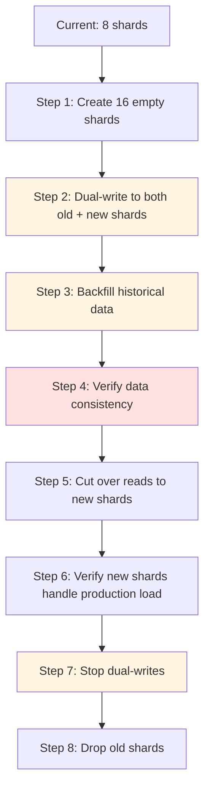
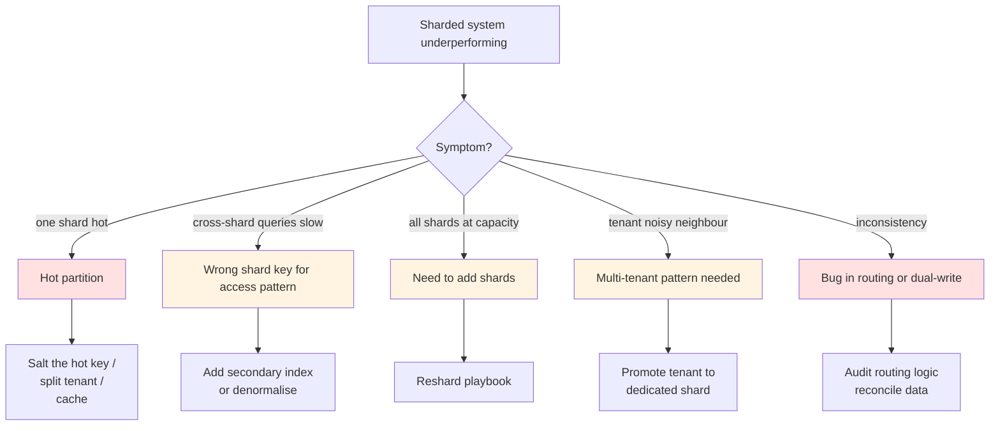

---
tags:
  - for-scale
  - applied
---

# Sharding Best Practices

A consolidated playbook for sharding done well. Shard key selection deep dives, the resharding playbook, observability, capacity planning, the common mistakes engineers make in their first sharding project — and how to avoid them.

For *what sharding is*, see [Sharding](sharding.md). For *how to query after sharding*, see [Querying Sharded Data](querying-sharded-data.md). This page is for **when you have to actually decide and operate**.

---

## Shard key selection — the most important decision

A bad shard key cannot be fixed without massive data migration. Spend hours on this; save weeks later.

### The four criteria

```
1. HIGH CARDINALITY
   How many distinct values can the key have?
   
   Too low → only a few partitions possible → unbalanced or wasted shards
   
   Examples:
     ✓ user_id (millions of values)
     ✓ device_id (billions)
     ✗ country (200 values, very uneven)
     ✗ status="active"|"inactive" (2 values)

2. UNIFORM DISTRIBUTION
   Are values spread roughly evenly?
   
   Skewed → hot shards
   
   Examples:
     ✓ hash(user_id) — uniform by design
     ✓ Random UUIDs
     ✗ Timestamp (recent values dominate writes)
     ✗ Country (US/EU are huge; islands are tiny)
     ✗ Customer tier (small number of enterprise customers, huge volume)

3. MATCHES ACCESS PATTERN
   Do your common queries filter by this key?
   
   If yes → single-shard queries (fast)
   If no → scatter-gather everywhere (slow)
   
   Examples:
     Query pattern: "user's orders" → shard by user_id ✓
     Query pattern: "products by category" → sharding by user_id makes this scatter-gather

4. IMMUTABLE
   Does the key change for a record?
   
   If yes → moving records between shards is painful
   
   Examples:
     ✓ user_id (assigned once, never changes)
     ✗ email (people change email)
     ✗ status (transitions to different states)
```

### Common shard key choices by use case

| Use case | Recommended | Why | Anti-pattern |
|---|---|---|---|
| User data | `user_id` | Naturally even, matches access | `email` (mutable, skewed) |
| Multi-tenant SaaS | `tenant_id` | Tenant queries together; isolation | `created_at` (hot recent shard) |
| Chat / messaging | `(conversation_id, time_bucket)` | Conversation queries local; bounded partition size | `user_id` (some users in many conversations) |
| Orders | `user_id` (not `order_id`) | User's orders together; common query | `order_id` (each order on different shard; user view = scatter-gather) |
| IoT sensors | `(device_id, date)` | Bounded growth; recent data clustered | `created_at` (write hot spot) |
| Time-series metrics | `(metric_name, time_bucket)` | Spreads writes across metrics | `created_at` alone (all writes to current shard) |
| Geospatial | `geohash_prefix` | Locality for region queries | `lat`/`lng` alone (no clustering) |
| Social graph | `user_id` (with replication of relationships) | User-centric queries fast | `relationship_id` (every relationship lookup spans shards) |

### The composite key pattern (Cassandra/DynamoDB style)

When you need locality within a partition + even distribution across partitions:

```
Partition key: hash distributed (e.g., user_id)
Sort/clustering key: ordered within partition (e.g., created_at)

Example: chat messages
  Partition key: conversation_id
  Sort key: timestamp
  
  → Reading "last 100 messages in conversation X" is a single-shard scan
  → Reading "all messages from yesterday" is scatter-gather
  
  Design implies: optimised for "view this conversation" queries
```

This is **why composite keys exist**: they encode the access pattern. Get it right and 95% of queries are single-shard.

---

## How many shards?

```
Too few:   shards too big; not enough headroom
Too many:  operational overhead; harder cross-shard queries

Rule of thumb:
  Start with ~16-256 logical shards
  Map onto fewer physical machines initially
  Scale physical machines without resharding logically
```

### The "virtual nodes" pattern

```
Logical shards: 256 (the shard map)
Physical nodes: 8 servers initially

Mapping:
  Shards 0-31 → Server 1
  Shards 32-63 → Server 2
  ...
  Shards 224-255 → Server 8

When you scale to 16 servers: just move half the shards
  Logical shard map unchanged (no app changes)
  Half of each old server's shards move to new servers
```

This is what Cassandra, DynamoDB, and Redis Cluster do internally with "virtual nodes" or "tokens." It separates **logical sharding** (stable, designed once) from **physical placement** (changes as you scale).

For application-level sharding: start with a constant like `NUM_SHARDS = 256` and never change it. Scale by adding physical servers and reassigning shards.

---

## Capacity planning

How big can each shard be?

```
For a typical Postgres shard:
  ✓ 100 GB - 1 TB of data
  ✓ 1K - 10K writes/sec sustained
  ✓ 5K - 50K reads/sec sustained
  
For DynamoDB partition:
  ✓ 10 GB max per partition
  ✓ 1000 WCU / 3000 RCU per partition
  ✓ Auto-splits when exceeded (mostly)
  
For Cassandra partition:
  ✓ 100 MB - 1 GB per partition (NOT per shard)
  ✓ Avoid >100K rows in one partition
  
Shard total capacity ≈ machine capacity divided by replication factor
  3-replica setup, r6g.2xlarge: ~30K writes/sec total, divided by 3 for redundancy
```

**Plan for 3-5× growth headroom** before resharding becomes urgent.

### Estimating shards from QPS

```
Target write QPS: 50,000 writes/sec
Per-shard sustainable writes: 5,000 writes/sec (with comfortable headroom)
Required shards: 50,000 / 5,000 = 10 shards
Round up + headroom: 16-32 logical shards
```

### Estimating shards from storage

```
Total dataset: 10 TB
Per-shard target: 500 GB
Required shards: 10 TB / 500 GB = 20 shards
Round up + future growth: 32-64 logical shards
```

Pick the higher of the two estimates.

---

## Resharding playbook

Adding shards to a running system. This is **the hardest operation** in sharding.

### When you must reshard

```
Signs:
  ✓ One shard at >80% capacity sustained
  ✓ Storage growing faster than projected
  ✓ Adding a new feature with massive new data
  ✓ One tenant outgrew their shard (multi-tenant)
  
Lead time:
  Plan ~3-6 months before you hit the limit.
  Resharding takes weeks to months for non-trivial systems.
```

### The online resharding sequence



Each step:

**1. Create new shards**
```sql
-- Provision the new infrastructure
-- Apply schema migrations to make new shards identical to old
```

**2. Dual-write**
```python
def write(record):
    # Old sharding scheme
    old_shard = old_shard_for(record.shard_key)
    old_shard.write(record)
    
    # New sharding scheme
    new_shard = new_shard_for(record.shard_key)
    new_shard.write(record)
```

Both writes must succeed. Tolerate failures via async retries.

**3. Backfill**
```python
# Background process: copy existing data from old to new shards
for record in old_shards.scan_all():
    new_shard = new_shard_for(record.shard_key)
    new_shard.write_if_not_exists(record)
```

Throttle to avoid impacting production. For TB-scale data, this can take days.

**4. Verify**
```python
# Sample-check: compare random keys across old and new
for key in random_keys(10000):
    old = old_shard_for(key).read(key)
    new = new_shard_for(key).read(key)
    assert old == new, f"Mismatch: {key}"
```

Critical step. Bugs in the dual-write logic show up here.

**5. Cut over reads**
```python
# Feature flag controls which scheme is canonical
def read(key):
    if feature_flags.is_enabled('use_new_shards', key):
        return new_shard_for(key).read(key)
    else:
        return old_shard_for(key).read(key)

# Roll out: 1% → 10% → 50% → 100%
```

**6-8. Drop dual-writes and old shards** (after stable on new shards for a soak period — typically 1-2 weeks).

### Tools that help

- **Vitess** has built-in online resharding (used at YouTube to reshard ~petabyte tables)
- **Citus** supports adding nodes to a Postgres cluster
- **AWS DMS** for one-time migrations between databases
- **Debezium** for CDC-based dual-writes (avoids the dual-write problem entirely)

### Common resharding failures

| Failure | Cause | Fix |
|---|---|---|
| Backfill takes too long | Single-threaded; not parallel | Parallelise by shard or key range |
| Dual-write failures cause inconsistency | One side writes succeeded, other failed | Async retry queue; reconciliation job |
| New shards underprovisioned | Didn't load-test in advance | Test new shards with full traffic before cutover |
| Mid-resharding outage | New code paths not battle-tested | Long soak period; gradual rollout |
| Data drift between old and new | Bug in dual-write logic | Reconciliation scans; checksums |

### Avoid resharding entirely with consistent hashing

If you use consistent hashing with virtual nodes from the start, **adding nodes doesn't require resharding** — just move some virtual nodes to the new physical machine. Cassandra, DynamoDB, Riak do this natively.

For application-level sharding: design with NUM_SHARDS large from day-1 (256 or more) and you'll likely never need to reshard logically.

---

## Observability for sharded systems

```yaml
Per-shard metrics:
  - QPS (read, write)
  - Latency (P50, P95, P99)
  - Error rate
  - Storage used
  - Connection pool utilisation
  - Replication lag (if applicable)

Cross-shard metrics:
  - Total QPS across all shards
  - Coefficient of variation (load skew across shards)
  - Scatter-gather query frequency
  - Resharding progress (during operations)

Alerts:
  - Single shard >80% capacity → reshard imminent
  - Coefficient of variation >50% → hot shard suspected
  - Cross-shard query latency exceeds SLO
  - Replication lag spiking (read replicas falling behind)
```

### The "shard inequality" dashboard

```
Healthy distribution:
  Shard 0:  ████████████ 14%
  Shard 1:  ████████████ 13%
  Shard 2:  ████████████ 13%
  Shard 3:  ████████████ 12%
  Shard 4:  ████████████ 14%
  Shard 5:  ████████████ 13%
  Shard 6:  ████████████ 12%
  Shard 7:  ████████████ 14%
  → Coefficient of variation: ~8% (good)

Unhealthy (hot shard):
  Shard 0:  ████ 5%
  Shard 1:  ████ 6%
  Shard 2:  ████████████████████████████████████████ 50%
  Shard 3:  ████ 5%
  Shard 4:  ████ 5%
  Shard 5:  ████ 5%
  Shard 6:  ████ 6%
  Shard 7:  █████████ 13%
  → Coefficient of variation: ~120% (investigate)
```

Render this for QPS, storage, and CPU. Outliers stick out visually.

---

## Multi-tenancy + sharding patterns

### Pattern: shard per tenant tier

```
Free / pro tenants: pooled across shared shards
Enterprise tenants: dedicated shard each
```

Solves: noisy neighbour (one big customer can't slow others); per-tenant compliance.

### Pattern: shard by tenant_id with virtual nodes

```python
# Hash tenants across N virtual shards
def get_shard(tenant_id):
    return hash(tenant_id) % NUM_VIRTUAL_SHARDS

# Migrate a tenant to a dedicated shard later
def get_shard_with_overrides(tenant_id):
    override = tenant_overrides.get(tenant_id)
    if override:
        return override  # dedicated shard
    return hash(tenant_id) % NUM_VIRTUAL_SHARDS
```

Most tenants live in pooled shards; promote individual tenants out when needed.

### Pattern: tenant_id + secondary distribution key

For very large tenants:

```
Composite key: (tenant_id, user_id)
  Partition key: hash(tenant_id, bucket_id) where bucket_id distributes a tenant's data
  
Effect: one tenant's data spread across multiple shards
```

Trade-off: queries for "all data for tenant X" now span multiple shards.

See [Multi-Tenancy](../architecture/multi-tenancy.md).

---

## Backup and disaster recovery

Each shard needs its own backup. At scale, this multiplies operational concerns.

```
Single Postgres: one backup, one restore procedure
8 shards: 8 backups, but they must be coordinated for point-in-time consistency

Considerations:
  ✓ All shards backed up at consistent times (snapshot synchronisation)
  ✓ Restore tested per shard
  ✓ Backups stored in different region (DR)
  ✓ Restore time × shards = total recovery time
```

For 100+ shards, this is non-trivial. Managed sharding services (Vitess Operator, Aurora, DynamoDB) handle this; DIY systems need disciplined automation.

---

## Schema migrations across shards

```bash
# Manual approach for N shards
for shard in shards:
    flyway migrate -url=$shard

# Better: orchestration tool runs migrations sequentially with verification
```

**Online migrations are mandatory**:

- Add nullable column: instant
- Add NOT NULL with default: needs rewrite; do as nullable first, backfill, then add NOT NULL
- Add index: use `CREATE INDEX CONCURRENTLY` (Postgres) or `pt-osc` (MySQL)
- Drop column: two-stage (deploy code that doesn't use it, then drop)

**Failure mid-migration is the worst case**:
- 3 of 8 shards migrated; production broken
- Need rollback or per-shard retry
- Have a runbook for this

---

## When NOT to shard

```
Don't shard if:
  ✗ Single DB at <50% capacity
  ✗ Vertical scaling (bigger instance) still has headroom
  ✗ Read-heavy: just add read replicas first
  ✗ One table is the problem: archive old data, partition (not shard)
  ✗ Multi-tenant noisy neighbour: bulkhead, rate limit (not shard)
  
First try, in order:
  1. Index optimisation (often 10× wins)
  2. Caching (10-100× wins on hot reads)
  3. Read replicas (read scaling)
  4. Vertical scaling (one bigger machine)
  5. Internal partitioning (manageability)
  6. THEN sharding (when none of the above suffices)
```

Sharding adds complexity for the rest of the system's life. It's reversible only with great pain. Earn it.

---

## Common mistakes — the curated list

| Mistake | Consequence | Avoid by |
|---|---|---|
| Picking shard key = primary key without thinking | Cross-shard queries dominate | Choose by access pattern |
| Starting with 4 shards | Reshard within 18 months | Start with 16-256 virtual shards |
| Shard key not in 90%+ of queries | Scatter-gather everywhere | Redesign queries or shard key |
| No connection pooler per shard | Connection exhaustion | PgBouncer (or equivalent) per shard |
| Distributed transactions across shards | Slow, fragile | Saga; design shard key to avoid |
| Routing logic scattered in app code | Hard to change | Centralise in one routing module |
| No per-shard monitoring | Hot shards invisible | Per-shard metrics, coefficient of variation |
| Schema migrations done manually per shard | Drift, errors | Orchestration tool; CI integration |
| No load test of new shards before cutover | Production surprise | Always replay traffic to new shards first |
| Sharding for "scale" with 1K QPS | Over-engineering | Don't shard until you must |

---

## Sharding maturity model

```
Level 0: No sharding
  Single DB, vertical scale, careful indexing
  
Level 1: Manual sharding
  App-level routing; small number of shards; manual migrations
  
Level 2: Sharded with tooling
  Proxy or framework handles routing; automated migrations; per-shard observability
  
Level 3: Sharded with operations
  Online resharding capability; HA per shard; cross-region DR; tenant isolation
  
Level 4: Mature sharding
  Self-balancing (virtual nodes); zero-downtime reshards; per-tenant dedicated shards available; multi-region
```

Most teams plateau at level 1-2. Levels 3-4 require dedicated platform engineering. PlanetScale, AWS Aurora Limitless, Yugabyte are level-4 offerings.

---

## Real-world examples

### Slack (Vitess)

```
Sharded by team_id (tenant)
  ✓ All of a team's data on one shard (most queries fast)
  ✓ Large teams: shard further within (sub-sharding)
  ✓ Vitess handles routing
```

### Instagram (early)

```
Sharded by user_id with hash distribution
  ✓ User's photos on one shard
  ✓ "Following" feed: scatter-gather (followers on many shards)
  ✓ Migrated from one Postgres to thousands of shards over years
```

### Pinterest (legacy)

```
Sharded by user_id
  ✓ Custom routing layer
  ✓ ZooKeeper for shard map
  ✓ Manual shard moves
```

### Stripe (custom sharding)

```
Sharded by user_id or merchant_id depending on table
  ✓ Different access patterns per data type
  ✓ Custom dual-write tooling for migrations
  ✓ Heavy investment in resharding automation
```

The common pattern: **shard by the most-queried entity ID**; live with scatter-gather for everything else.

---

## Decision flow when something goes wrong



---

## Interview angle

!!! tip "What interviewers are testing"
    Whether you've actually operated a sharded system at scale — not just read about it.

**Strong answer pattern:**
1. Shard key choice driven by access patterns (most queries should be single-shard)
2. Composite keys for systems like Cassandra/DynamoDB
3. Start with many virtual shards (256+); scale physical machines independently
4. Avoid distributed transactions; use sagas
5. Secondary indexes / denormalisation for non-shard-key lookups
6. Online resharding via dual-write + backfill + cutover

**Common follow-up:** *"You picked user_id as shard key. Marketing wants to query 'all orders from users in the EU'. How?"*
> Three options. (1) Replicate user-EU mapping to every shard so each shard can locally filter — works if user list is small. (2) Maintain a separate "users_by_region" index (Postgres / DynamoDB) that maps region → user_ids, then look up orders by user_id (single-shard per user). (3) Async export to a data warehouse where this kind of query runs against denormalised, region-tagged data. Choice depends on frequency: marketing reports = warehouse; real-time UI = secondary index; rare = scatter-gather.

---

## Quick reference checklist

```
Before sharding:
  ☐ Index optimisation tried
  ☐ Caching added
  ☐ Read replicas in place
  ☐ Vertical scaling exhausted

Choosing shard key:
  ☐ High cardinality (1M+ values)
  ☐ Uniform distribution (no skew)
  ☐ Matches common query patterns
  ☐ Immutable per record

Starting setup:
  ☐ 16-256 logical shards (not 4)
  ☐ Connection pooler per shard
  ☐ Centralised routing module
  ☐ Per-shard observability
  ☐ Schema migration orchestration

Operating sharded:
  ☐ Per-shard alerts
  ☐ Coefficient of variation monitoring
  ☐ Resharding playbook documented
  ☐ Backup procedures tested per shard
  ☐ Failure runbooks per shard
  ☐ Online migration capability
```

---

## Related

- [Sharding](sharding.md) — the concept
- [Querying Sharded Data](querying-sharded-data.md) — the routing problem
- [Partitioning Fundamentals](../fundamentals/partitioning-fundamentals.md) — broader concept
- [Hot Partitions](../fundamentals/hot-partitions.md) — when sharding goes wrong
- [Consistent Hashing](consistent-hashing.md) — avoid reshards
- [CAP Theorem in Practice](../fundamentals/cap-theorem-applied.md) — consistency implications of distributed data
- [Multi-Tenancy](../architecture/multi-tenancy.md) — tenant-aware sharding
- [Connection Pooling](connection-pooling.md) — required infrastructure
- [Outbox Pattern](outbox.md) — secondary index consistency
