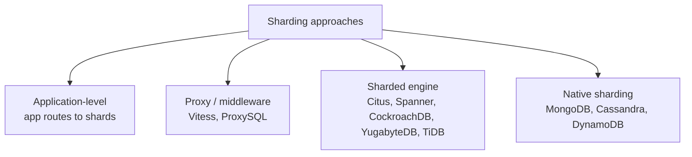
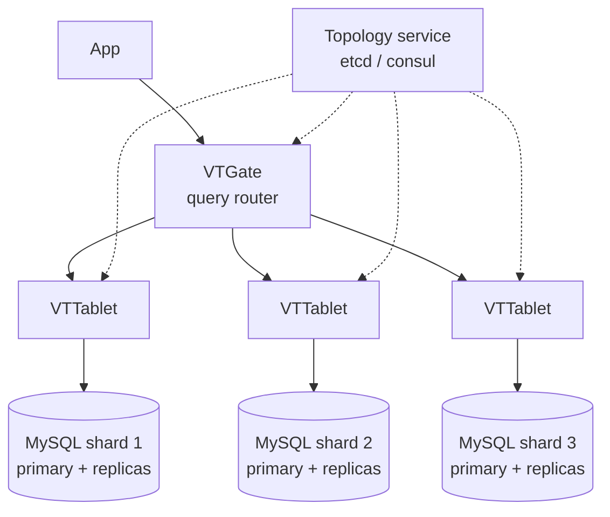
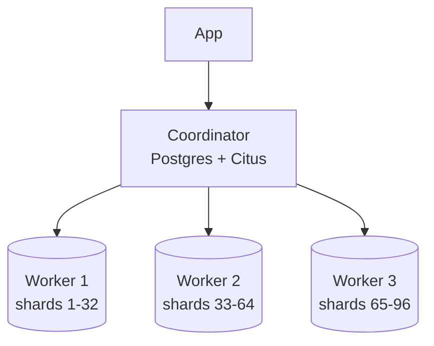
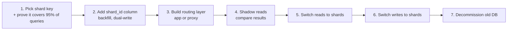
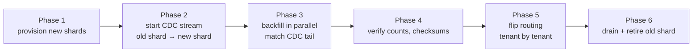

---
tags:
  - applied
  - for-scale
---

# Sharding Tooling in Practice

## You'll see this when...

- A single Postgres / MySQL has crossed ~5 TB or ~20K writes/sec and vertical scaling is running out
- The team is debating "do we shard at the app layer, use a proxy, or move to a sharded engine?"
- You've heard "Vitess" and "Citus" thrown around as solutions and need to know the trade-offs
- Migration to sharded data is on the table and someone wants to know what's involved

The [Sharding](sharding.md) page covers the theory: hash, range, directory, consistent hashing. This page covers the **operational reality** — the tools you'd actually use, what they hide from you, what they don't, and how migration plays out.

## The options on the table



| Approach | What you keep | What changes | Operational cost |
|---|---|---|---|
| **App-level** | Same DB engine, full SQL on each shard | App reads a routing config, opens shard-specific connections | Highest — you build it |
| **Proxy** | Same DB protocol (MySQL or Postgres) | Apps think they're talking to one DB; proxy splits queries | Moderate — operate the proxy |
| **Sharded engine** | SQL-ish interface | Different engine, different semantics, different ops story | Highest cognitive load up front, lower long-term ops |
| **Native sharding** | If you were already on Mongo/Cassandra/DDB, "just" use shard keys well | Different consistency model | Often easiest if you're already there |

## App-level sharding (the boring path)

Most companies that "shard" started here. The app holds a routing table and picks the right connection.

```python
def shard_for_user(user_id: str) -> str:
    return SHARD_MAP[hash(user_id) % NUM_SHARDS]

def get_user(user_id: str):
    conn = pool[shard_for_user(user_id)]
    return conn.query("SELECT * FROM users WHERE id = %s", user_id)
```

### What you keep

- Single-engine simplicity per shard
- All Postgres features (extensions, advanced indexes, JSON ops, full SQL)
- Independent failover, backup, and upgrade per shard

### What you give up

- Cross-shard joins (you do them in the app or you don't)
- Cross-shard transactions (sagas / outbox / accept eventual consistency)
- Cross-shard `COUNT(*)` (precompute or accept slow)
- A simple migration story (every schema change must fan out)

### When it's the right answer

- You have a clear shard key (tenant_id, user_id) and >95% of queries fit it
- The team is small and you don't want to operate a new database system
- You're comfortable building tooling: schema migrator, cross-shard query, rebalance

This was Shopify, GitHub, Notion, and many others at certain scales — and they wrote a lot of in-house tooling. Be honest about that cost.

## Vitess (MySQL)

Originally built at YouTube to shard MySQL. Now CNCF graduated. Used by Slack, Square, GitHub (partially), Etsy.



### What Vitess gives you

- **VSchema**: declarative sharding scheme (which tables, which key, lookup tables for cross-shard joins)
- **Online resharding**: split shards while serving traffic (months-long projects become weeks)
- **Query routing**: app talks to VTGate using MySQL protocol; VTGate fans out
- **Cross-shard query support**: scatter-gather for some queries (with caveats)
- **VReplication**: stream changes between shards (and to external systems)
- **Online schema changes**: gh-ost-style with safety

### What Vitess hides imperfectly

- Cross-shard transactions are 2PC-ish — slow and footgunned. Avoid by design.
- Scatter-gather is real but has limits; aggregations across many shards are slow
- Sequencing (auto-increment) becomes a `sequence` table
- Some MySQL features don't survive the proxy (specific session vars, certain DDL)

### Operational reality

You now operate three things: MySQL shards, VTTablets, and the topology service. The control plane is non-trivial. Plan for someone (or a small team) to own it. The Vitess docs are good; the failure modes are well documented; the community is active.

## Citus (Postgres)

Postgres extension that turns one Postgres cluster into a distributed sharded one. Acquired by Microsoft; available as open source and as Azure Cosmos DB for PostgreSQL.



### Model

- You pick a **distribution column** per table (often `tenant_id` or `customer_id`)
- Tables are split into N shards; small reference tables are replicated to all workers
- The coordinator parses SQL, pushes down to workers, gathers results

### What Citus is great at

- Multi-tenant SaaS: each tenant lives on one shard, queries route there with full Postgres semantics
- Real-time analytics: parallel scans across workers
- Largely standard Postgres: you keep extensions, JSON, etc.

### What it isn't

- A drop-in replacement for arbitrary Postgres workloads. Queries that don't filter by the distribution column do scatter-gather; some patterns just won't work.
- It's not a magic horizontal scale-out for OLTP without rethinking your schema.

## Distributed SQL engines

A different class of system: built sharded from the ground up, present a SQL interface, handle distribution and replication internally.

| System | Origin | Notable for |
|---|---|---|
| **Google Spanner** | Google | TrueTime, global strong consistency |
| **CockroachDB** | Spanner-inspired OSS | Postgres-compatible wire, geo-partitioning |
| **YugabyteDB** | Spanner-inspired OSS | Postgres-compatible, plugin ecosystem |
| **TiDB** | PingCAP | MySQL-compatible wire, HTAP (TiFlash) |
| **AlloyDB Omni / Aurora Limitless** | Cloud-hybrid | Managed sharded Postgres |

### What they buy you

- Horizontal scale without app changes (mostly)
- Strong consistency across regions (Spanner) or within a cluster (Cockroach/Yuga/TiDB)
- Survives whole-AZ or region loss without manual failover

### What they cost you

- Latency floor: distributed consensus on writes is slower than single-node Postgres
- Operational complexity: more moving parts (placement drivers, sequencer nodes, raft groups)
- Subtle semantic differences: some Postgres/MySQL features missing or different
- Cost: typically more expensive per workload than a single-node Postgres
- Hiring: smaller pool of engineers who've actually operated these in prod

### When the math actually favors them

- True global write workload (users in EU and US updating the same data)
- Need HA across regions and don't want to manage failover
- Already painfully sharded and want to consolidate

For most teams under 10 TB and within one region, Postgres + read replicas + careful schema is still cheaper, simpler, and faster.

## Migration from single-node to sharded

This is the part most teams underestimate. A realistic timeline:



### Realistic durations

| Step | Reality |
|---|---|
| Pick shard key | 1-2 months (audit every query, every report, every cron) |
| Co-locate data (denormalize where needed) | 2-6 months — touches the data model |
| Routing + dual-write | 1-2 months |
| Backfill | Days to weeks depending on size |
| Shadow + verify | 1-2 months of running both |
| Cutover | A weekend with a runbook |
| Decommission | Months later (you'll keep the old DB around) |

### Common shard keys

| Domain | Likely key |
|---|---|
| Multi-tenant SaaS | `tenant_id` / `org_id` |
| Consumer app | `user_id` |
| E-commerce orders | `customer_id` (not `order_id` — you'd lose per-customer history locality) |
| IoT / time-series | `device_id` + time partition |
| Messaging | `conversation_id` (so all messages in one place) |

### Cross-shard queries — the ugly truth

Once sharded, these get hard:

- **Admin search**: "find any user by email" → need a global secondary index (a `email → shard` lookup table)
- **Reports**: "total revenue this month across all tenants" → run on warehouse, not OLTP
- **Cross-tenant features**: "users sharing the same X" → rare; if needed, pre-join in a side store
- **Top-N globally**: scatter-gather to all shards, merge, take top N

Plan these escape hatches up front, not after migration.

## Rebalancing

The shard key is fixed; the shard count is not. Adding shards requires moving data.



Vitess automates this for MySQL (`Reshard`). Citus has rebalance functions. App-level sharding leaves you to build it — it's not impossible but it's a project.

### Consistent hashing helps a little

Hash-mod-N requires re-hashing everything when N changes. Consistent hashing (and its derivatives like Jump Hash) limits the data that moves to roughly 1/N. Many sharded systems use it under the hood. See [Consistent Hashing](consistent-hashing.md).

## Operational concerns at shard scale

| Concern | What changes |
|---|---|
| **Schema migrations** | Must apply to every shard; need parallel migrator with safety; long-running |
| **Backups** | Each shard backed up independently; PITR per shard; cross-shard restore is by hand |
| **Monitoring** | Per-shard dashboards + aggregate; hot shard detection is critical |
| **Failover** | Each shard has its own primary; failover scripts per shard |
| **DDL** | Online DDL becomes much harder; tools like gh-ost / pg_repack must run everywhere |
| **Hot shard** | A celebrity user / mega-tenant can melt one shard; sub-sharding or moving them is the fix |
| **Cost** | More replicas, more standbys; baseline cost scales with shards even before traffic |

### Detecting hot shards

```
- Per-shard QPS, p99 latency, CPU, IOPS
- Compare across shards: if shard 5 is 3x the rest, you have a hot shard
- Top keys by row count, by writes/sec — find the celebrity
```

## Anti-patterns

| Anti-pattern | Why it hurts | Better |
|---|---|---|
| Shard prematurely | Drowning in complexity for problems you don't have | First exhaust read replicas, indexes, partitioning, caching |
| Pick `order_id` (random UUID) as shard key | All user data scattered | Pick the key the user owns (`user_id`/`tenant_id`) |
| Cross-shard joins in app code | N+1 hell, slow, complex | Denormalize at write time, pre-compute, or warehouse |
| Cross-shard transactions over 2PC | Latency + failure modes | Saga / outbox / idempotency |
| One shard per customer | Crazy operational sprawl, idle shards | Hash buckets of customers; isolate only the mega ones |
| Shard but no global directory | "Where does user X live?" → scan all shards | Maintain a routing table or directory shard |
| Skip the warehouse | Force OLTP shards to answer analytical queries | Stream to warehouse for cross-shard analytics |
| No rebalance plan | First imbalance becomes a crisis | Design rebalance from day one |

## Quick reference

| Situation | Reach for |
|---|---|
| Multi-tenant SaaS at 5-50 TB | Citus or app-level sharding by tenant |
| MySQL-shaped workload, ready to operate it | Vitess |
| Global writes with strong consistency | Spanner / CockroachDB / YugabyteDB |
| MySQL compatibility but distributed | TiDB |
| Already on Cassandra/Mongo/DDB | Native sharding, good shard key design |
| Just need to scale reads | Read replicas first; sharding later |
| Just need to keep history small | Partitioning, not sharding |

## Interview angle

!!! tip "What interviewers are testing"
    Saying "shard the DB" is the easy part. The signal is in how you'd choose the key, how you'd live with cross-shard queries, and how the migration actually rolls out without downtime.

**Strong answer pattern:**

1. Justify why sharding is needed now (size, write rate) and why simpler options were exhausted
2. Pick a shard key that aligns with 95%+ of access patterns; explain the 5% escape hatches
3. Pick a tool (app-level, Vitess, Citus, distributed SQL) and own the trade-off
4. Lay out the migration: dual-write, backfill, shadow, cutover; mention idempotency and rebuild
5. Cover ops: schema migrations, hot shards, rebalance, monitoring, cost
6. Mention cross-shard read patterns (directory shard, global secondary index, warehouse)

**Common follow-ups:**

- "What if a customer becomes too big for one shard?" — isolate that tenant to a dedicated shard or sub-shard by a secondary key
- "How do you change the shard key later?" — practically a full migration; that's why the first choice matters
- "How do you do schema changes across shards?" — parallel migrator with throttling, online DDL per shard, version-tolerant code in between
- "Walk me through a hot-shard incident" — detect via per-shard metrics, identify hot key, isolate (read replica, move tenant), longer-term: sub-shard or rate-limit

## Related topics

- [Sharding](sharding.md) — fundamentals
- [Consistent Hashing](consistent-hashing.md)
- [Database Operations at Scale](../fundamentals/database-operations-at-scale.md)
- [Database Internals Deep Dive](../fundamentals/database-internals-deep-dive.md)
- [SQL vs NoSQL](../storage/sql-vs-nosql.md)
- [Hot Partitions](../fundamentals/hot-partitions.md)
