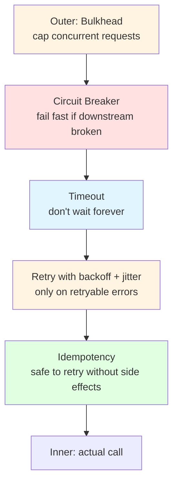

---
tags:
  - applied
  - for-scale
---

# Unhappy-Path Engineering

Most production code handles the happy path well. **What separates resilient systems from fragile ones is how they handle the unhappy paths**: timeouts, retries, failures, partial outages, overload. Each individual pattern (circuit breaker, retry, bulkhead) is well-known. The art is **combining them correctly** so they don't make things worse.

This page is about how those patterns work **together** in production: the configurations that compose, the anti-patterns that arise from misuse, and load shedding / graceful degradation as first-class capabilities.

---

## The fundamental problem

Each pattern in isolation is simple. Combined naively, they actively make outages worse.

```
Bad combination:
  Retry 3 times with no backoff
  + No circuit breaker
  + No timeouts
  
  → Slow downstream → all retries hammer it → guaranteed cascade failure
```

```
Good combination:  
  Retry with exponential backoff + jitter
  + Circuit breaker that opens on sustained failure
  + Timeout shorter than retries × backoff
  + Bulkhead limiting concurrent retries
  + Idempotent operations so retries are safe
```

Same patterns, very different outcomes. The combination is the skill.

---

## The unhappy-path stack



Reading bottom-up: the actual call is **idempotent**, so retries are safe. Each retry has a **timeout**. The retry policy uses **exponential backoff with jitter**. A **circuit breaker** wraps the whole thing — if the downstream is sustainedly failing, stop calling for a while. A **bulkhead** caps how many concurrent requests this entire stack can run.

Every layer matters. Skipping any one makes the others less effective.

---

## Retry + Circuit Breaker — they need each other

### Retry alone is dangerous

```python
def call_payment_service(req):
    for attempt in range(3):
        try:
            return http.post(payment_url, req, timeout=5)
        except (Timeout, ConnectionError):
            continue
    raise PaymentFailure()
```

```
Payment service overloaded (slow). 
1000 client requests retry × 3 = 3000 requests hitting it.
Payment service melts down.
```

### Circuit breaker alone is too pessimistic

```python
breaker = CircuitBreaker()

def call_payment_service(req):
    if breaker.is_open():
        raise CircuitOpen()
    try:
        return http.post(payment_url, req, timeout=5)
    except Exception as e:
        breaker.record_failure()
        raise
```

```
Transient network blip → one failure → no retry → user sees error
```

### Combined: retry first, then break

```python
breaker = CircuitBreaker(failure_threshold=10, timeout=60)

def call_payment_service(req):
    if breaker.is_open():
        raise CircuitOpen()  # fail fast; don't even try
    
    last_error = None
    for attempt in range(3):
        try:
            response = http.post(payment_url, req, timeout=5)
            breaker.record_success()
            return response
        except (Timeout, ConnectionError) as e:
            last_error = e
            time.sleep(backoff_with_jitter(attempt))
    
    # All retries failed
    breaker.record_failure()
    raise last_error
```

The combination:
- **Transient failures** → retry (1-2 retries usually succeed)
- **Sustained failures** → circuit opens; stop retrying; fail fast
- **Recovery** → after timeout, half-open state lets one probe through

### Failure threshold tuning

```
Failure threshold too low (e.g., 3): false trips on transient blips
Failure threshold too high (e.g., 100): slow to react to real outages

Typical: 50% error rate over the last 10s window
OR:      10 consecutive failures
OR:      Failed/total > 50% AND min 20 requests in window

Library: Resilience4j defaults are reasonable; Hystrix-style works
```

The right answer depends on your traffic. At 10 QPS: count-based works. At 10K QPS: rate-based is better.

### Half-open state

```
Open state: all calls fail fast
After timeout: move to half-open
Half-open: allow N probe requests through

If probe succeeds: close circuit, normal operation
If probe fails: back to open
```

Don't move from open to closed instantly. The half-open probe limits damage if the dependency is still broken.

---

## Backoff strategies

Wrong backoff = thundering herd. Right backoff = smooth recovery.

### Fixed delay (don't)

```python
for attempt in range(3):
    try:
        return call()
    except RetryableError:
        time.sleep(1)  # always 1 second
```

```
All clients retry in lockstep:
  T=0: 1000 requests fail
  T=1: same 1000 requests retry → all fail again  
  T=2: same 1000 requests retry → ...
```

Synchronisation. Service can't recover.

### Exponential backoff (better, not enough)

```python
for attempt in range(3):
    try:
        return call()
    except RetryableError:
        time.sleep(2 ** attempt)  # 1, 2, 4 seconds
```

Better spreading, but clients still synchronise on the exponential schedule.

### Exponential backoff + jitter (the right answer)

```python
import random

def backoff_with_jitter(attempt, base=1.0, cap=30.0):
    """Decorrelated jitter — AWS Architecture Blog standard."""
    return random.uniform(base, min(cap, base * 2 ** attempt))

for attempt in range(3):
    try:
        return call()
    except RetryableError:
        time.sleep(backoff_with_jitter(attempt))
```

Each client picks a random wait time. Recovery is gradual. No thundering herd.

### Full jitter vs decorrelated jitter

Two variants of jitter (Marc Brooker's analysis, AWS):

```python
# Full jitter: uniform between 0 and cap
def full_jitter(attempt, base=1.0, cap=30.0):
    return random.uniform(0, min(cap, base * 2 ** attempt))

# Decorrelated jitter: uses last delay
def decorrelated_jitter(last_delay, base=1.0, cap=30.0):
    return min(cap, random.uniform(base, last_delay * 3))
```

Decorrelated jitter typically produces better recovery curves. Either is fine; **fixed exponential without any jitter is wrong**.

### When NOT to retry

```
DON'T retry on:
  ✗ 4xx client errors (your bug; retry won't help)
  ✗ Validation errors
  ✗ Authorization failures (auth could change but rarely transient)
  ✗ Resource not found (404 — won't appear by retrying)

DO retry on:
  ✓ Timeouts
  ✓ Connection errors
  ✓ 5xx server errors (usually)
  ✓ 429 rate limited (with Retry-After header honour)
  ✓ Specific transient codes (e.g., 503 Service Unavailable)
```

Retrying a 400 Bad Request 3 times wastes resources and doesn't change the outcome.

### Total retry budget

Sometimes you need to bound the *total* time across all retries:

```python
import time

deadline = time.time() + 10  # total budget: 10 seconds

while time.time() < deadline:
    try:
        return call()
    except RetryableError:
        time.sleep(min(backoff_with_jitter(attempt), deadline - time.time()))
        attempt += 1
```

Don't let exponential backoff push past your overall deadline. Better to fail explicitly than to keep waiting.

---

## Timeouts — the most-forgotten pattern

Every network call needs a timeout. Period.

### Default timeouts in popular libraries

```python
# Python requests: NO TIMEOUT by default — will wait forever
import requests
response = requests.get(url)  # ← BUG

# Always set:
response = requests.get(url, timeout=5)

# Or use a Session with default timeout:
session = requests.Session()
session.timeout = 5  # but this doesn't work on requests; need adapter

# Better: use httpx
import httpx
client = httpx.Client(timeout=5.0)
response = client.get(url)
```

```python
# AWS SDK boto3: 60s default — too long for most cases
import boto3
client = boto3.client('s3', config=botocore.client.Config(
    connect_timeout=2,
    read_timeout=5
))
```

```javascript
// fetch (Node.js): no timeout by default
const controller = new AbortController();
const timeoutId = setTimeout(() => controller.abort(), 5000);
const response = await fetch(url, { signal: controller.signal });
clearTimeout(timeoutId);
```

```go
// Go http.Client: no timeout by default!
client := &http.Client{
    Timeout: 5 * time.Second,
}
```

Audit your codebase for HTTP / RPC / DB calls without explicit timeouts. They will eventually cause an incident.

### Timeout hierarchy

```
User request → API gateway: 30s
API gateway → service A: 10s
Service A → service B: 5s
Service B → database: 2s
```

Each downstream timeout should be **less than** the upstream. Otherwise the upstream gives up before the downstream finishes, wasting work.

This is called the **timeout budget**.

### Read vs connect timeouts

```
Connect timeout: how long to establish a TCP connection
                 Should be short (1-3s); if you can't connect quickly, give up

Read timeout:    how long to wait for response after connecting
                 Depends on the operation; could be 1s-5min
```

Always set both. A short connect + long read is a common pattern for queries that legitimately take time.

### Server-side timeouts

Clients aren't the only side. Servers should kill long-running requests too:

```python
# uvicorn (Python ASGI)
uvicorn main:app --timeout-keep-alive 5 --timeout-graceful-shutdown 30

# Nginx
proxy_read_timeout 30s;
proxy_connect_timeout 5s;

# Postgres
SET statement_timeout = '30s';

# nginx-ingress in K8s
nginx.ingress.kubernetes.io/proxy-read-timeout: "30"
```

Without server-side timeouts, a misbehaving client (or DDoS) ties up server resources.

---

## Bulkheading — preventing resource exhaustion

Each downstream gets its own resource pool. One slow downstream can't exhaust resources for the others.

### Thread pool bulkhead

```python
# Each downstream gets a separate thread pool
from concurrent.futures import ThreadPoolExecutor

payment_pool = ThreadPoolExecutor(max_workers=20)
inventory_pool = ThreadPoolExecutor(max_workers=50)
notification_pool = ThreadPoolExecutor(max_workers=10)

def charge_card(req):
    future = payment_pool.submit(call_payment_service, req)
    return future.result(timeout=5)
```

If payment is slow: 20 threads pile up, but inventory_pool's 50 threads are untouched. Inventory queries continue working.

### Semaphore bulkhead (lighter weight)

```python
import threading

payment_semaphore = threading.Semaphore(20)

def charge_card(req):
    if not payment_semaphore.acquire(blocking=False):
        raise BulkheadFull()  # fail fast
    try:
        return call_payment_service(req)
    finally:
        payment_semaphore.release()
```

For async code, use async semaphores.

### Per-dependency connection pools

```python
# Each external service has its own HTTP client / pool
payment_client = httpx.Client(
    base_url='https://payment.internal',
    limits=httpx.Limits(max_connections=20, max_keepalive_connections=10)
)

inventory_client = httpx.Client(
    base_url='https://inventory.internal',
    limits=httpx.Limits(max_connections=50, max_keepalive_connections=25)
)
```

Same idea applied to TCP connections. One slow service can't exhaust all your client sockets.

### Bulkhead size tuning

```
Too small: legitimate concurrent requests fail
Too big:   doesn't actually isolate (consumes too many shared resources)

Rule of thumb:
  Estimate steady-state concurrent requests to that service
  Add ~50% headroom for spikes
  Cap below "the point where it would exhaust shared resources"
```

For most services: 10-50 workers per dependency is reasonable.

---

## Idempotency — the foundation

Retries are only safe if the operation is idempotent. See [Idempotency](idempotency.md).

```python
# Idempotent: safe to retry
def credit_account(account_id, amount, idempotency_key):
    if already_processed(idempotency_key):
        return cached_result(idempotency_key)
    process_and_record(idempotency_key, account_id, amount)

# Not idempotent: retry doubles the work
def credit_account_bad(account_id, amount):
    db.execute("UPDATE accounts SET balance = balance + %s WHERE id = %s",
               (amount, account_id))
```

**Every unhappy-path pattern presupposes idempotency.** Without it, retries are bugs waiting to happen.

---

## Graceful degradation

When something breaks, return a partial result instead of an error. Maintain core functionality even if peripherals fail.

### Examples

```
Recommendations service down:
  Bad:  user sees error page on home
  Good: home loads without recommendations section

Profile picture service down:
  Bad:  user sees broken image icons everywhere
  Good: fall back to initials placeholder

Search down:
  Bad:  whole search page errors
  Good: cached recent search results; or "search temporarily unavailable, browse instead"

Analytics async write fails:
  Bad:  user-facing operation fails
  Good: log error; continue serving user; replay analytics later
```

### Implementation patterns

```python
def render_homepage(user_id):
    # Critical: user identity (must succeed)
    user = get_user(user_id)
    
    # Important: recent activity (degrade gracefully)
    try:
        activity = get_recent_activity(user_id, timeout=2)
    except (Timeout, ConnectionError, CircuitOpen):
        activity = None  # or cached version
        log_degraded('recent_activity')
    
    # Nice-to-have: recommendations (best-effort)
    try:
        recommendations = get_recommendations(user_id, timeout=1)
    except Exception:
        recommendations = []
        log_degraded('recommendations')
    
    return render(user, activity, recommendations)
```

The hierarchy: critical → important → nice-to-have. Each level has a different failure tolerance.

### Static fallbacks

For very high-traffic pages: pre-rendered or last-known-good versions served from cache when origin is down.

```
Normal: dynamic page renders for each user (slow but personalised)
Degraded: serve last-known-good static page (fast, less personalised)
CDN edge: can serve even when origin is completely down
```

CDNs like Cloudflare can be configured for "Always Online" — serve a cached version when origin is unreachable.

---

## Load shedding

When you can't keep up, **drop requests deliberately**. Better than queuing forever and timing out everywhere.

### Why shed load

```
Without load shedding:
  System overloaded → all requests queue → all requests time out
  → Backend exhausted → all requests fail
  → 0% success rate

With load shedding:
  System overloaded → drop 30% of requests early (cheap rejection)
  → 70% of requests handled successfully
  → 70% > 0% — strictly better
```

This is **Little's Law applied to incidents**: when arrival rate exceeds service rate, queue grows; queue growth = latency growth = more cascading failures.

### Where to shed

```
At the edge (CDN / API gateway):
  Cheapest to reject
  Doesn't consume internal resources
  Use for: known bad clients, abuse, very high load

At the load balancer:
  Reject before reaching app servers
  Use for: capacity-based shedding

At the service:
  Last line of defence
  Use for: dependency overload (other services slow)

In code (per-request):
  Drop if queue depth exceeds threshold
  Drop if dependency circuit is open
```

### Adaptive load shedding (Netflix)

```python
# Track success rate; shed when below threshold
class AdaptiveLoadShedder:
    def __init__(self, target_success_rate=0.95):
        self.target = target_success_rate
        self.current_drop_rate = 0
    
    def should_shed(self, request_priority):
        # Lower priority requests dropped first
        if random.random() < self.current_drop_rate * (1 - request_priority):
            return True
        return False
    
    def record_outcome(self, success):
        # Adapt: increase drop rate if success rate falling
        self.current_drop_rate = adapt(success_rate, target=self.target)
```

This is what Netflix's "Concurrency Limits" library does (and Lyft's Envoy adaptive concurrency).

### Priority-based shedding

```
Critical:   login, payment, checkout       — never shed
Important:  search, profile, browsing       — shed 10% under load
Optional:   recommendations, analytics      — shed 50% under load
Background: A/B test assignment, telemetry  — shed 90% under load
```

User experience degrades gracefully. The critical path stays up.

### Queue-aware shedding

```python
def handle_request(req):
    if queue_depth() > max_queue_size:
        return HTTP_503_ServiceUnavailable()  # fast rejection
    
    if request_age(req) > acceptable_latency:
        # Request has been queued too long; client has likely timed out
        return HTTP_503_ServiceUnavailable()
    
    process(req)
```

Don't process requests that have been queued so long the client has already given up. Wastes resources.

---

## Chaos engineering — practising the unhappy path

You can't claim to handle failures until you've practised them.

### What to inject

```
Network failures:
  - Drop packets between services
  - Add 100ms latency to specific paths
  - Block traffic to a region

Resource failures:
  - Fill up disk on one node
  - Pin CPU at 100% on one node
  - Kill random pods

Dependency failures:
  - Return 500 from one downstream
  - Make a downstream 10× slower
  - Disconnect a database replica

Time/timezone:
  - Skew clocks between nodes
```

### Tools

```
Chaos Monkey (Netflix):     terminates random instances
Litmus:                     CNCF chaos engineering platform
Gremlin:                    commercial chaos engineering SaaS
AWS Fault Injection Simulator: AWS-native
Chaos Toolkit:              open-source orchestrator
```

### Starting safely

```
Step 1: Run in staging first (with realistic load)
Step 2: Pre-announced game days in production
Step 3: Continuous low-impact chaos (kill 1 pod every 4h)
Step 4: Higher-impact tests with on-call notified
Step 5: Random unannounced chaos (true "chaos engineering" maturity)
```

Most companies should aim for stages 1-3. Stages 4-5 are for organisations with deep maturity.

### Game day format

```
1. Pre-meet: define scenario, success criteria, rollback plan
2. Run scenario in production (or production-like)
3. Observe how the system responds; on-call practices response
4. Restore normal operation
5. Debrief: what worked, what didn't, action items
6. Action items: improve runbooks, add resilience, fix bugs
```

Quarterly minimum. Even monthly is reasonable.

---

## Anti-patterns

| Anti-pattern | Why it fails |
|---|---|
| Retry without backoff | Thundering herd; makes outages worse |
| No timeout | Requests pile up forever; threads exhausted |
| Circuit breaker without retry | Too pessimistic; fails on transient blips |
| Retry without circuit breaker | Hammers failing dependency forever |
| Bulkhead without timeouts | Workers stuck forever |
| Single thread pool for all dependencies | One slow dependency takes everything down |
| No idempotency on retried operations | Double-charges, duplicate work |
| Hardcoded retry count without budget | Exponential backoff blows past deadlines |
| Timeout longer than upstream's timeout | Wasted work after upstream gave up |
| Retrying 4xx errors | Won't succeed; wastes resources |
| No load shedding | Queue grows, everything times out |
| No chaos engineering | First time failures are tested is in production |
| Server has no timeouts | Bad client can tie up resources |

---

## Production checklist

```
For every cross-service call:
  ☐ Connect timeout set (1-3s typical)
  ☐ Read timeout set (depends on operation)
  ☐ Retry policy: exponential backoff with jitter
  ☐ Retry budget bounded by overall deadline
  ☐ Circuit breaker wrapping the call
  ☐ Bulkhead (separate pool / semaphore per dependency)
  ☐ Idempotent operation OR idempotency key passed
  ☐ Errors classified: retryable vs not
  ☐ Metrics: latency, error rate, retry count, circuit state

At the service level:
  ☐ Server-side request timeout
  ☐ Server-side queue depth limit
  ☐ Load shedding above threshold
  ☐ Graceful degradation for non-critical dependencies
  ☐ Static fallback for very high-traffic pages

For the organisation:
  ☐ Game days quarterly
  ☐ Chaos engineering: at least continuous low-impact
  ☐ Runbooks for each major dependency failure
  ☐ Postmortems include "did our resilience patterns work?"
```

---

## Library choices

| Language | Resilience library |
|---|---|
| Java | **Resilience4j** (modern; replaces Hystrix) |
| .NET | **Polly** (the standard) |
| Go | **gobreaker** + manual retry; **github.com/sony/gobreaker** |
| Python | **tenacity** for retry; **pybreaker** for circuit breaker |
| Node.js | **opossum** for circuit breaker; **async-retry** for retry |
| Ruby | **circuitbox**, **retryable** |
| Rust | **failsafe-rs**, **tokio-retry** |
| Multi-language | **Envoy proxy** sidecar (handles all of this in the network) |

For service mesh users (Istio, Linkerd): much of this can be configured at the proxy level instead of in code. Cleaner for polyglot orgs.

---

## Observability for unhappy paths

```yaml
Metrics:
  ✓ Retry rate per dependency (high = trouble)
  ✓ Circuit breaker state per dependency (% time open)
  ✓ Bulkhead saturation per dependency
  ✓ Load shed rate
  ✓ Timeout rate per dependency
  ✓ Failure type breakdown (timeout vs 5xx vs circuit-open)

Alerts:
  ✓ Circuit breaker open for >5 minutes
  ✓ Retry rate > baseline + N standard deviations
  ✓ Bulkhead consistently saturated
  ✓ Load shed rate > 1%
  ✓ Cross-dependency cascade (multiple circuits open simultaneously)
```

A dashboard per service: row per dependency, columns for these metrics. Pattern: failing dependencies stick out instantly.

---

## Interview angle

!!! tip "What interviewers are testing"
    Whether you understand resilience as a *system property* — combinations, not individual patterns.

**Strong answer pattern:**
1. Each pattern is necessary but not sufficient; they must combine
2. Retry needs backoff with jitter, circuit breaker, idempotency
3. Bulkhead per dependency; thread/connection pools isolated
4. Server timeouts as essential as client timeouts
5. Load shedding > queueing forever
6. Graceful degradation: critical → important → optional
7. Chaos engineering as practice, not theory

**Common follow-up:** *"Your team added retries to fix transient errors. Now outages last longer. Why?"*
> The retries were probably added without backoff and without a circuit breaker. When the downstream is sustainedly failing (real outage, not transient), every client request now triples or more — the downstream gets hammered, can't recover. Fixes: (1) exponential backoff with jitter so retries spread out, (2) circuit breaker that opens after sustained failures to stop retrying entirely, (3) shorter timeouts so failed requests give up earlier, (4) overall retry budget. Without these, retries make transient failures shorter at the cost of making real outages much worse.

---

## Related

- [Circuit Breaker](circuit-breaker.md) — concept
- [Retry & Timeout](retry-timeout.md) — concept
- [Backoff Strategies](backoff.md) — concept
- [Bulkhead](bulkhead.md) — concept
- [Idempotency](idempotency.md) — foundation
- [Rate Limiting](rate-limiting.md) — companion: shed load externally
- [Failure Modes Catalogue](../fundamentals/failure-modes.md) — what to expect
- [Incident Response Craft](../observability/incident-response-craft.md) — when patterns fail
