---
tags:
  - applied
---

# Decision Flowcharts

When you're designing rather than diagnosing. 11 decision trees for the most common architectural choices, each with one-line rationale per branch.

This page is the **decision-tool complement** to [Symptom → Concept Lookup](symptom-lookup.md). Symptom Lookup = "I see X, what is it?" Flowcharts = "I'm choosing, what should I pick?"

Use these as starting points — every real decision has more nuance than a flowchart can carry. Each tree links to the relevant concept pages for depth.

!!! tip "Interactive"
    Leaf nodes with a dotted underline are clickable — they jump straight to the recommended concept page. Click any diagram to expand it fullscreen.

<div class="sd-mermaid-links" data-links='{
  "SQL": "../../storage/relational-databases/",
  "Key-value: DynamoDB, Redis": "../../storage/key-value-stores/",
  "Document: MongoDB, Firestore": "../../storage/document-stores/",
  "TSDB: TimescaleDB, ClickHouse": "../../storage/time-series-databases/",
  "REST broadly understood, easy to consume": "../../api/rest/",
  "gRPC binary, schema-first, faster": "../../api/grpc/",
  "GraphQL client specifies fields": "../../api/graphql/",
  "Stream: Kafka, Kinesis": "../../messaging/event-streaming/",
  "Pub/Sub: SNS, EventBridge, Redis Pub/Sub": "../../messaging/pub-sub/",
  "Queue: SQS, RabbitMQ": "../../messaging/message-queues/",
  "Async with polling or webhook callback": "../../api/webhooks/",
  "Async message queue": "../../messaging/message-queues/",
  "Event-driven pub/sub or stream": "../../architecture/event-driven/",
  "Write-through: write to cache + DB together": "../../caching/caching-strategies/",
  "Cache-aside app loads on miss": "../../caching/caching-strategies/",
  "Write-back cache → DB later": "../../caching/caching-strategies/",
  "Partition within the DB native range/list/hash partitioning": "../../fundamentals/partitioning-fundamentals/",
  "Read replicas + caching before any sharding": "../../patterns/read-replicas/",
  "Shard across machines app-level, Vitess, or Citus": "../../patterns/sharding-tooling/",
  "Fix indexes / queries first partitioning won't help": "../../fundamentals/database-internals-deep-dive/",
  "Shard by user_id / tenant_id even distribution; natural per-tenant queries": "../../patterns/sharding/",
  "Shard by content hash even distribution; no natural locality": "../../patterns/consistent-hashing/",
  "Shard by region/country compliance + locality, but skew risk": "../../architecture/multi-region/",
  "⚠️ time-based shard = all writes hit latest shard = hot": "../../fundamentals/hot-partitions/",
  "Combine: shard by metric_name + time bucket": "../../storage/time-series-databases/",
  "Choreography: services subscribe to events": "../../architecture/event-driven/",
  "Orchestration: workflow engine like Temporal": "../../patterns/durable-workflows/",
  "Active-passive warm standby; 1.2-1.5× cost": "../../architecture/multi-region/",
  "Read replicas in regions + primary for writes": "../../patterns/read-replicas/",
  "Active-active 2-3× cost; conflict strategy needed": "../../architecture/multi-region/",
  "Per-tenant region each tenant lives in one region": "../../architecture/multi-tenancy/",
  "Monolith or modular monolith": "../../architecture/monolith-vs-microservices/",
  "Modular monolith": "../../architecture/modular-monolith/",
  "Microservices around bounded contexts": "../../architecture/microservices-patterns/",
  "Modular monolith is fine forever": "../../architecture/modular-monolith/",
  "Pure batch: dbt on warehouse, scheduled ETL": "../../storage/modern-data-stack/",
  "Lambda: batch + stream + serving": "../../architecture/lambda-kappa-architectures/",
  "Kappa: stream-only with replay": "../../architecture/lambda-kappa-architectures/",
  "Lakehouse: Delta/Iceberg on S3, both engines access": "../../storage/modern-data-stack/"
}'></div>

---

## 1. SQL or NoSQL?

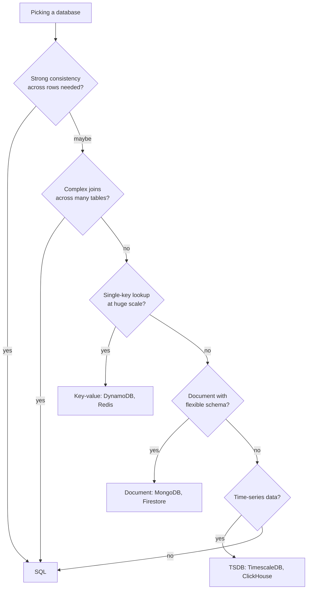

**Default**: SQL (Postgres). Don't pick NoSQL "for scale" unless you've actually outgrown Postgres or your access pattern genuinely doesn't fit.

→ [SQL vs NoSQL](../storage/sql-vs-nosql.md)
→ [Storage section overview](../storage/index.md)

---

## 2. REST, gRPC, or GraphQL?

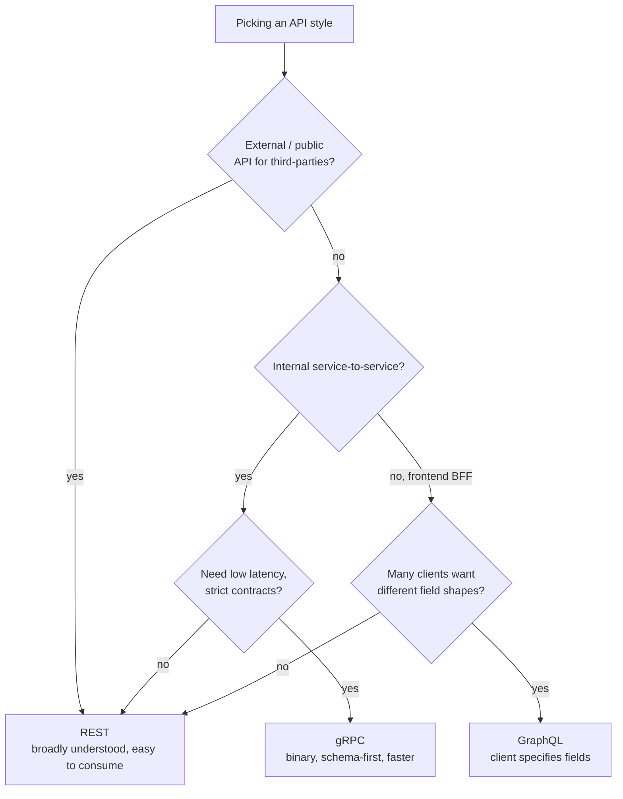

**Defaults**: REST for external, gRPC for service-to-service, GraphQL when frontend needs flexibility.

→ [REST vs gRPC vs GraphQL](../api/comparison.md)
→ [API Design overview](../api/index.md)

---

## 3. Queue, stream, or pub/sub?

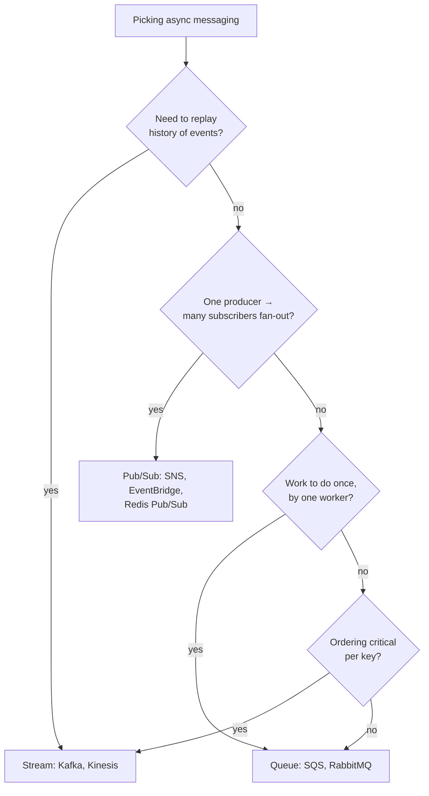

**Rule of thumb**: SQS for "do this work," SNS/EventBridge for "tell everyone," Kafka for "everything that happened, with replay."

→ [Message Queues](../messaging/message-queues.md)
→ [Pub/Sub](../messaging/pub-sub.md)
→ [Event Streaming](../messaging/event-streaming.md)

---

## 4. Sync, async, or scheduled?

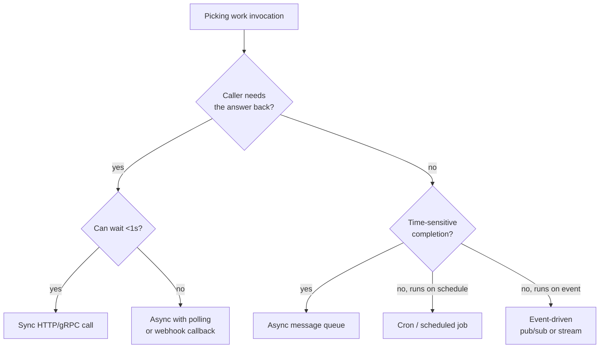

**Default**: sync only when caller actually needs the answer right now. Everything else is async-by-default.

→ [Choreography vs Orchestration](../architecture/choreography-vs-orchestration.md)
→ [Event-Driven Architecture](../architecture/event-driven.md)

---

## 5. Cache strategy?

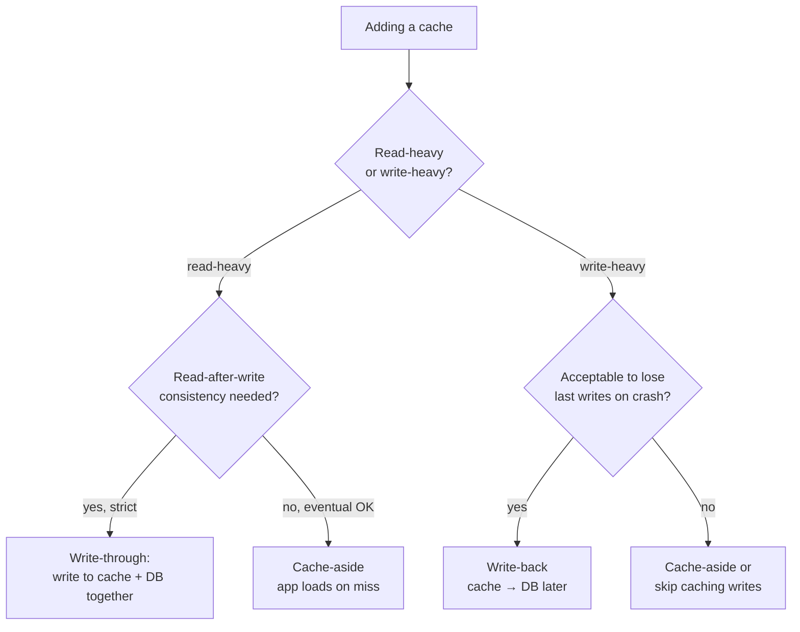

**Default**: cache-aside (lazy loading). Most common, simplest, eventual consistency. Add write-through only when strict read-after-write is required.

→ [Caching Strategies](../caching/caching-strategies.md)
→ [Cache Patterns & Pitfalls](../caching/cache-patterns.md)

---

## 6. Partition or shard?

The table is big — do you partition within one database, or shard across machines?

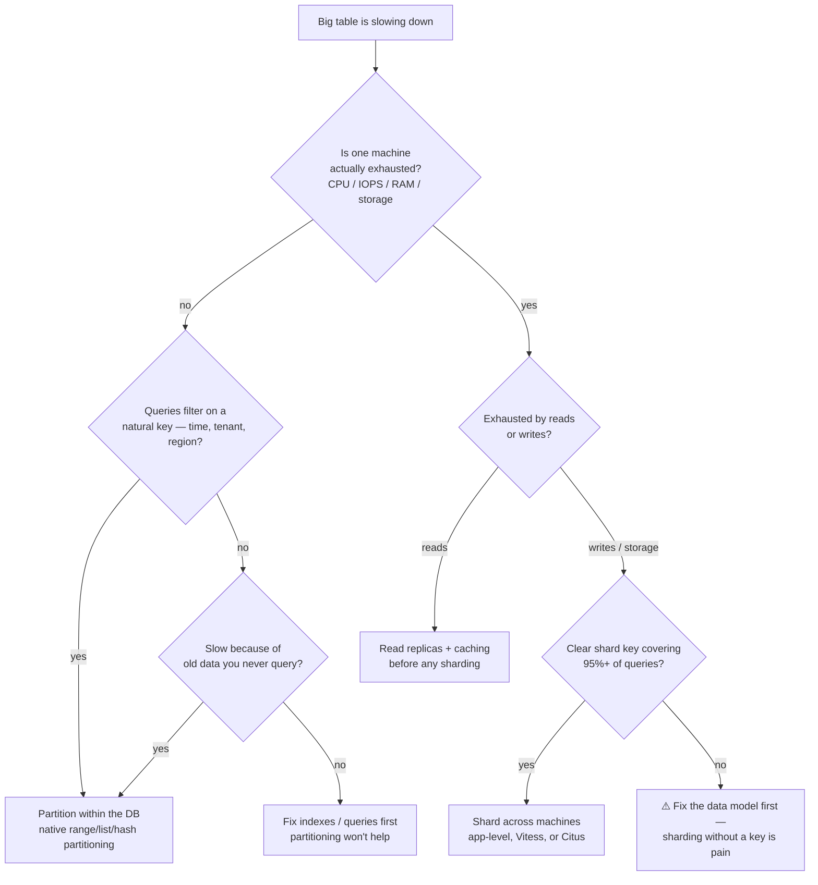

**Default order**: indexes/queries → partitioning → read replicas + cache → sharding. Each step is ~10x cheaper to operate than the next.

| | Partitioning (one DB) | Sharding (many machines) |
|---|---|---|
| **Solves** | Slow scans, bloated indexes, data lifecycle | One machine can't hold the load |
| **Routing** | DB does it — queries unchanged | App/proxy must route by shard key |
| **Joins & transactions** | Still work normally | Cross-shard = hard, redesign needed |
| **Ops cost** | Near zero (native feature) | High — migrations, rebalancing, per-shard failover |
| **Reach for it when** | Time-series, drop-old-data, query pruning | >5 TB or >10K write QPS with a clear key |

→ [Partitioning Fundamentals](../fundamentals/partitioning-fundamentals.md)
→ [Sharding](../patterns/sharding.md)
→ [Sharding Tooling (Vitess / Citus)](../patterns/sharding-tooling.md)

---

## 7. Sharding key — how do you partition?

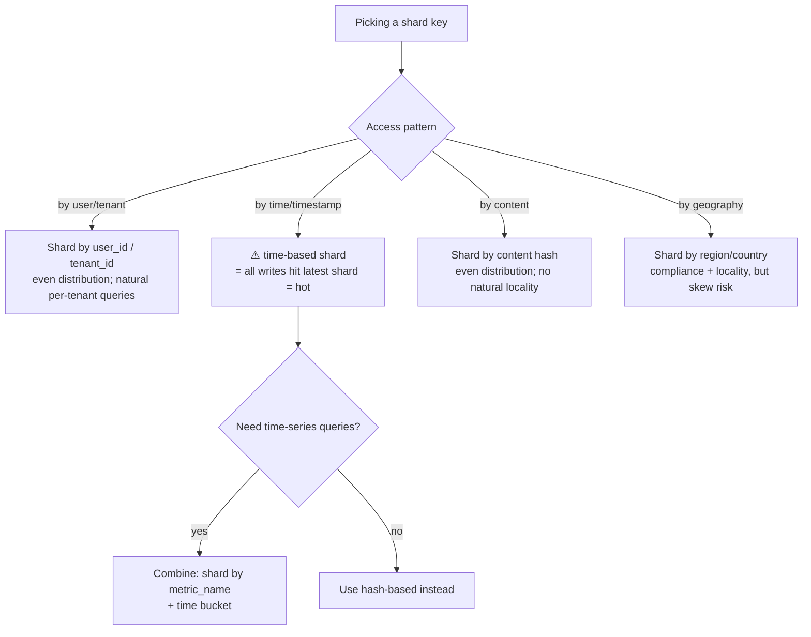

**Default**: hash of user_id or tenant_id. Time-based partitioning has hot-shard problems unless you sub-shard by metric/key.

→ [Sharding](../patterns/sharding.md)
→ [Consistent Hashing](../patterns/consistent-hashing.md)
→ [Hot Partitions](../fundamentals/hot-partitions.md)

---

## 8. Choreography or orchestration?

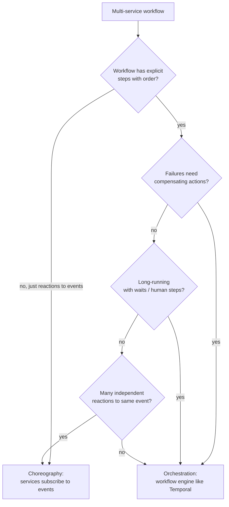

**Rule of thumb**: orchestration for explicit business workflows with rollback. Choreography for fan-out and decoupled reactions.

→ [Choreography vs Orchestration](../architecture/choreography-vs-orchestration.md)
→ [Saga Pattern](../patterns/saga-pattern.md)

---

## 9. Multi-region — active-active, active-passive, or single?

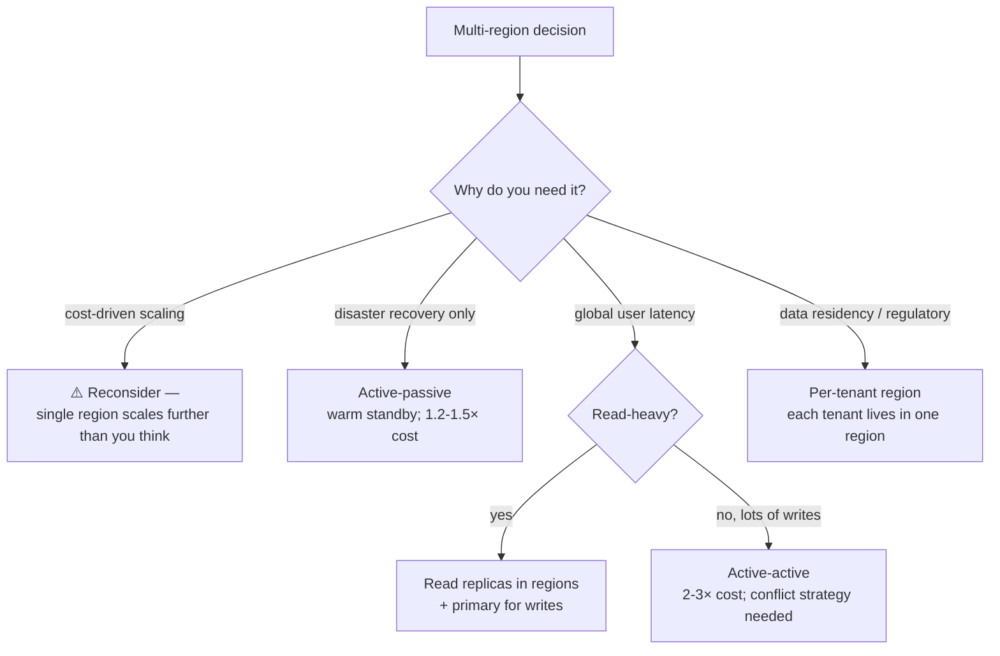

**Default**: stay single-region until you have a specific driver. Multi-region cost = 2-3×; complexity is much higher.

→ [Multi-Region Architecture](../architecture/multi-region.md)
→ [Edge Architecture](../architecture/edge-architecture.md)

---

## 10. Monolith, modular monolith, or microservices?

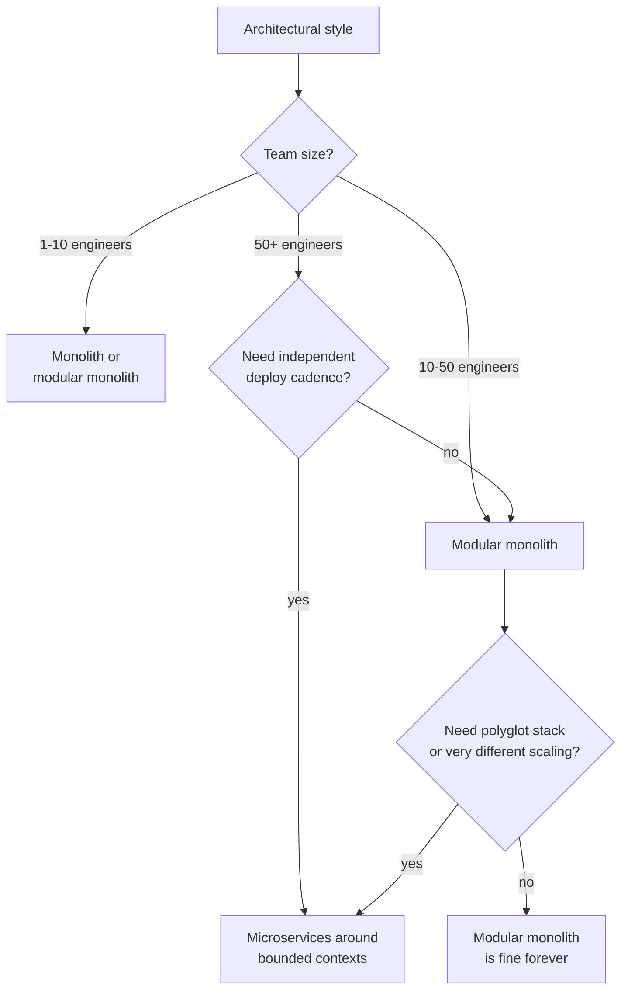

**Default for new builds**: modular monolith. Microservices are a destination, not a starting point.

→ [Monolith vs Microservices](../architecture/monolith-vs-microservices.md)
→ [Modular Monolith](../architecture/modular-monolith.md)

---

## 11. Lambda, Kappa, or just batch?

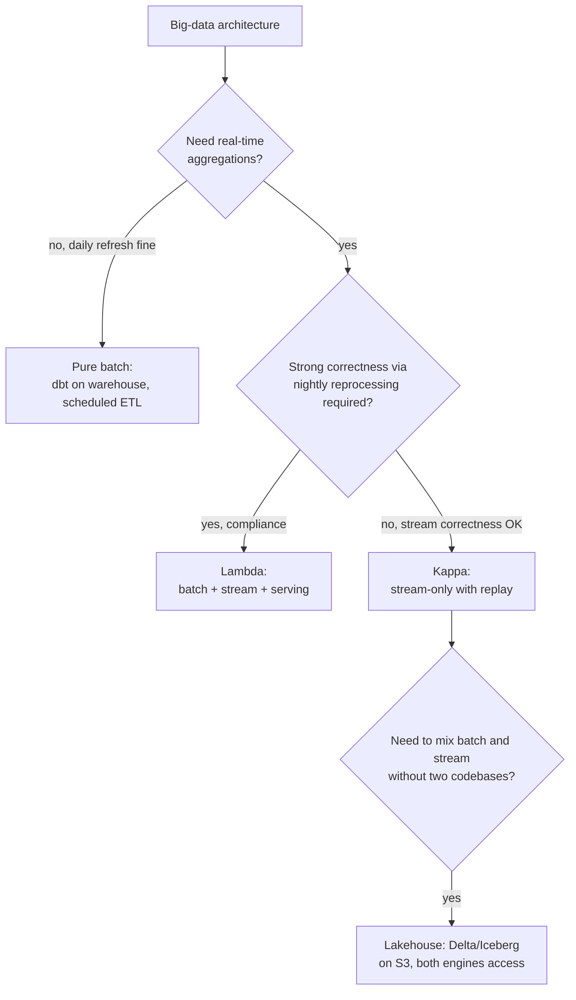

**Default for new builds (2026)**: Kappa with lakehouse storage. Lambda persists for legacy / compliance.

→ [Lambda & Kappa Architectures](../architecture/lambda-kappa-architectures.md)
→ [Data Warehousing](../storage/data-warehousing.md)

---

## How to use these flowcharts

```
1. Find the tree closest to your decision
2. Walk down it answering each question honestly
3. Land on a leaf — that's your default
4. Read the linked concept pages for depth on trade-offs
5. Adjust based on your specific context

Anti-pattern: treating a flowchart as gospel.
Reality: every "default" has exceptions; the tree helps you spot when you're choosing differently and why.
```

---

## What flowcharts can't capture

Some decisions resist a flowchart because the right answer depends on the **interaction** of multiple factors. For those, see:

- [Quality Attributes](../architecture/quality-attributes.md) — multi-dimensional trade-off analysis
- [ADRs](../architecture/adrs.md) — how to document non-trivial decisions
- [Architecture Styles Comparison](../architecture/styles-comparison.md) — side-by-side trade-off matrix
- [Practical Examples](../examples/index.md) — concepts combined in real scenarios

---

## Related

- [Symptom → Concept Lookup](symptom-lookup.md) — diagnostic complement to these decision tools
- [Practical Examples](../examples/index.md) — concepts applied in concrete scenarios
- [AWS Mapping](../aws/index.md) — once you've decided on a concept, what AWS service implements it
