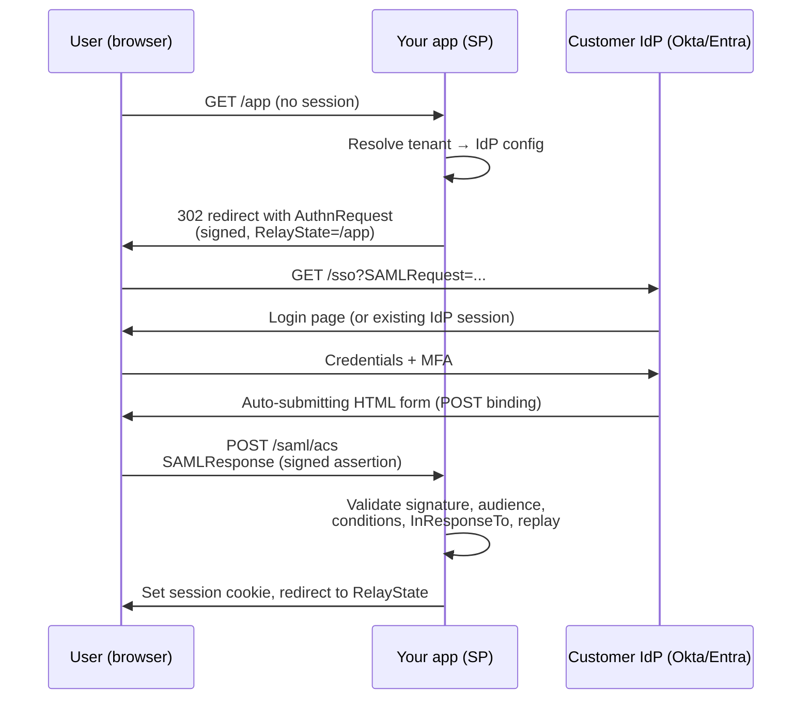
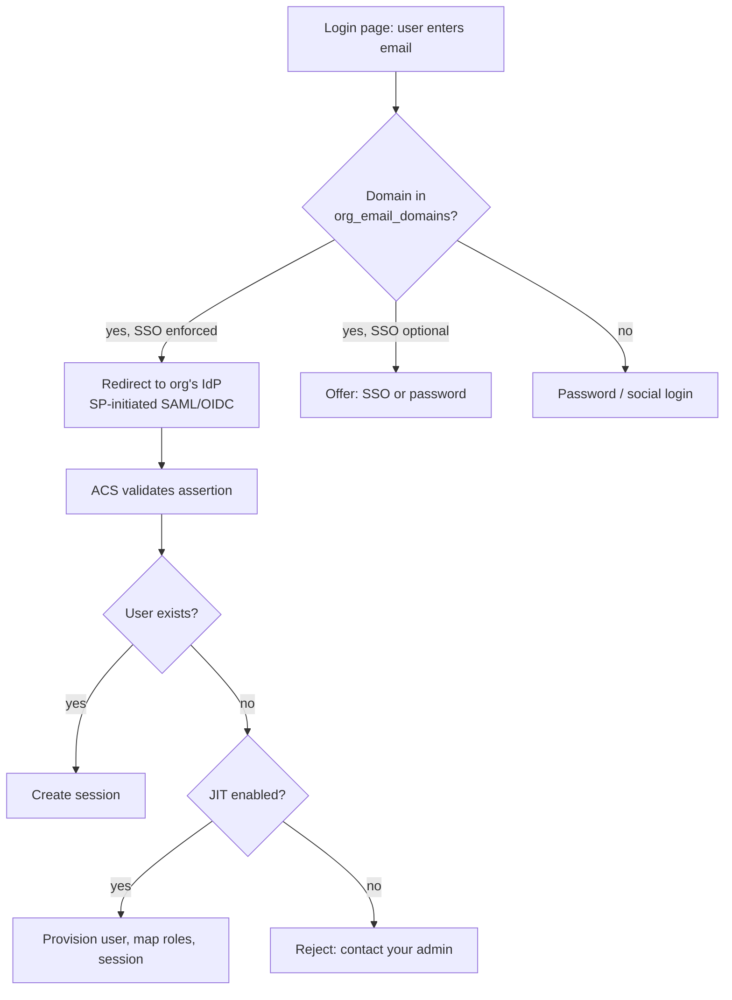

---
tags:
  - applied
  - for-saas
---

# Enterprise Auth (SSO, SAML, SCIM)

How B2B SaaS authenticates *companies*, not just users. SSO via SAML/OIDC, automated provisioning via SCIM, and the multi-tenant architecture that lets a thousand customers each bring their own identity provider. This is the feature set that unblocks enterprise deals — and the one most teams underestimate.

---

## You'll see this when...

- Sales says a six-figure deal is stuck because "their security team requires SSO" — and you only have email/password
- A customer's IT admin asks "do you support SCIM?" and your answer determines whether they renew
- An employee left a customer's company three months ago and **still has access** to their data in your app — because nobody told you
- Every enterprise security questionnaire asks: SAML? SCIM? SLO? Audit logs? IdP-initiated login?
- You hard-coded one Okta integration for your biggest customer and now the second customer uses Entra ID, the third uses Ping, and the fourth runs on-prem ADFS
- Your login page needs to know *which* identity provider to send a user to before the user has authenticated

---

## Why enterprise auth is a sales blocker

Enterprises don't manage employee access app-by-app. They centralise identity in an IdP (Okta, Microsoft Entra ID, Ping, OneLogin, Google Workspace) and require every vendor to integrate with it. The reasons are operational, not aesthetic:

```
Onboarding:    new hire gets access to 50 apps on day 1 via group membership
Offboarding:   terminated employee loses access to ALL apps in minutes (the big one)
Policy:        MFA, device posture, IP restrictions enforced once, at the IdP
Audit:         one place to answer "who can access what?"
Compliance:    SOC 2 / ISO 27001 access reviews become tractable
```

So "no SSO, no deal" is literal. Many enterprises have procurement checklists where SAML support is a hard gate. The follow-on asks arrive in a predictable order:

```
1. SSO (SAML or OIDC)         → table stakes; gates the deal
2. SCIM provisioning           → gates larger deals / renewals
3. Audit logs (exportable)     → security team requirement
4. SLO / session policies      → sophisticated buyers
```

A related anti-pattern is the **"SSO tax"** — charging 2-5× for the SSO tier. Know that buyers resent it (see sso.tax); whether to charge is a pricing decision, but architecturally you should build SSO as if every tenant will use it.

---

## SAML 2.0 — the protocol enterprises actually use

Security Assertion Markup Language. XML-based, born in 2005, and still the lingua franca of enterprise SSO in 2026. Two parties:

```
IdP (Identity Provider):  Okta, Entra ID, Ping — authenticates the user
SP (Service Provider):    your app — consumes the assertion
```

### SP-initiated flow (the common one)



### IdP-initiated flow

User clicks a tile in their IdP dashboard; the IdP POSTs an *unsolicited* assertion to your ACS endpoint. No `AuthnRequest`, so no `InResponseTo` to correlate — which removes one of your CSRF/replay defences. Enterprises expect it anyway (users live in the Okta dashboard). Support it, but apply stricter replay caching and consider converting it to an SP-initiated round-trip internally if your risk posture demands it.

### The assertion

The signed XML the IdP sends contains:

```xml
<saml:Assertion>
  <saml:Subject>
    <saml:NameID Format="...emailAddress">jane@customer.com</saml:NameID>
  </saml:Subject>
  <saml:Conditions NotBefore="..." NotOnOrAfter="...">
    <saml:AudienceRestriction>
      <saml:Audience>https://yourapp.com/saml/metadata</saml:Audience>
    </saml:AudienceRestriction>
  </saml:Conditions>
  <saml:AttributeStatement>
    <saml:Attribute Name="email">...</saml:Attribute>
    <saml:Attribute Name="groups">Engineering, Admins</saml:Attribute>
  </saml:AttributeStatement>
</saml:Assertion>
```

### Validation — where implementations go wrong

Every one of these checks is mandatory; most SAML CVEs come from skipping or mis-ordering them:

```
✓ Signature valid AND made with the certificate configured for THIS tenant
✓ Validate the signature BEFORE parsing/trusting any content
✓ Signature covers the assertion you actually consume (see signature wrapping below)
✓ Audience matches your SP entity ID
✓ NotBefore / NotOnOrAfter within clock-skew tolerance (±2-5 min)
✓ InResponseTo matches an AuthnRequest you issued (SP-initiated)
✓ Assertion ID not seen before (replay cache, TTL ≥ assertion validity)
✓ Destination/Recipient matches your ACS URL exactly
✓ Disable XML external entities (XXE) and DTDs in your parser
```

Never write your own SAML validation. Use a maintained library (`samlify`, `python3-saml`, Spring Security SAML, ruby-saml — and track their CVEs; ruby-saml and xml-crypto have both had signature-bypass advisories).

---

## OIDC — the modern alternative (and why SAML survives)

OpenID Connect: OAuth 2.0 + an ID token (JWT). JSON instead of XML, far smaller attack surface, libraries everywhere. If a customer's IdP supports OIDC, prefer it.

| | SAML 2.0 | OIDC |
|---|---|---|
| Format | Signed XML | Signed JWT (JSON) |
| Designed | 2005, browser-POST era | 2014, API/mobile era |
| Crypto pitfalls | Many (XML DSig, canonicalisation, wrapping) | Fewer (JWS; still check `alg`, `aud`, `iss`, `nonce`) |
| Mobile / SPA | Awkward | Native (PKCE) |
| Enterprise IdP support | Universal | Good and growing |
| Legacy/on-prem IdPs (ADFS, Shibboleth) | Yes | Often missing or limited |
| Procurement checklists | Explicitly required | Sometimes accepted as equivalent |

Why enterprises still demand SAML in 2026: decades of installed IdPs, security teams with SAML-shaped checklists, on-prem federation servers, and government/education sectors standardised on it. **Practical answer: support both.** Abstract "SSO connection" in your data model so a tenant's connection is `type: saml | oidc` and the rest of the app doesn't care.

---

## Multi-tenant SSO architecture

The hard part isn't the protocol — it's doing it for N customers, each with their own IdP, certificates, and attribute quirks.

### Per-org IdP configuration

```sql
CREATE TABLE sso_connections (
  id              uuid PRIMARY KEY,
  org_id          uuid NOT NULL REFERENCES orgs(id),
  type            text NOT NULL,          -- 'saml' | 'oidc'
  idp_entity_id   text,                   -- SAML
  idp_sso_url     text,
  idp_certificates jsonb,                 -- ARRAY: support cert rotation overlap
  oidc_issuer     text,                   -- OIDC: discovery from /.well-known
  oidc_client_id  text,
  oidc_client_secret_ref text,            -- pointer into secrets manager
  attribute_mapping jsonb,                -- email/name/groups claim names
  enforced        boolean DEFAULT false,  -- block password login for this org?
  created_at      timestamptz
);

CREATE TABLE org_email_domains (
  domain   text PRIMARY KEY,              -- 'customer.com'
  org_id   uuid NOT NULL,
  verified boolean DEFAULT false          -- DNS TXT verification!
);
```

Two details that bite later: store **multiple certificates** per connection (IdP cert rotation needs an overlap window), and **verify domain ownership** via DNS before routing a domain to a tenant — otherwise tenant A can claim `tenant-b.com` and intercept their logins.

### Home realm discovery (email-domain routing)

The login page must figure out where to send the user *before* authentication:



Alternatives to email-domain routing: per-org vanity login URLs (`acme.yourapp.com/login`), or an org picker. Most products do email-first; it's the smoothest UX and what Okta-trained users expect. Cache the domain→org lookup; it's on the hot path of every login.

---

## SCIM — provisioning is the other half

System for Cross-domain Identity Management. SSO answers "can this person log in *right now*"; SCIM answers "which users and groups should exist in your app at all". The IdP **pushes** changes to a REST API you host:

```
POST   /scim/v2/Users          create user (hire)
GET    /scim/v2/Users?filter=userName eq "jane@customer.com"
PATCH  /scim/v2/Users/{id}     update attributes, set active:false  ← offboarding
DELETE /scim/v2/Users/{id}     hard deprovision
POST   /scim/v2/Groups         create group
PATCH  /scim/v2/Groups/{id}    add/remove members
```

```json
// PATCH from Okta when an employee is terminated
{
  "schemas": ["urn:ietf:params:scim:api:messages:2.0:PatchOp"],
  "Operations": [
    { "op": "replace", "value": { "active": false } }
  ]
}
```

### Deprovisioning is the security-critical path

This is the entire reason enterprises buy SCIM. When HR terminates someone, the IdP deactivates them everywhere within minutes. Your obligations:

```
✓ active:false must take effect IMMEDIATELY — not at next login
✓ Revoke live sessions and refresh tokens for the user (requires a
  server-side session store or short-lived tokens + revocation list)
✓ Revoke the user's API keys / personal access tokens (often forgotten —
  the laptop is locked but the PAT in a script still works)
✓ Soft-delete, don't destroy: preserve audit history and authored content
✓ Log the deprovision event with timestamp — auditors will ask for it
```

Failure mode that loses renewals: customer's security team runs an access review, finds an employee who left in March still active in your app in June. That's a finding *against the customer* caused by *your* missing/broken SCIM.

### JIT provisioning vs SCIM

| | JIT (create on first SSO login) | SCIM |
|---|---|---|
| Build cost | Trivial (piggybacks on assertion) | Real API surface + IdP gallery testing |
| User created | At first login | Before first login |
| User **removed** | Never — only blocked at next login attempt | Within minutes of termination |
| Live sessions/API keys on offboard | Untouched | Revoked (if you do it right) |
| Group sync | Snapshot at login time only | Continuous |
| Enterprise acceptability | Fine for mid-market | Required by serious security teams |

JIT is the right v1 — ship it with SSO. But be honest in security reviews: JIT alone means deprovisioning depends on the IdP blocking the *next* login, while existing sessions and tokens survive. SCIM (plus session revocation) closes that hole. Most mature products run **both**: SCIM as source of truth, JIT as fallback for attributes.

---

## Role mapping: IdP groups → app roles

Enterprises manage access via IdP groups (`App-YourProduct-Admins`). Map them, per tenant, to your roles:

```json
// per-org mapping config
{
  "group_mappings": [
    { "idp_group": "yourapp-admins",  "app_role": "org_admin" },
    { "idp_group": "engineering",     "app_role": "editor" }
  ],
  "default_role": "viewer",
  "strategy": "idp_authoritative"   // or "app_managed"
}
```

Decisions to make explicit:

```
Sync timing:      at SSO login (snapshot) vs SCIM group PATCH (continuous)
Authority:        does IdP mapping OVERWRITE in-app role changes? (pick one;
                  "idp_authoritative" is cleaner but admins will be surprised
                  when their manual change reverts at next sync)
Multiple groups:  user in two mapped groups → highest role wins (document it)
Unmapped user:    default role vs reject login (let the org admin choose)
```

---

## Sessions, logout, and SLO

SSO creates **two sessions**: the IdP's and yours. They drift apart, and logout becomes genuinely hard.

```
Your session expires, IdP session alive  → user bounces through IdP, silently
                                           back in. Feels like "never logged out".
User logs out of your app                → IdP session survives; clicking the
                                           Okta tile logs them straight back in.
IdP terminates the user                  → your session knows nothing (unless
                                           SCIM deactivation revokes sessions,
                                           or you re-validate periodically).
```

Single Logout (SLO) — the SAML protocol where logout propagates across all SPs — exists but is the least reliable part of the spec: front-channel SLO dies if any SP in the chain errors, back-channel SLO is patchily implemented across IdPs. Pragmatic stance in 2026:

```
1. Local logout always works: kill YOUR session server-side
2. Honour IdP-initiated SLO requests if sent (kill local session)
3. Don't promise full SLO orchestration in security questionnaires
4. Lean on short sessions + SCIM deactivate-revokes-sessions for the
   security property people actually want (terminated user is out)
5. Let org admins configure max session length per tenant — a common
   enterprise policy requirement
```

Server-side sessions (or short JWTs + revocation) are non-negotiable here; you cannot revoke a stateless 24h JWT when SCIM says `active:false`.

---

## Build vs buy

| Option | What you get | Watch out for |
|---|---|---|
| **WorkOS** | SSO + SCIM + audit logs as API; per-connection pricing; admin portal for customer IT | Per-connection cost at scale; another vendor in the auth path |
| **Auth0 (Okta)** | Full CIAM: SAML/OIDC, orgs, MFA, rules | Pricing jumps hard at enterprise tiers; orgs model has limits; you still build SCIM or pay for it |
| **Keycloak** | Open-source, self-hosted, full SAML/OIDC broker, themes | You operate it (HA, upgrades, CVE patching); multi-tenant realm strategy is a project in itself |
| **AWS Cognito** | Cheap, AWS-native, SAML/OIDC federation per user pool | The weak option for B2B SSO: clunky multi-IdP-per-app story, **no SCIM server**, hosted UI inflexible, hard quotas, painful migration out (password hashes locked in) |
| **DIY on libraries** | Full control; no per-seat tax | You own SAML CVE response forever; SCIM conformance testing against Okta/Entra/Ping is weeks of work; every IdP has quirks |

Rule of thumb: if enterprise SSO is a *checkbox* for your product, buy (WorkOS-style). If identity is *core* to your product, or you have hundreds of connections where per-connection pricing breaks, consider Keycloak or DIY — and budget a standing owner, not a one-off project.

---

## Audit logging expectations

Enterprise buyers expect an exportable trail of auth events. Minimum set:

```
login.succeeded / login.failed (with method: sso|password, connection id)
sso_connection.created / updated / certificate_rotated
scim.user_provisioned / scim.user_deactivated / scim.group_synced
role.changed (actor, target, old → new)
session.revoked, api_key.created / revoked
```

Each event: actor, target, org, timestamp, IP, result. Buyers increasingly ask for **streaming export** to their SIEM (Splunk/Datadog) — not just a UI. Retention: 1 year visible, longer archived. See [Compliance & Regulatory Engineering](compliance-regulatory-engineering.md) for storage patterns (immutable, separate account).

---

## Common SAML vulnerabilities

**XML Signature Wrapping (XSW).** The classic. Attacker takes a validly-signed assertion and wraps it: the signed assertion is moved somewhere the signature check still finds it, while a *forged, unsigned* assertion sits where the application reads identity from. Validator says "signature OK", app reads attacker's `NameID`.

```
Defence:
  - Use a library hardened against XSW (and keep it patched)
  - After signature validation, extract identity ONLY from the exact
    node the signature covered — never re-query the document by tag name
  - Reject responses with more than one Assertion
  - Disable DTDs/XXE in the XML parser
```

**Replay.** A captured assertion is POSTed again. Defence: replay cache on assertion ID (TTL ≥ validity window), tight `NotOnOrAfter`, `InResponseTo` correlation for SP-initiated flows. IdP-initiated flows lack `InResponseTo` — replay caching does the heavy lifting there.

**Others worth knowing:** accepting unsigned responses when "signature optional" is misconfigured; validating against *any* known cert instead of the tenant's cert (tenant A's IdP forging assertions for tenant B — a multi-tenant-specific bug); comment-injection NameID parsing bugs (the 2018 Duo-disclosed class); open RelayState redirects.

---

## Anti-patterns

| Anti-pattern | Why it hurts | Better |
|---|---|---|
| Hand-rolled SAML XML validation | XSW, XXE, canonicalisation bugs — the CVE list writes itself | Maintained library, patched aggressively, conformance-tested |
| One global IdP config (built for first big customer) | Second customer's Entra ID config collides; cert rotation breaks everyone | Per-org `sso_connections` from day one |
| Validating signature against any trusted cert | Tenant A's IdP can mint assertions for tenant B | Resolve tenant first, validate against that tenant's cert only |
| JIT-only and calling it "provisioning" in security reviews | Terminated users keep live sessions and API keys | SCIM with deactivate → revoke sessions + tokens |
| Stateless 24h JWTs with SSO | Nothing to revoke when SCIM says `active:false` | Server-side sessions or short tokens + revocation list |
| Unverified email-domain → org routing | Domain squatting steals another tenant's logins | DNS TXT verification before routing |
| Storing one IdP certificate | Customer rotates cert → hard outage for their whole org | Cert array, overlap window, expiry alerts to org admin |
| Promising full SLO in questionnaires | SAML SLO is unreliable across IdPs; you'll fail the customer's test | Local logout + IdP-initiated SLO honoured + session policies |
| Manual CSV "provisioning" for enterprise org | Doesn't survive the customer's access review | SCIM, or at least JIT + scheduled IdP reconciliation |

---

## Quick reference

| Need | Reach for |
|---|---|
| SSO checkbox fast, B2B SaaS | WorkOS (or Auth0 Organizations); SAML + OIDC behind one abstraction |
| Self-hosted / cost control at many connections | Keycloak (budget an operator) |
| Customer asks "do you support Okta/Entra/Ping?" | SAML 2.0 SP + OIDC RP, per-org connection config |
| Which user goes to which IdP | Home realm discovery: verified email domain → org → connection |
| Auto user lifecycle, instant offboarding | SCIM v2 server; `active:false` → revoke sessions + API keys |
| Quick v1 of provisioning | JIT from SAML/OIDC attributes; upgrade to SCIM later |
| IdP groups should drive app permissions | Per-org group→role mapping, explicit authority strategy |
| "Terminated employee still had access" incident | SCIM deprovision path + session revocation + PAT revocation audit |
| Security questionnaire: audit logs | Append-only auth event log, SIEM export, 1yr+ retention |
| SAML library choice | Battle-tested lib, XSW-hardened, DTD/XXE disabled, CVE watch |

---

## Interview angle

!!! tip "What interviewers are testing"
    Whether you understand that enterprise auth is a *multi-tenant systems problem* (per-org IdP config, discovery, lifecycle) rather than "add a SAML library" — and whether you know that deprovisioning, not login, is the security-critical path.

**Strong answer pattern:**

1. Frame the business driver: enterprise buyers centralise identity; SSO gates the deal, SCIM gates the renewal
2. Model it multi-tenant from the start: `sso_connections` per org, verified email-domain routing (home realm discovery)
3. Support SAML *and* OIDC behind one abstraction; explain why SAML persists (installed IdP base, procurement checklists)
4. Enumerate assertion validation: tenant-scoped signature, audience, conditions, `InResponseTo`, replay cache; name XSW as the attack class
5. Provisioning: JIT for v1, SCIM for real lifecycle; deprovision must revoke live sessions and API keys, not just block next login
6. Sessions: server-side/revocable, per-tenant session policies; honest about SLO unreliability
7. Build vs buy with a clear rule: checkbox feature → buy; identity-core or connection-count economics → own it

**Common follow-ups:**

- *"User logs in via SSO but their IdP account was just disabled — what happens?"* → Depends on the gap you've engineered: with SCIM, the `active:false` PATCH already revoked their session, so nothing to exploit. With JIT-only, their existing session survives until expiry — which is why I keep sessions short and revocable, and why I'd flag JIT-only as a known risk in a security review.
- *"How do you onboard a new customer's IdP without an engineer in the loop?"* → Self-serve admin portal: org admin uploads IdP metadata XML (or OIDC discovery URL), we parse entity ID/SSO URL/certs, they verify their email domain via DNS TXT, run a test login, then optionally enforce SSO for the org. This is exactly what WorkOS/Auth0 admin portals productise.
- *"Why is IdP-initiated SAML riskier than SP-initiated?"* → No `AuthnRequest`, so no `InResponseTo` correlation — an unsolicited assertion is harder to distinguish from a replayed or injected one. Mitigate with strict replay caching and tight validity windows, or convert to an SP-initiated flow internally.
- *"Where does multi-tenancy make SAML validation harder?"* → Certificate scoping. The bug class is validating a signature against the global set of trusted certs instead of *this tenant's* cert — letting one tenant's IdP forge assertions for another. Resolve tenant before validating, validate only against that tenant's certs.

---

## Test yourself

??? question "Why does SAML persist in 2026 when OIDC is technically superior on almost every axis?"

    Installed base and procurement, not technology. Enterprises have decades of IdP investment (ADFS, Shibboleth, older Okta/Ping configs), security teams with SAML-shaped review checklists, and sectors (government, education, healthcare) standardised on SAML federation. A vendor that supports only OIDC fails checklists regardless of technical merit. The practical architecture is both protocols behind a single per-org "SSO connection" abstraction, preferring OIDC when the customer's IdP supports it.

??? question "What is XML Signature Wrapping and what are the two key defences?"

    XSW exploits the gap between *where the signature validator looks* and *where the application reads identity from*. The attacker relocates a validly-signed assertion within the document and inserts a forged assertion at the position the app parses — signature check passes, app trusts attacker-controlled data. Defences: (1) use a maintained, XSW-hardened SAML library with DTDs/XXE disabled; (2) after validation, extract identity only from the exact node the signature covered — never re-query the DOM by tag name — and reject documents containing multiple assertions.

??? question "A customer's employee was terminated this morning. Walk through what should happen in your app under JIT-only vs SCIM."

    JIT-only: nothing happens proactively. The user's existing session, refresh tokens, and personal API keys all keep working. They're only blocked when their session expires and the next SSO attempt fails at the IdP — potentially hours or days of residual access. SCIM: the IdP PATCHes `active:false` within minutes; your handler must deactivate the account, revoke all live sessions and refresh tokens, revoke API keys/PATs, soft-delete (preserving audit history), and write an audit event. The session/token revocation step is the part teams most often miss — deactivating the DB row alone doesn't end a live session.

??? question "Why must SSO sessions be revocable server-side, and what does that rule out?"

    Because the two security-critical events — SCIM deactivation and admin-forced logout — happen *between* logins. A stateless long-lived JWT can't be invalidated; the bearer keeps access until expiry no matter what the IdP or SCIM says. That rules out the "24h self-contained JWT, no session store" design. Acceptable options: server-side sessions (cookie → session store lookup), or short-lived access tokens (minutes) with revocable refresh tokens, plus a revocation list checked on refresh.

??? question "How does home realm discovery work, and what's the security prerequisite people skip?"

    The login page collects an email first, extracts the domain, looks it up in a domain→org table, and routes the user to that org's IdP (SP-initiated) — or falls back to password login if no mapping exists. The skipped prerequisite is **domain ownership verification** (DNS TXT record) before activating the mapping. Without it, a malicious tenant claims a competitor's domain and silently receives their users' login attempts — a cross-tenant phishing primitive you built yourself.

---

## Related

- [AuthN & AuthZ](../security/authn-authz.md) — the foundations under SSO
- [OAuth 2.0 & JWT](../security/oauth-jwt.md) — OIDC builds on these
- [Multi-Tenancy](../architecture/multi-tenancy.md) — per-org config and isolation patterns
- [Compliance & Regulatory Engineering](../security/compliance-regulatory-engineering.md) — audit logs, SOC 2 access reviews
- [API Security](../security/api-security.md) — protecting the SCIM endpoint and API keys
