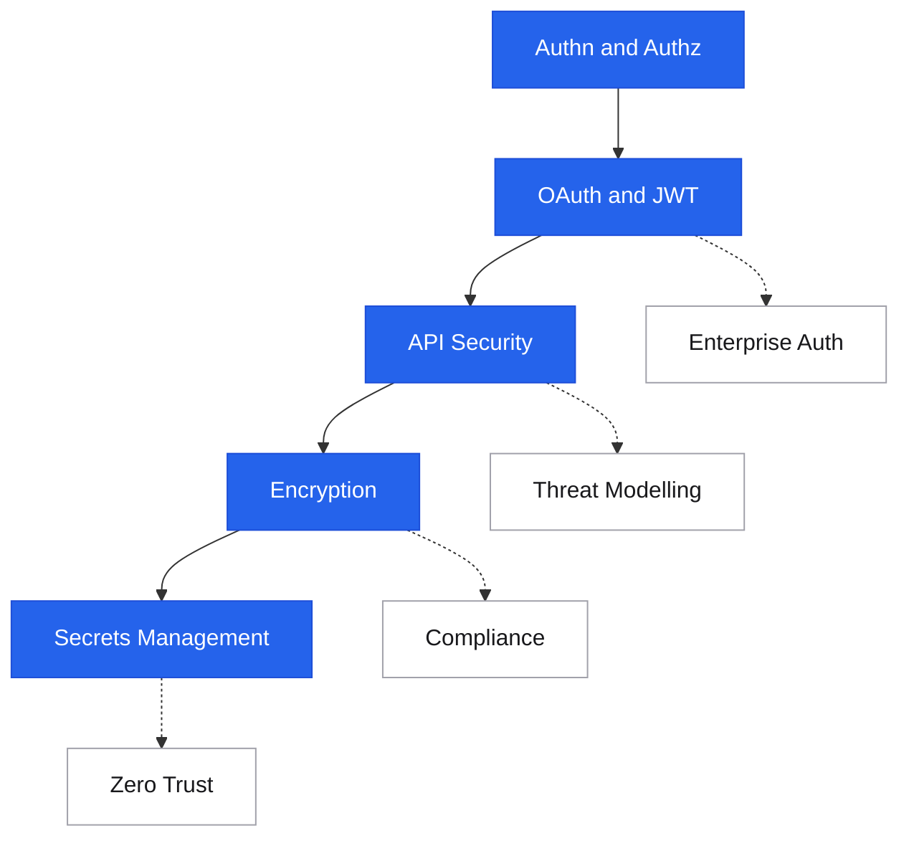

# Security

<div class="sec-hero" markdown>
<span class="ey">Reliability & Operations · defense</span>
Security is not a feature you bolt on after the fact. It's a property of the system's design — how access is controlled, how data is protected, how trust is established between services. Getting this wrong has irreversible consequences: breached user data, regulatory fines, or complete system compromise.
</div>

## Roadmap

Follow the spine top-to-bottom your first time. Dashed branches hang off the topic they support — grab them when you need them.

<div class="sd-mermaid-links" data-links='{
  "Authn and Authz": "authn-authz/",
  "OAuth and JWT": "oauth-jwt/",
  "API Security": "api-security/",
  "Encryption": "encryption/",
  "Secrets Management": "secrets-management/",
  "Enterprise Auth": "enterprise-auth/",
  "Compliance": "compliance-regulatory-engineering/",
  "Zero Trust": "zero-trust/",
  "Threat Modelling": "threat-modelling/"
}'></div>



## Core security topics

Identity, tokens, API surface, data protection, and the keys to all of it.

<div class="pcards">
<a class="pcard" href="authn-authz/"><span class="t">Authentication & Authorization</span><span class="d">Who you are vs what you're allowed to do — RBAC, ABAC, session management</span></a>
<a class="pcard" href="oauth-jwt/"><span class="t">OAuth 2.0 & JWT</span><span class="d">Delegated authorization, token flows, JWT validation, refresh tokens</span></a>
<a class="pcard" href="api-security/"><span class="t">API Security</span><span class="d">Input validation, injection prevention, OWASP API Top 10</span></a>
<a class="pcard" href="encryption/"><span class="t">Encryption</span><span class="d">At-rest and in-transit encryption, key management, envelope encryption</span></a>
<a class="pcard" href="zero-trust/"><span class="t">Zero Trust</span><span class="d">Never trust, always verify — beyond the perimeter model</span></a>
<a class="pcard" href="secrets-management/"><span class="t">Secrets Management</span><span class="d">Vaults, rotation, avoiding credential sprawl</span></a>
</div>

## Going deeper

Enterprise-scale auth, regulatory engineering, and proactive threat work.

<div class="pcards">
<a class="pcard" href="enterprise-auth/"><span class="t">Enterprise Auth</span><span class="d">SAML, SSO, SCIM, directory integration at org scale</span></a>
<a class="pcard" href="compliance-regulatory-engineering/"><span class="t">Compliance & Regulatory Engineering</span><span class="d">Building systems that satisfy SOC 2, GDPR, PCI</span></a>
<a class="pcard" href="threat-modelling/"><span class="t">Threat Modelling</span><span class="d">STRIDE and reasoning about attackers before they show up</span></a>
</div>

## Suggested reading order

New to this topic? Read these in order — each builds on the previous:

1. [Authentication & Authorization](authn-authz.md) — who you are vs what you may do; the foundation everything else assumes
2. [OAuth 2.0 & JWT](oauth-jwt.md) — the standard token machinery built on those authn/authz concepts
3. [API Security](api-security.md) — applying auth plus input validation at your real attack surface
4. [Encryption](encryption.md) — protecting data in transit and at rest once access is controlled
5. [Secrets Management](secrets-management.md) — keeping the keys to all of the above out of code and logs

**Then, as needed (reference):** [Enterprise Auth](enterprise-auth.md), [Compliance & Regulatory Engineering](compliance-regulatory-engineering.md)

**Advanced — come back later:** [Zero Trust](zero-trust.md), [Threat Modelling](threat-modelling.md)

---

## The security model layers

```
Defense in depth: every layer assumes the layers above it can fail

Layer 1: Identity & Access
  ├── Authentication (who are you?)
  │     → Passwords + MFA, OAuth 2.0 tokens, API keys, mTLS
  └── Authorization (what can you do?)
        → RBAC, ABAC, policy engines (OPA, Cedar)

Layer 2: API & Network Surface
  ├── Input validation (reject malformed input before it reaches logic)
  ├── Rate limiting (prevent abuse and enumeration)
  ├── TLS everywhere (encrypt in transit)
  └── Zero Trust (never trust by network position alone)

Layer 3: Data Protection
  ├── Encryption at rest (AES-256, envelope encryption)
  ├── Encryption in transit (TLS 1.2+, certificate pinning)
  └── Data minimization (don't store what you don't need)

Layer 4: Secrets & Credentials
  ├── Secrets vaults (Vault, AWS Secrets Manager)
  ├── Rotation (credentials should expire and rotate)
  └── No credentials in code, environment vars, or logs
```

---

## Topics in this section

| Topic | What it covers | When it matters |
|---|---|---|
| [Authentication & Authorization](authn-authz.md) | Who you are vs what you're allowed to do — RBAC, ABAC, session management | Every system that has users or services |
| [OAuth 2.0 & JWT](oauth-jwt.md) | Delegated authorization, token flows, JWT validation, refresh tokens | Third-party auth, SSO, mobile apps |
| [API Security](api-security.md) | Input validation, injection prevention, OWASP API Top 10 | Public APIs, user-facing endpoints |
| [Encryption](encryption.md) | At-rest and in-transit encryption, key management, envelope encryption | Storing sensitive data, regulatory compliance |
| [Zero Trust](zero-trust.md) | Never trust, always verify — beyond the perimeter model | Microservices, remote work, cloud-native |
| [Secrets Management](secrets-management.md) | Vaults, rotation, avoiding credential sprawl | Any service with API keys, DB passwords, or certificates |

---

## Common attack surface

```
Input attacks
  ├── SQL injection   → parameterized queries, ORM, never string concat
  ├── XSS            → escape output, Content-Security-Policy header
  ├── Command injection → avoid shell execution, validate args
  └── SSRF           → allowlist internal endpoints, block 169.254/metadata

Auth attacks
  ├── Broken auth     → brute force, credential stuffing → rate limit + MFA
  ├── Insecure JWT    → validate signature + expiry + audience + issuer
  └── Privilege escalation → authorization checks on every action, not just login

API attacks
  ├── Mass assignment → explicitly allowlist fields, don't bind all request params
  ├── IDOR           → check ownership, don't trust user-supplied IDs
  └── Excessive data → return only what client needs, not full DB objects

Supply chain
  ├── Dependency vulnerabilities → pin versions, audit with `npm audit` / `pip-audit`
  └── Secret leakage in code    → git-secrets, pre-commit hooks, secret scanning
```

---

## Interview shortlist

| Question | Key answer |
|---|---|
| *"How does OAuth 2.0 work?"* | Authorization server issues short-lived access token to client after user consents. Client presents token to resource server. Token contains scopes — resource server validates without calling auth server (JWT). |
| *"JWT vs opaque tokens — when to use each?"* | JWT: stateless validation (no DB lookup), good for microservices. Opaque: revocable (check DB), better for long-lived sessions where revocation matters. |
| *"How do you prevent IDOR?"* | Authorization on every action: does this user own this resource? Don't use sequential numeric IDs externally (use UUIDs). Log access for audit. |
| *"What is Zero Trust?"* | No implicit trust based on network position. Every request authenticated + authorized. mTLS between services. Least privilege. Assume breach: segment and audit. |
| *"How do you handle secrets in a microservices environment?"* | Central vault (HashiCorp Vault, AWS Secrets Manager). Dynamic secrets with short TTLs. Sidecar injection (Vault Agent). Never in code, env vars, or config files committed to git. |

---

## Related topics

- [Networking: API Gateway](../networking/api-gateway.md) — auth + rate limiting at the edge
- [API Design: API Security](../api/comparison.md) — protocol-level security considerations
- [Infrastructure: Service Mesh](../infrastructure/service-mesh.md) — mTLS between services
- [AWS: Security](../aws/security.md) — IAM, KMS, Secrets Manager, WAF on AWS
