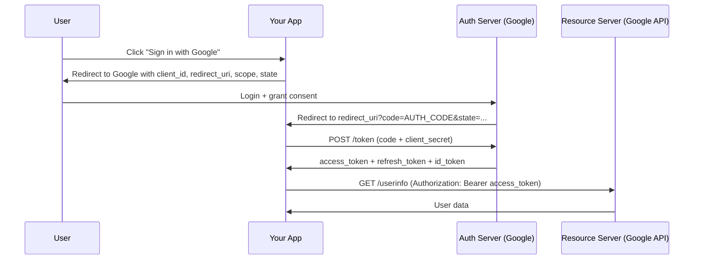

# OAuth 2.0 and JWT

## OAuth 2.0

OAuth 2.0 is an authorization framework that lets a user grant a third-party application limited access to their account without sharing credentials.

```
Scenario: "Sign in with Google" on your app

Without OAuth: "Give me your Gmail password"
  → Terrible for users, stores credentials everywhere

With OAuth:
  → User proves identity to Google (trusted)
  → Google issues token to your app
  → Your app uses token to access allowed resources
  → User can revoke at any time, without changing their password
```

### Key roles

| Role | Description |
|---|---|
| **Resource Owner** | The user who owns the data |
| **Resource Server** | The API that holds the data (Google APIs, GitHub API) |
| **Authorization Server** | Issues tokens after user consent (Google Auth, Auth0, Cognito) |
| **Client** | Your application requesting access |

### Authorization Code Flow (for web apps)

The most secure and common flow:



```python
# FastAPI OAuth 2.0 with Google
from authlib.integrations.starlette_client import OAuth

oauth = OAuth()
oauth.register(
    name='google',
    client_id=os.getenv('GOOGLE_CLIENT_ID'),
    client_secret=os.getenv('GOOGLE_CLIENT_SECRET'),
    server_metadata_url='https://accounts.google.com/.well-known/openid-configuration',
    client_kwargs={'scope': 'openid email profile'}
)

@app.get('/auth/google')
async def login_google(request: Request):
    redirect_uri = request.url_for('auth_callback')
    return await oauth.google.authorize_redirect(request, redirect_uri)

@app.get('/auth/callback')
async def auth_callback(request: Request):
    token = await oauth.google.authorize_access_token(request)
    user_info = token.get('userinfo')
    
    # Create or find user in your DB
    user = await db.find_or_create_user(
        email=user_info['email'],
        name=user_info['name'],
        google_id=user_info['sub']
    )
    
    # Create your own session/JWT for this user
    access_token = create_jwt(user.id)
    return {"access_token": access_token}
```

### PKCE (Proof Key for Code Exchange)

For mobile apps and SPAs that can't store a client_secret securely:

```
Without PKCE: Authorization Code can be stolen in redirect
  → Attacker intercepts code → exchanges for tokens

With PKCE:
  1. App generates: code_verifier = random 32 bytes
  2. App computes: code_challenge = base64url(SHA256(code_verifier))
  3. App sends code_challenge in auth request
  4. Auth server stores code_challenge
  5. App sends code + code_verifier to get token
  6. Auth server: SHA256(code_verifier) == stored code_challenge? → issue token
  → Attacker who intercepts code doesn't have code_verifier → useless
```

### Client Credentials Flow (machine-to-machine)

No user involved — service A authenticates as itself to call service B:

```python
import httpx

async def get_service_token() -> str:
    response = await httpx.post(
        "https://auth.example.com/oauth/token",
        data={
            "grant_type": "client_credentials",
            "client_id": CLIENT_ID,
            "client_secret": CLIENT_SECRET,
            "scope": "orders:read payments:write",
        }
    )
    return response.json()["access_token"]

# Cache the token, refresh when expired
class TokenCache:
    def __init__(self):
        self._token = None
        self._expires_at = 0
    
    async def get_token(self) -> str:
        if time.time() > self._expires_at - 60:  # refresh 60s early
            token_data = await fetch_new_token()
            self._token = token_data["access_token"]
            self._expires_at = time.time() + token_data["expires_in"]
        return self._token
```

## JWT (JSON Web Token)

JWT is a compact, self-contained token format for transmitting claims between parties.

### Structure

```
eyJhbGciOiJSUzI1NiIsInR5cCI6IkpXVCJ9.    ← Header
eyJzdWIiOiJ1c3JfMTIzIiwibmFtZSI6IkFsaWNlIiwiaWF0IjoxNzE0MTM3NjAwLCJleHAiOjE3MTQxNDA2MDB9.  ← Payload
[signature]                                  ← Signature

Decoded:
Header:  {"alg": "RS256", "typ": "JWT"}
Payload: {
  "sub": "usr_123",         ← subject (user ID)
  "name": "Alice",
  "email": "alice@example.com",
  "role": "customer",
  "iat": 1714137600,        ← issued at
  "exp": 1714141200,        ← expires at (1 hour later)
  "iss": "https://auth.example.com",  ← issuer
  "aud": "order-service"    ← audience
}
Signature: RS256(base64(header) + "." + base64(payload), private_key)
```

### JWT signing algorithms

| Algorithm | Key type | Use case |
|---|---|---|
| **HS256** | Shared secret (HMAC) | Single service; simple |
| **RS256** | RSA key pair | Multiple services; issuer signs, anyone with public key verifies |
| **ES256** | ECDSA key pair | Like RS256 but smaller keys, faster |

**RS256 for microservices:**
```
Auth Service has private key → signs JWTs
All other services have public key → verify JWTs
→ Services can verify without calling Auth Service
→ Horizontal scalability
```

### Creating JWTs

```python
import jwt
from datetime import datetime, timedelta, timezone
from cryptography.hazmat.primitives import serialization

# Load RSA keys
with open("private_key.pem", "rb") as f:
    PRIVATE_KEY = serialization.load_pem_private_key(f.read(), password=None)

with open("public_key.pem", "rb") as f:
    PUBLIC_KEY = serialization.load_pem_public_key(f.read())

def create_access_token(user: User) -> str:
    now = datetime.now(timezone.utc)
    payload = {
        "sub": user.id,
        "email": user.email,
        "role": user.role,
        "iat": now,
        "exp": now + timedelta(minutes=15),  # short-lived
        "iss": "https://auth.example.com",
        "aud": "api.example.com",
        "jti": str(uuid4()),  # JWT ID (for revocation tracking)
    }
    return jwt.encode(payload, PRIVATE_KEY, algorithm="RS256")

def create_refresh_token(user_id: str) -> str:
    now = datetime.now(timezone.utc)
    payload = {
        "sub": user_id,
        "exp": now + timedelta(days=30),  # long-lived
        "jti": str(uuid4()),
        "type": "refresh",
    }
    # Store jti in DB (enables revocation)
    db.store_refresh_token(payload["jti"], user_id)
    return jwt.encode(payload, PRIVATE_KEY, algorithm="RS256")

def verify_token(token: str) -> dict:
    try:
        return jwt.decode(
            token,
            PUBLIC_KEY,
            algorithms=["RS256"],
            audience="api.example.com",
            issuer="https://auth.example.com",
        )
    except jwt.ExpiredSignatureError:
        raise HTTPException(401, "Token expired")
    except jwt.InvalidTokenError as e:
        raise HTTPException(401, f"Invalid token: {e}")
```

### JWT in FastAPI

```python
from fastapi import Depends
from fastapi.security import HTTPBearer, HTTPAuthorizationCredentials

security = HTTPBearer()

async def get_current_user(
    credentials: HTTPAuthorizationCredentials = Depends(security)
) -> User:
    token = credentials.credentials
    payload = verify_token(token)
    
    user = await db.get_user(payload["sub"])
    if user is None:
        raise HTTPException(401, "User not found")
    return user

@app.get("/orders")
async def list_orders(current_user: User = Depends(get_current_user)):
    return await order_service.get_orders(current_user.id)
```

## Access token + refresh token pattern

Short-lived access tokens with long-lived refresh tokens:

```
Access Token:  15 minutes (used for API calls)
Refresh Token: 30 days (used only to get new access tokens)

Flow:
1. Login → receive access_token (15m) + refresh_token (30d)
2. API calls: Authorization: Bearer <access_token>
3. access_token expires:
   POST /auth/refresh
   {"refresh_token": "..."}
   → new access_token (15m) + optionally new refresh_token (rolling)
4. If refresh_token stolen → attacker has 30 days max
   To revoke: delete refresh_token from DB (invalidates immediately)
```

```python
@app.post("/auth/refresh")
async def refresh_token(body: RefreshRequest):
    # Verify the refresh token
    payload = verify_token(body.refresh_token)
    
    if payload.get("type") != "refresh":
        raise HTTPException(400, "Not a refresh token")
    
    # Check it hasn't been revoked (or used before - rotation)
    if not await db.is_refresh_token_valid(payload["jti"]):
        # Possible theft: rotate was already used
        # Revoke ALL tokens for this user
        await db.revoke_all_user_tokens(payload["sub"])
        raise HTTPException(401, "Refresh token already used")
    
    # Rotate: delete old, create new
    await db.revoke_refresh_token(payload["jti"])
    
    user = await db.get_user(payload["sub"])
    return {
        "access_token": create_access_token(user),
        "refresh_token": create_refresh_token(user.id),
    }
```

## JWT pitfalls

```
❌ Storing JWTs in localStorage
  → XSS can steal them
  ✓ Use httpOnly cookie instead

❌ Storing sensitive data in JWT payload
  → JWTs are encoded (base64), not encrypted
  → Anyone can decode the payload
  ✓ Only store non-sensitive: user_id, role, email

❌ Long-lived access tokens (hours/days)
  → If stolen, attacker has that long
  ✓ 15-minute access tokens + refresh token rotation

❌ Trusting algorithm from JWT header (alg: none attack)
  → Attacker modifies header: {"alg": "none"}, removes signature
  ✓ Always specify algorithms: jwt.decode(token, key, algorithms=["RS256"])

❌ Not validating iss, aud, exp claims
  → Token from another service accepted
  ✓ Always verify all standard claims
```

## OpenID Connect (OIDC)

OIDC is OAuth 2.0 + identity layer. Adds the `id_token` (JWT with user info):

```
OAuth 2.0: "I authorize this app to access my Google Drive"
OIDC:      "This is who I am (identity), AND authorize access to Google Drive"

OIDC adds:
  id_token: JWT with user identity (sub, email, name, picture)
  /userinfo endpoint: fetch latest user info
  /.well-known/openid-configuration: discovery document
```

**OIDC for "Sign in with Google/GitHub/Microsoft":**
- Your app is an OAuth client
- Google/GitHub is the OIDC provider
- `id_token` gives you the user's identity
- You create your own session after verifying `id_token`

## AWS Cognito

AWS managed auth service:

```python
import boto3

cognito = boto3.client('cognito-idp', region_name='us-east-1')

USER_POOL_ID = 'us-east-1_abc123'
CLIENT_ID = 'your_app_client_id'

# Login (User Password Auth)
def login(username: str, password: str) -> dict:
    response = cognito.initiate_auth(
        AuthFlow='USER_PASSWORD_AUTH',
        AuthParameters={
            'USERNAME': username,
            'PASSWORD': password,
        },
        ClientId=CLIENT_ID,
    )
    return response['AuthenticationResult']
    # Returns: AccessToken, IdToken, RefreshToken

# Verify JWT from Cognito
from jose import jwt, jwk

def verify_cognito_token(token: str) -> dict:
    # Cognito publishes JWKS (public keys)
    jwks_url = f"https://cognito-idp.us-east-1.amazonaws.com/{USER_POOL_ID}/.well-known/jwks.json"
    
    # In production: cache JWKS and refresh periodically
    jwks = requests.get(jwks_url).json()
    
    return jwt.decode(
        token,
        jwks,
        algorithms=['RS256'],
        audience=CLIENT_ID,
    )
```

## Interview angle

!!! tip "What interviewers are testing"
    They want to see you understand stateless authentication and the tradeoffs.

**Strong answer pattern:**
1. JWT: stateless — no DB lookup per request (scalable); tradeoff: can't revoke before expiry
2. Short-lived access tokens (15m) + refresh token rotation mitigates theft risk
3. RS256 for microservices — each service verifies with public key, no auth service call
4. OAuth for third-party access — user grants permission without sharing password
5. Store JWTs in httpOnly cookies — not localStorage (XSS risk)
6. AWS Cognito handles all of this as a managed service

## Related topics

- [Authentication & Authorization](authn-authz.md) — the broader authN/authZ context
- [API Security](api-security.md) — JWT in API design
- [Zero Trust](zero-trust.md) — tokens as the trust mechanism
- [Secrets Management](secrets-management.md) — storing signing keys safely
