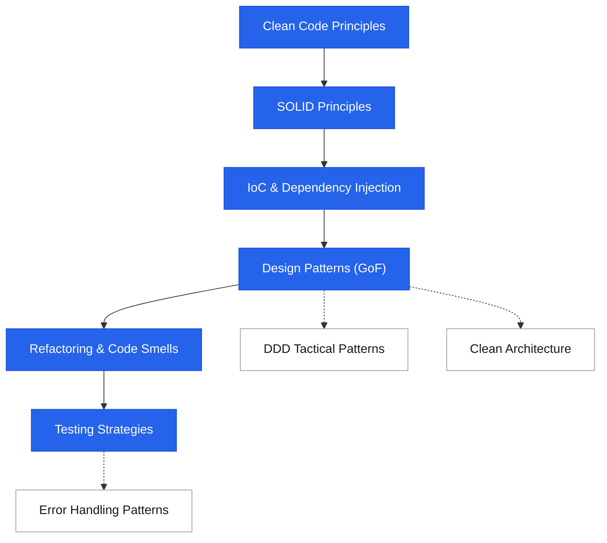

# Software Design

Foundations · code craft
The foundation before system design. These principles operate at the code and component level — they determine how well a system can evolve, be tested, and be understood by the next engineer.

## Roadmap

Follow the spine top-to-bottom your first time. Dashed branches hang off the topic they support — grab them when you need them.

## Suggested reading order

New to this topic? Read these in order — each builds on the previous:

1. [Clean Code Principles](clean-code-principles.md) — the vocabulary of good code (DRY, KISS, YAGNI) everything else assumes
2. [SOLID Principles](solid.md) — why well-structured code is shaped the way it is
3. [IoC & Dependency Injection](ioc-di.md) — how components connect without coupling; makes SOLID concrete
4. [Design Patterns (GoF)](design-patterns.md) — proven, named solutions to the recurring problems you now recognize
5. [Refactoring & Code Smells](refactoring.md) — how to safely move existing code toward those principles
6. [Testing Strategies](testing-strategies.md) — the safety net that makes refactoring and good design verifiable

**Then, as needed (reference):** [Error Handling Patterns](error-handling.md)

**Advanced — come back later:** [DDD Tactical Patterns](ddd-tactical.md), [Clean Architecture](clean-architecture.md)

## Principles

The vocabulary and structure that everything else assumes — what makes code good and why it's shaped the way it is.

<a class="pcard" href="clean-code-principles/">Clean Code PrinciplesDRY, KISS, YAGNI, SoC, Law of Demeter</a>
<a class="pcard" href="solid/">SOLID PrinciplesThe 5 principles every OOP design is judged by</a>
<a class="pcard" href="ioc-di/">IoC & Dependency InjectionInversion of control, DI containers, pure DI</a>

## Patterns & modeling

Proven solutions to recurring problems, modeling the domain in code, and organizing it all at scale.

<a class="pcard" href="design-patterns/">Design Patterns (GoF)Creational, structural, behavioral patterns with intent</a>
<a class="pcard" href="ddd-tactical/">DDD Tactical PatternsEntities, Value Objects, Aggregates, Repositories, Domain Events</a>
<a class="pcard" href="clean-architecture/">Clean ArchitectureDependency rule, ports & adapters, layered rings</a>

## Craft

Improving existing code safely, making failure a first-class citizen, and verifying it all works.

<a class="pcard" href="refactoring/">Refactoring & Code SmellsRecognizing and safely fixing bad code</a>
<a class="pcard" href="error-handling/">Error Handling PatternsResult types, fail-fast, error propagation, boundary translation</a>
<a class="pcard" href="testing-strategies/">Testing StrategiesTesting pyramid, test doubles, contract testing, integration tests</a>

---

## Why this matters in system design interviews

Interviewers at senior+ levels expect you to reason about code structure, not just boxes on a diagram. "How would you structure the matching service?" is a software design question. "How do you model an Order and prevent invalid states?" is a DDD tactical question. "What happens when the payment service returns an error mid-checkout?" is an error handling question.

The jump from drawing boxes to designing evolvable systems is exactly what these principles enable.
