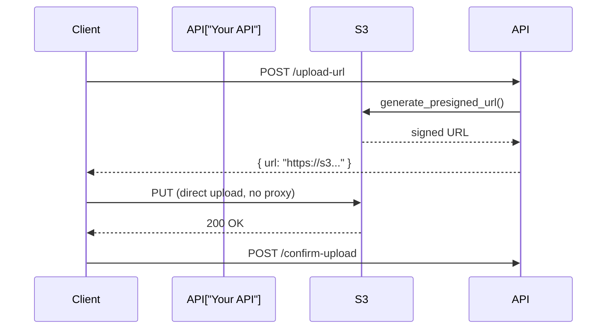
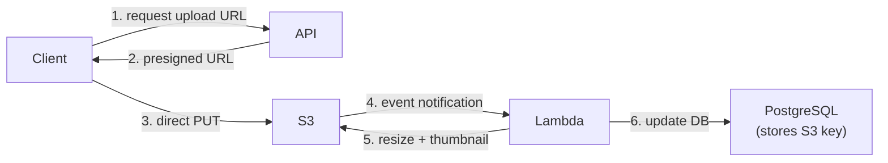

# Blob Storage

## What it is

Blob (Binary Large Object) storage is an object store for unstructured data — files, images, videos, backups, logs — at any scale. Objects are stored flat (no hierarchy, though paths with `/` simulate folders). Each object has a key, value (bytes), and metadata.

## S3 — the standard

Amazon S3 is the de facto standard for blob storage. It's infinitely scalable, highly durable, and used as a building block across virtually all modern architectures.

### Core concepts

```
Account
  └── Bucket (globally unique name)
        ├── object-key-1.jpg  (up to 5 TB per object)
        ├── folder/object-key-2.mp4
        └── logs/2024/04/26/access.log
```

**Key:** The full path string (`logs/2024/04/26/access.log`) — there are no real folders  
**Value:** Opaque bytes  
**Metadata:** Content-Type, custom key-value pairs, system metadata (size, ETag, last-modified)

### Durability and availability

- **Durability:** 99.999999999% (11 nines) — data is automatically replicated across ≥3 AZs
- **Availability:** 99.99% SLA (Standard)
- **Consistency:** S3 provides **strong read-after-write consistency** for all objects (since Dec 2020)

### Storage classes

| Class | Use case | Retrieval | Cost |
|---|---|---|---|
| S3 Standard | Frequently accessed | Instant | Highest |
| S3 Intelligent-Tiering | Unknown/changing access | Instant | Auto-optimized |
| S3 Standard-IA | Infrequent access, immediate | Instant | Lower storage, retrieval fee |
| S3 One Zone-IA | Infrequent, single AZ ok | Instant | Cheapest IA |
| S3 Glacier Instant | Archive, rare access | Instant | Very low storage |
| S3 Glacier Flexible | Archive, hours ok | 1-12 hours | Low |
| S3 Glacier Deep Archive | Long-term archive | 12-48 hours | Lowest |

**Lifecycle policies** automate transitions:
```json
{
  "Rules": [{
    "Status": "Enabled",
    "Transitions": [
      { "Days": 30, "StorageClass": "STANDARD_IA" },
      { "Days": 90, "StorageClass": "GLACIER" },
      { "Days": 365, "StorageClass": "DEEP_ARCHIVE" }
    ],
    "Expiration": { "Days": 2555 }  // delete after 7 years
  }]
}
```

### Upload patterns

**Simple upload** (< 5 GB):
```python
s3.put_object(Bucket='my-bucket', Key='images/photo.jpg', Body=data)
```

**Multipart upload** (> 100 MB, mandatory > 5 GB):
```
1. Initiate upload → get upload_id
2. Upload part 1 (5 MB min), part 2, ... → get ETags
3. Complete upload → S3 assembles the parts

Benefits:
- Resume interrupted uploads (retry individual parts)
- Parallelize parts for throughput
- Handle large files without loading all into memory
```

**Presigned URLs** — temporary, signed URLs for direct client uploads/downloads (bypasses your server):
```python
# Generate presigned upload URL (expires in 300s)
url = s3.generate_presigned_url(
    'put_object',
    Params={'Bucket': 'my-bucket', 'Key': 'uploads/user_photo.jpg'},
    ExpiresIn=300
)
# Client uploads directly to S3 using this URL
# Your server never handles the file bytes
```



This pattern avoids your server becoming an upload proxy — critical for large files and high volume.

### Access control

**Bucket policies** (resource-based, JSON):
```json
{
  "Effect": "Allow",
  "Principal": { "AWS": "arn:aws:iam::123:role/AppRole" },
  "Action": ["s3:GetObject"],
  "Resource": "arn:aws:s3:::my-bucket/public/*"
}
```

**Block Public Access** — account/bucket-level setting to prevent any public access regardless of policies. Enable this by default; explicitly open only what needs to be public.

**Server-Side Encryption:**
- SSE-S3: AWS manages keys (default, no cost)
- SSE-KMS: AWS KMS manages keys (audit trail, fine-grained control)
- SSE-C: Customer provides keys

### S3 + CloudFront (CDN)

For public assets, serve via CloudFront instead of directly from S3:

```
User → CloudFront Edge → (cache miss) → S3 Origin → CloudFront Edge (cached) → User
```

Benefits:
- Lower latency (edge node near user)
- Reduced S3 request costs
- S3 bucket can be private (CloudFront uses OAC)
- DDoS protection via AWS Shield

### S3 for data lakes

S3 is the foundation of AWS data lake architecture:

```
Raw data (S3) → ETL (Glue) → Processed data (S3) → Analytics (Athena / Redshift Spectrum)
```

**S3 Select / Athena:** Query S3 data with SQL without loading it into a database.
```sql
-- Athena: query CSV/Parquet files in S3 directly
SELECT user_id, COUNT(*) as events
FROM s3_events_bucket.events
WHERE event_date = '2024-04-26'
GROUP BY user_id
HAVING COUNT(*) > 100;
```

### S3 event notifications

Trigger downstream processing on object creation:

```
Upload to S3 → S3 Event → SQS / SNS / Lambda
                              ↓
                         Process image (resize)
                         Virus scan
                         Index metadata in DB
                         Transcode video
```

## Architecture patterns

### Avatar / profile photo upload



### Video storage

```
Upload → S3 (raw video)
       → SQS event
       → Transcoding service (Elastic Transcoder / MediaConvert)
       → Multiple resolutions (360p, 720p, 1080p) → S3
       → CloudFront → Users (adaptive bitrate streaming)
```

### Log archival

```
Application logs → Kinesis Firehose → S3 (compressed .gz, partitioned by date)
                                     → Athena queries
                                     → Glacier after 90 days
```

## Comparison with other object stores

| | S3 | GCS | Azure Blob |
|---|---|---|---|
| Durability | 11 nines | 11 nines | 12 nines |
| Min storage duration | None (Standard) | None | None |
| Strong consistency | Yes (2020+) | Yes | Yes |
| Multipart upload | Yes | Yes | Yes (blocks) |
| Lifecycle policies | Yes | Yes | Yes |
| AWS integration | Native | N/A | N/A |

## Interview angle

!!! tip "What interviewers are testing"
    They want to see you know S3 is not just "file storage" — it's the foundation for CDN, data lakes, event pipelines, and async upload flows.

**Strong answer pattern:**
1. Use presigned URLs for client uploads — don't proxy through your server
2. Put CloudFront in front for public assets
3. Use lifecycle policies for cost management
4. Emit S3 events to trigger async processing (thumbnail, transcoding, indexing)
5. For analytics: raw data in S3 + Athena/Glue for querying

## Related topics

- [CDN](../networking/cdn.md) — CloudFront in front of S3
- [Video Streaming case study](../case-studies/video-streaming.md) — S3 + transcoding + CDN
- [Data Warehousing](data-warehousing.md) — S3 as data lake foundation
- [Messaging](../messaging/event-streaming.md) — S3 events → downstream processing
