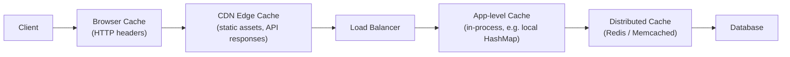
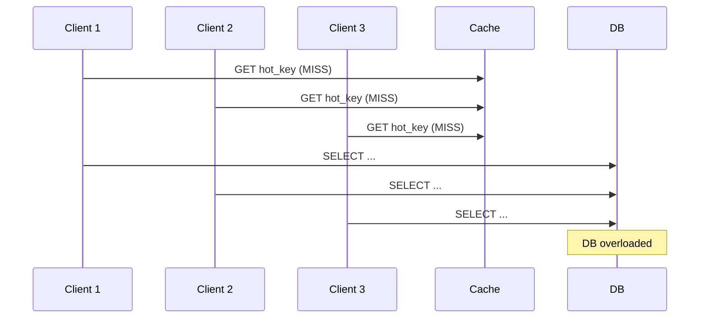

# Caching

## What it is

A cache is a fast, in-memory data store that sits in front of slower storage (database, API, disk) to reduce latency and offload read traffic.

## Cache layers



Each layer trades freshness for speed. Pick the right layer for the data's access pattern and staleness tolerance.

## Read strategies

=== "Cache-Aside (Lazy Loading)"
    Most common pattern. App is responsible for populating the cache.

    ```
    1. Read from cache
    2. Cache miss → read from DB → write to cache → return
    3. Cache hit → return
    ```

    **Pros:** Only caches what's actually read. Cache failure is non-fatal.  
    **Cons:** First request is always slow (cold start). Risk of stale data.

=== "Read-Through"
    Cache sits in front of DB and handles the miss itself (library/provider manages it).

    ```
    App → Cache → (on miss) Cache fetches from DB → returns to app
    ```

    **Pros:** Simpler app code.  
    **Cons:** First request is slow. Cache and DB must be kept in sync by the cache layer.

=== "Refresh-Ahead"
    Cache proactively refreshes entries before they expire.

    ```
    Cache detects key is near TTL expiry → pre-fetches from DB in background
    ```

    **Pros:** Low latency for hot keys.  
    **Cons:** Wastes resources if predictions are wrong.

## Write strategies

=== "Write-Through"
    Write to cache and DB synchronously.

    ```
    App → write to Cache → write to DB → ack
    ```

    **Pros:** Cache always consistent with DB.  
    **Cons:** Write latency is sum of both. Cache fills with data that may never be read.

=== "Write-Behind (Write-Back)"
    Write to cache immediately, async write to DB.

    ```
    App → write to Cache → ack
    Cache → (async) → write to DB
    ```

    **Pros:** Very low write latency.  
    **Cons:** Risk of data loss if cache fails before flushing. Complex failure handling.

=== "Write-Around"
    Write directly to DB, bypass cache.

    ```
    App → write to DB (cache not updated)
    Next read → cache miss → load from DB
    ```

    **Pros:** Avoids polluting cache with write-heavy data that won't be re-read.  
    **Cons:** Higher read latency after writes.

## Eviction policies

| Policy | Behavior | Best for |
|---|---|---|
| **LRU** (Least Recently Used) | Evict the item accessed longest ago | General-purpose, temporal locality |
| **LFU** (Least Frequently Used) | Evict the item accessed least often | Stable hot-set with clear popularity |
| **TTL** (Time-To-Live) | Evict after fixed time window | Data with known freshness requirements |
| **FIFO** | Evict oldest inserted item | Simple, predictable working sets |
| **Random** | Evict random item | Approximates LRU with lower overhead |

Redis default: LRU (configurable via `maxmemory-policy`).

## Cache invalidation

> "There are only two hard things in Computer Science: cache invalidation and naming things." — Phil Karlton

### Strategies

**TTL-based:** Set an expiry on every key. Simple but can serve stale data up to TTL duration.

**Event-driven invalidation:** On write to DB, explicitly delete or update the cache key. Requires coordination between write path and cache.

**Write-through:** Cache is always up to date because every write goes through it.

**Versioning:** Append a version/hash to the cache key. Old keys naturally become orphans and expire via TTL.

```
user:42:profile:v7  ← current
user:42:profile:v6  ← stale, will TTL out
```

## Cache stampede (Thundering Herd)

When a hot key expires, many requests simultaneously hit the DB:



**Solutions:**
- **Mutex/lock:** Only one request fetches from DB; others wait
- **Probabilistic early expiry:** Randomly refresh keys *before* they expire
- **Staggered TTLs:** Add jitter to TTL values so keys don't expire simultaneously

## Redis vs Memcached

| | Redis | Memcached |
|---|---|---|
| Data structures | Strings, hashes, lists, sets, sorted sets, streams | Strings only |
| Persistence | RDB snapshots + AOF log | None |
| Replication | Leader-replica, Redis Cluster | No built-in replication |
| Pub/Sub | Yes | No |
| Lua scripting | Yes | No |
| Multi-threading | Single-threaded (I/O via event loop) | Multi-threaded |
| Memory efficiency | Slightly higher overhead | More memory efficient for simple KV |

**Default choice: Redis.** Use Memcached only if you need raw multi-threaded throughput for simple string caching and don't need any Redis features.

## AWS equivalent

| Concept | AWS Service | Notes |
|---|---|---|
| Distributed cache | ElastiCache for Redis | Fully managed, cluster mode for sharding |
| Simple KV cache | ElastiCache for Memcached | If you specifically need Memcached |
| HTTP caching | CloudFront | CDN-level, configurable TTL and cache behaviors |
| DB query cache | RDS Proxy | Connection pooling, not a true cache |
| DAX | DynamoDB Accelerator | Purpose-built write-through cache for DynamoDB, microsecond reads |

## Interview angle

!!! tip "What interviewers are testing"
    They want to see you reason about *where* to cache, *what* to cache, and *when* it breaks.

**Strong answer pattern:**
1. Identify the hot read path in the system (usually user profile, feed, session, product catalog)
2. Choose cache-aside for most cases — explain why
3. Define TTL based on staleness tolerance of that data
4. Address invalidation — event-driven delete on write is usually the right answer
5. Mention cache stampede and how you'd prevent it for high-traffic keys

**Common follow-up:** *"What happens if your cache goes down?"*
> With cache-aside, the system degrades gracefully — all reads fall through to the DB. The risk is a thundering herd. Mitigation: circuit breaker, request coalescing, or a warm standby replica.

## Related topics

- [Key-Value Stores](key-value-stores.md) — Redis as a primary store, not just a cache
- [CDN](../networking/cdn.md) — caching at the edge
- [Rate Limiting](../patterns/rate-limiting.md) — Redis as the counter store
- [Consistent Hashing](../patterns/consistent-hashing.md) — how distributed caches shard keys
