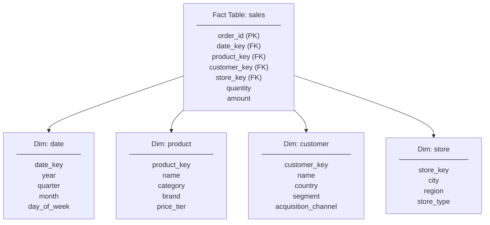
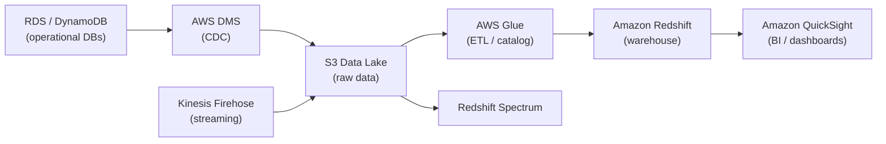

# Data Warehousing

## What it is

A data warehouse is an OLAP (Online Analytical Processing) database optimized for analytical queries over large datasets — aggregations, joins across many tables, historical analysis. It is the opposite of OLTP (transactional) databases in its optimization target.

## OLTP vs OLAP

| | OLTP | OLAP |
|---|---|---|
| **Purpose** | Transactional — insert, update, delete | Analytical — aggregations, reports |
| **Query type** | Few rows, by primary key | Many rows, aggregations across columns |
| **Schema** | Normalized (3NF) | Denormalized (star/snowflake) |
| **Data volume** | GBs to TBs | TBs to PBs |
| **Query latency** | Milliseconds | Seconds to minutes |
| **Concurrency** | Thousands of users | Tens of analysts |
| **Examples** | PostgreSQL, MySQL, DynamoDB | Redshift, BigQuery, Snowflake |

## Columnar storage

Traditional row-store databases store full rows contiguously:
```
Row store:
Row 1: [user_id=1, name="Alice", age=30, country="US", spent=500.00]
Row 2: [user_id=2, name="Bob",   age=25, country="UK", spent=200.00]

SELECT country, SUM(spent) → must read ALL columns of ALL rows
```

Columnar store keeps each column contiguously:
```
Column store:
user_id: [1, 2, 3, ...]
name:    ["Alice", "Bob", ...]
country: ["US", "UK", ...]
spent:   [500.00, 200.00, ...]

SELECT country, SUM(spent) → only read country + spent columns (skip others)
```

**Benefits:**
- I/O reduction: only read needed columns
- Compression: similar values in a column compress extremely well
- Vectorized operations: SIMD processing of column arrays

## Star Schema

The standard analytical data model. Optimized for fast aggregations.



**Fact table:** Contains measurable events (sales, clicks, page views) with foreign keys to dimensions + numeric metrics

**Dimension tables:** Descriptive context (who, what, where, when) — denormalized for query speed

```sql
-- Analytical query on star schema
SELECT
    d.quarter,
    p.category,
    c.country,
    SUM(f.amount)     AS revenue,
    COUNT(f.order_id) AS order_count,
    AVG(f.amount)     AS avg_order_value
FROM sales f
JOIN dim_date     d ON f.date_key     = d.date_key
JOIN dim_product  p ON f.product_key  = p.product_key
JOIN dim_customer c ON f.customer_key = c.customer_key
WHERE d.year = 2024
  AND c.country = 'US'
GROUP BY d.quarter, p.category, c.country
ORDER BY revenue DESC;
```

## Amazon Redshift

AWS's managed columnar data warehouse. Based on ParAccel (PostgreSQL fork). Petabyte-scale analytics.

### Architecture

```
Leader Node (query planning + result aggregation)
  ├── Compute Node 1 (slice 0, slice 1)
  ├── Compute Node 2 (slice 2, slice 3)
  └── Compute Node 3 (slice 4, slice 5)

Each compute node: multiple slices (parallel processing units)
Data distributed across slices by distribution style
```

### Distribution styles

```sql
-- EVEN: rows distributed round-robin (default, good for large fact tables with no obvious key)
CREATE TABLE events DISTSTYLE EVEN;

-- KEY: rows with same key on same node (eliminates cross-node joins)
CREATE TABLE orders DISTKEY (customer_id);
CREATE TABLE customers DISTKEY (customer_id);
-- → JOINs on customer_id are local (no network)

-- ALL: full copy on every node (good for small dimension tables)
CREATE TABLE dim_country DISTSTYLE ALL;
-- → JOINs to dim_country are always local
```

### Sort keys

```sql
-- COMPOUND: most selective column first
CREATE TABLE events SORTKEY (event_date, event_type);
-- Queries filtering on event_date skip blocks (zone maps)

-- INTERLEAVED: balanced across all sort columns
CREATE TABLE events INTERLEAVED SORTKEY (event_date, user_id, event_type);
-- Better for queries with different filter combinations
```

### VACUUM and ANALYZE

```sql
-- VACUUM: reclaim space from deleted rows + re-sort unsorted data
VACUUM FULL orders;

-- ANALYZE: update query planner statistics
ANALYZE orders;

-- Redshift Advisor recommends when to run these
```

### Redshift Spectrum

Query S3 data directly without loading it:

```sql
-- External table pointing to S3
CREATE EXTERNAL TABLE spectrum_schema.raw_events (
    user_id VARCHAR(50),
    event_type VARCHAR(50),
    event_time TIMESTAMP
)
STORED AS PARQUET
LOCATION 's3://my-data-lake/events/';

-- Query joins Redshift table + S3 data
SELECT r.user_id, COUNT(e.event_type)
FROM redshift_users r
JOIN spectrum_schema.raw_events e ON r.user_id = e.user_id
WHERE e.event_time >= '2024-01-01'
GROUP BY r.user_id;
```

## Modern data warehouse: Snowflake

Snowflake separates storage and compute — you can scale each independently and pay per second of compute used.

```
Storage (S3-backed, compressed columnar)
  ↑
Virtual Warehouses (independent compute clusters)
  ├── Analytics Team VW (M size)
  ├── Data Engineering VW (XL size, paused when not used)
  └── BI Tools VW (S size, always on)
```

**Key differentiators:**
- Multiple VWs can query the same data simultaneously without contention
- VWs auto-suspend when idle (cost optimization)
- Zero-copy cloning for dev/test environments
- Time travel — query data as it existed at any point in the past 90 days

## ETL vs ELT

**Traditional ETL (Extract, Transform, Load):**
```
Source → Transform (outside DB, e.g. Spark) → Load to DW
```

**Modern ELT (Extract, Load, Transform):**
```
Source → Load raw to DW → Transform inside DW using SQL
```

ELT is preferred with modern cloud warehouses (Redshift, Snowflake, BigQuery) because:
- Warehouse compute is cheap and fast
- Raw data is preserved — re-transform without re-ingesting
- Tools like dbt manage SQL transformations as code

## AWS data pipeline



## Interview angle

!!! tip "What interviewers are testing"
    They want to see you distinguish OLTP from OLAP and know when to route analytical queries to a separate system.

**Strong answer pattern:**
1. Identify if the query is analytical (aggregations, historical, many rows) vs transactional
2. State why you can't run heavy analytics on your OLTP DB — it competes with production traffic
3. Describe the pipeline: OLTP → CDC/batch export → S3 → Redshift/Snowflake
4. Mention columnar storage and why it's fast for aggregations

## Related topics

- [Blob Storage](blob-storage.md) — S3 as the data lake foundation
- [Messaging](../messaging/event-streaming.md) — Kinesis for streaming into the warehouse
- [Relational Databases](relational-databases.md) — OLTP contrast
- [AWS Storage & Databases](../aws/storage-databases.md) — Redshift in AWS context
