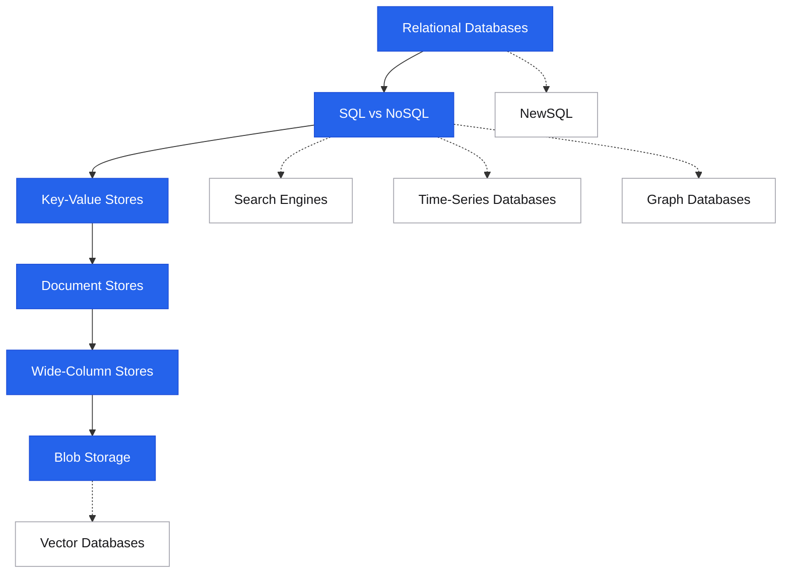

# Storage

Data · picking a datastore
Choosing the right storage is one of the most consequential decisions in any system design. This section covers the full spectrum — from relational databases to blob storage.

## Roadmap

Follow the spine top-to-bottom your first time. Dashed branches hang off the topic they support — grab them when you need them.

## Suggested reading order

New to this topic? Read these in order — each builds on the previous:

1. [Relational Databases](relational-databases.md) — the baseline every other store is measured against
2. [SQL vs NoSQL](sql-vs-nosql.md) — the decision framework for everything that follows
3. [Key-Value Stores](key-value-stores.md) — the simplest NoSQL model, and why simplicity scales
4. [Document Stores](document-stores.md) — flexible schemas and the trade-offs they bring
5. [Wide-Column Stores](wide-column-stores.md) — write-heavy workloads at massive scale
6. [Blob Storage](blob-storage.md) — where unstructured data lives in almost every real system

**Then, as needed (reference):** [Search Engines](search-engines.md), [Time-Series Databases](time-series-databases.md), [Graph Databases](graph-databases.md), [Data Warehousing](data-warehousing.md)

**Advanced — come back later:** [NewSQL](newsql.md), [Vector Databases](vector-databases.md), [Modern Data Stack](modern-data-stack.md)

## The decision & the baseline

Start here — the framework for choosing, and the relational store everything else is measured against.

<a class="pcard" href="sql-vs-nosql/">SQL vs NoSQLThe decision framework, not just the difference</a>
<a class="pcard" href="relational-databases/">Relational DatabasesACID, indexes, replication, PostgreSQL/MySQL patterns</a>

## NoSQL models

The core NoSQL families — pick by access pattern, write volume, and schema flexibility.

<a class="pcard" href="key-value-stores/">Key-Value StoresRedis, DynamoDB — when simplicity wins</a>
<a class="pcard" href="document-stores/">Document StoresMongoDB, DynamoDB — flexible schema tradeoffs</a>
<a class="pcard" href="wide-column-stores/">Wide-Column StoresCassandra, HBase — write-heavy, massive scale</a>

## Specialized stores

Purpose-built engines for search, time-series, blobs, graphs, and analytics.

<a class="pcard" href="time-series-databases/">Time-Series DatabasesInfluxDB, Timestream — metrics and events</a>
<a class="pcard" href="search-engines/">Search EnginesElasticsearch — inverted indexes and full-text search</a>
<a class="pcard" href="blob-storage/">Blob StorageS3 — unstructured data at any scale</a>
<a class="pcard" href="graph-databases/">Graph DatabasesNeo4j, Neptune — traversing relationships at any depth</a>
<a class="pcard" href="data-warehousing/">Data WarehousingOLAP, columnar storage, analytical workloads</a>

## Modern & emerging

Newer entrants — distributed SQL, embeddings, and the analytics stack.

<a class="pcard" href="newsql/">NewSQLCockroachDB, Spanner — ACID + horizontal scale</a>
<a class="pcard" href="vector-databases/">Vector DatabasesEmbeddings, semantic search, RAG — similarity at scale</a>
<a class="pcard" href="modern-data-stack/">Modern Data StackIngestion, transformation, and the analytics pipeline</a>
<a class="pcard" href="../caching/">CachingRedis, Memcached — layers, eviction, invalidation</a>

