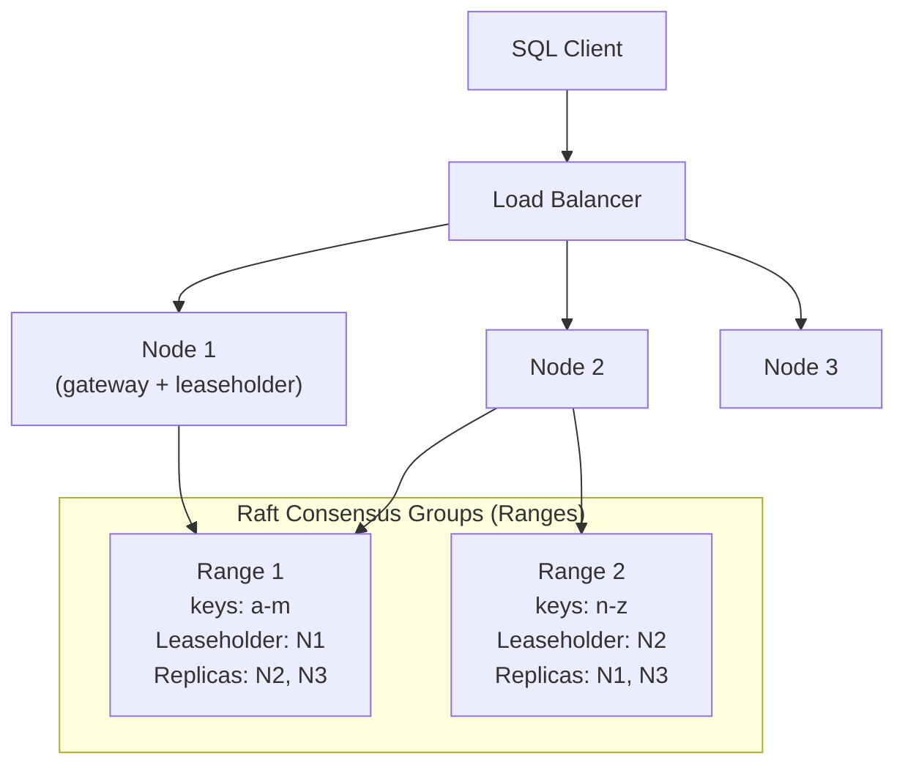

# NewSQL

## What it is

NewSQL databases provide the ACID guarantees and SQL interface of traditional relational databases while achieving the horizontal scalability of NoSQL systems. They emerged to solve the "can't have both SQL and horizontal scale" dilemma.

## The problem they solve

```
Traditional SQL:
  ✅ ACID transactions
  ✅ SQL query language
  ❌ Horizontal write scaling (single leader)

NoSQL:
  ✅ Horizontal write scaling
  ✅ Massive scale
  ❌ ACID transactions
  ❌ SQL joins

NewSQL:
  ✅ ACID transactions
  ✅ SQL query language
  ✅ Horizontal write scaling
```

## CockroachDB

Inspired by Google Spanner. Distributed SQL database with global ACID transactions.

### Architecture



**Ranges:** Data is divided into 64MB chunks (ranges). Each range is replicated via Raft across 3+ nodes. One node holds the lease (serves reads/writes for that range).

**Multi-range transactions:** CockroachDB uses a hybrid timestamp + 2PC protocol to provide serializable isolation across any number of ranges, nodes, and even regions.

### Usage

```sql
-- Standard SQL — works just like PostgreSQL
CREATE TABLE accounts (
    id   UUID DEFAULT gen_random_uuid() PRIMARY KEY,
    name TEXT NOT NULL,
    bal  DECIMAL NOT NULL CHECK (bal >= 0)
);

-- ACID transaction across multiple rows
BEGIN;
UPDATE accounts SET bal = bal - 100 WHERE id = 'alice-uuid';
UPDATE accounts SET bal = bal + 100 WHERE id = 'bob-uuid';
COMMIT;

-- Multi-region table (survive region failure)
ALTER TABLE accounts SET LOCALITY GLOBAL;
```

### Survivability zones

```sql
-- Survive zone (AZ) failure
ALTER DATABASE mydb SURVIVE ZONE FAILURE;

-- Survive region failure (requires 3+ regions)
ALTER DATABASE mydb SURVIVE REGION FAILURE;
```

## Google Spanner

Google's globally distributed relational database. Uses TrueTime (GPS + atomic clocks) for global linearizability without coordination.

```
TrueTime API:
  TT.now()  → (earliest, latest)  — bounded uncertainty interval
  TT.after(t) → true if t has definitely passed
  TT.before(t) → true if t has definitely not passed

Spanner waits out the uncertainty interval before committing
→ commits are globally ordered by real time
→ external consistency (linearizability across regions)
```

**Cloud Spanner on GCP / Spanner on AWS (not available — GCP only)**

## PlanetScale (Vitess-based)

PlanetScale is MySQL-compatible, built on Vitess (YouTube's MySQL sharding layer).

```
Vitess:
  - Horizontal sharding of MySQL
  - Schema changes without downtime (non-blocking DDL)
  - Query routing — application talks to VTGate, Vitess routes to correct shard
  
PlanetScale adds:
  - GitHub-like database branching (dev/preview/main)
  - Schema change workflow with deploy requests
  - Serverless pricing
```

**Trade-off:** No multi-shard transactions. Schema design must avoid cross-shard joins.

## TiDB (PingCAP)

MySQL-compatible distributed SQL. Separates storage (TiKV — key-value, Raft-based) from compute (TiDB — SQL processing). Horizontally scalable for both reads and writes.

```
TiDB (SQL layer) ← MySQL protocol
     ↓
PD (placement driver — metadata + scheduling)
     ↓
TiKV (distributed KV store — Raft replication)
```

## When to choose NewSQL

| Use case | Why NewSQL |
|---|---|
| ACID transactions at global scale | CockroachDB / Spanner — what traditional SQL can't do |
| Multi-region active-active writes | Spanner / CockroachDB |
| MySQL workload that outgrew single node | PlanetScale / TiDB |
| Strong consistency + horizontal scale | CockroachDB |

## NewSQL vs alternatives

| Situation | Choice | Reason |
|---|---|---|
| < 10TB, moderate write load | PostgreSQL | Simpler, cheaper, mature |
| High write QPS, eventual consistency ok | Cassandra / DynamoDB | More performant, lower cost |
| Complex relational + high write scale | CockroachDB | ACID + horizontal scale |
| Global transactions, money | Spanner | External consistency |
| Existing MySQL, need to scale | PlanetScale | Drop-in compatible |

## AWS equivalent

AWS does not offer a direct NewSQL product. Closest options:

| NewSQL concept | AWS approximation |
|---|---|
| Global ACID transactions | Aurora Global Database (but limited cross-region writes) |
| Horizontal SQL | Aurora Serverless v2 (auto-scales, but single-region write) |
| Multi-region active-active | DynamoDB Global Tables (but sacrifices SQL/ACID) |

For true NewSQL on AWS, you'd run CockroachDB or TiDB on EC2/EKS.

## Interview angle

!!! tip "When to mention NewSQL"
    Bring it up when a design needs both: strong ACID transactions AND horizontal write scalability. Example: a global payments system that must be consistent and can't have a single-region writer.

**Strong answer pattern:**
- "For a global financial system requiring ACID transactions across regions, I'd consider CockroachDB or Google Spanner — they provide linearizable transactions without the single-writer bottleneck of traditional PostgreSQL."
- Know the tradeoff: NewSQL is more complex to operate, more expensive, and has higher latency than single-node SQL for local transactions.

## Related topics

- [Relational Databases](relational-databases.md) — the foundation NewSQL extends
- [Distributed Transactions](../distributed/distributed-transactions.md) — the problem NewSQL solves
- [Consensus (Raft & Paxos)](../distributed/consensus.md) — the replication mechanism under the hood
- [CAP Theorem](../fundamentals/cap-theorem.md) — NewSQL is CP, at a latency cost
