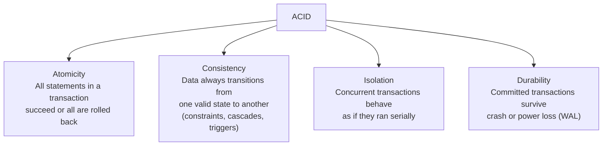
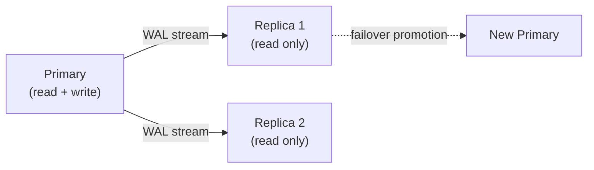

# Relational Databases

## What it is

A relational database organizes data into tables with rows and columns, enforces schema constraints, and provides ACID transactions. SQL is the query language. PostgreSQL and MySQL are the dominant open-source systems; Oracle and SQL Server dominate enterprise.

## ACID guarantees



## Isolation levels

A critical and often overlooked topic. Higher isolation = safer but slower.

| Level | Dirty Read | Non-repeatable Read | Phantom Read |
|---|---|---|---|
| Read Uncommitted | Possible | Possible | Possible |
| Read Committed | Protected | Possible | Possible |
| Repeatable Read | Protected | Protected | Possible |
| Serializable | Protected | Protected | Protected |

**Default levels:** PostgreSQL → Read Committed. MySQL InnoDB → Repeatable Read.

**Phenomena explained:**

- **Dirty Read:** Read a value written by an uncommitted transaction (then rolled back)
- **Non-repeatable Read:** Read same row twice in a transaction, get different values (someone updated between reads)
- **Phantom Read:** Read same query twice, get different rows (someone inserted/deleted between reads)

```sql
-- Explicit transaction isolation in PostgreSQL
BEGIN;
SET TRANSACTION ISOLATION LEVEL SERIALIZABLE;
-- your statements here
COMMIT;
```

## Indexes

### B-Tree (default)

Balanced tree — efficient for range queries, equality, sorting. The default index type.

```
B-Tree index on users(email):
- SELECT * WHERE email = 'alice@example.com'  → O(log n)
- SELECT * WHERE email LIKE 'alice%'          → O(log n) (prefix match)
- SELECT * WHERE email LIKE '%alice'          → full scan (no index use)
```

### Hash Index

Exact equality only. Faster than B-Tree for equality, useless for ranges.

```sql
-- PostgreSQL hash index
CREATE INDEX idx_hash ON users USING HASH (email);
-- Only useful for: WHERE email = 'alice@example.com'
-- Not useful for: WHERE email > 'a' or ORDER BY email
```

### Composite Index

Index on multiple columns. Column order matters — left-prefix rule.

```sql
CREATE INDEX idx_user_status ON orders(user_id, status, created_at);

-- Uses index (left prefix match):
WHERE user_id = 123
WHERE user_id = 123 AND status = 'pending'
WHERE user_id = 123 AND status = 'pending' AND created_at > '2024-01-01'

-- Does NOT use index:
WHERE status = 'pending'          -- skips user_id
WHERE created_at > '2024-01-01'   -- skips user_id and status
```

### Covering Index

Index contains all columns needed for a query — no table lookup required.

```sql
-- Query
SELECT user_id, status FROM orders WHERE user_id = 123;

-- Covering index: includes all selected columns
CREATE INDEX idx_covering ON orders(user_id) INCLUDE (status);
-- → "Index-only scan" — never touches the table
```

### Partial Index

Indexes only a subset of rows. Useful for sparse conditions.

```sql
-- Only index pending orders (most queries filter on pending)
CREATE INDEX idx_pending ON orders(created_at) WHERE status = 'pending';
```

## Query planning and EXPLAIN

```sql
EXPLAIN ANALYZE SELECT * FROM orders WHERE user_id = 123;

-- Look for:
-- Seq Scan  → no index used (bad for large tables)
-- Index Scan → index used, fetches rows from table
-- Index Only Scan → covering index, no table access (best)
-- Hash Join / Nested Loop / Merge Join → join strategy

-- Rows estimate vs actual rows: large mismatch = stale statistics
-- Run: ANALYZE orders;  to update statistics
```

## Replication



**Synchronous replication:** Primary waits for replica to acknowledge before committing. Zero data loss. Higher write latency.

**Asynchronous replication:** Primary commits immediately, replica catches up. Lower latency. Risk of data loss on failover (replica lag).

**Replication lag:** The delay between a write on primary and visibility on replica. Monitor with `pg_stat_replication`. Read from replica only if staleness is acceptable.

## Connection pooling

Each PostgreSQL connection consumes ~5-10MB RAM and a process. At high concurrency, connections become the bottleneck.

```
App servers: 100 instances × 20 connections each = 2,000 connections
PostgreSQL max_connections: typically 100-500 before performance degrades

Solution: PgBouncer or RDS Proxy between app and DB
  App → PgBouncer (2,000 app connections) → PostgreSQL (50 DB connections)
```

**PgBouncer modes:**
- **Session pooling:** Connection held for entire session (safe for all features)
- **Transaction pooling:** Connection held only during transaction (best efficiency, breaks some features like `LISTEN/NOTIFY`)

## Write-Ahead Log (WAL)

Before modifying data, PostgreSQL writes the change to the WAL (append-only log). This provides durability (crash recovery) and is the basis for replication.

```
Write request →
  1. Write to WAL buffer
  2. fsync WAL to disk
  3. Apply change to data pages
  4. Ack to client

On crash recovery:
  1. Read WAL
  2. Replay uncommitted transactions
  3. Roll back incomplete transactions
```

WAL is also used for **logical replication** (row-level changes) and **change data capture (CDC)** — streaming DB changes to Kafka.

## Partitioning

Split one large table into smaller physical partitions, still queried as one table.

**Range partitioning:**
```sql
CREATE TABLE events (
    id BIGSERIAL,
    event_time TIMESTAMPTZ,
    data JSONB
) PARTITION BY RANGE (event_time);

CREATE TABLE events_2024_01 PARTITION OF events
    FOR VALUES FROM ('2024-01-01') TO ('2024-02-01');
CREATE TABLE events_2024_02 PARTITION OF events
    FOR VALUES FROM ('2024-02-01') TO ('2024-03-01');
```

**Benefits:**
- Queries with `WHERE event_time > ...` only scan relevant partitions
- Old partitions can be dropped (instead of DELETE) — instant, no vacuum needed
- Each partition gets its own indexes

**Partitioning vs Sharding:** Partitioning is within one database server. Sharding is across multiple servers. See [Sharding](../patterns/sharding.md).

## Full-text search

PostgreSQL has built-in full-text search, though Elasticsearch is used when advanced search is needed.

```sql
-- Create a tsvector column
ALTER TABLE articles ADD COLUMN search_vector TSVECTOR;
UPDATE articles SET search_vector = to_tsvector('english', title || ' ' || body);
CREATE INDEX idx_fts ON articles USING GIN(search_vector);

-- Search
SELECT title FROM articles
WHERE search_vector @@ to_tsquery('english', 'postgresql & index');
```

## AWS equivalent

| Concept | AWS Service | Notes |
|---|---|---|
| Managed PostgreSQL | RDS PostgreSQL / Aurora PostgreSQL | Aurora offers 5x throughput over standard RDS |
| Managed MySQL | RDS MySQL / Aurora MySQL | |
| Read replicas | RDS Read Replicas | Up to 15 for Aurora |
| Multi-AZ | RDS Multi-AZ | Synchronous standby in another AZ |
| Connection pooling | RDS Proxy | Serverless connection pooler |
| Global distribution | Aurora Global Database | <1s cross-region replication |

## Interview angle

!!! tip "What interviewers are testing"
    They want to see you know more than "use Postgres." They want indexing strategy, isolation trade-offs, and scaling limits.

**Strong answer pattern:**
1. Identify the query patterns — what indexes are needed?
2. Mention connection pooling for high-concurrency apps
3. Add read replicas for read-heavy workloads
4. State when you'd move to sharding or NoSQL (> ~10TB, > 10K write QPS)
5. Mention isolation level if transactions are in scope

## Related topics

- [SQL vs NoSQL](sql-vs-nosql.md) — when to use relational vs not
- [Sharding](../patterns/sharding.md) — scaling beyond a single instance
- [Replication](../patterns/replication.md) — replication patterns and failover
- [Caching](../caching/index.md) — reducing read load on the database
