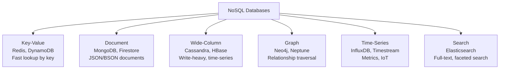
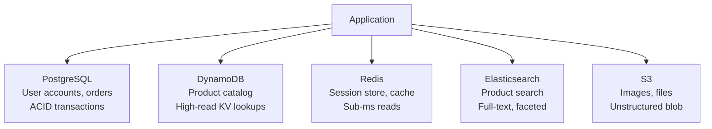

# SQL vs NoSQL

## The decision framework

Choosing between SQL and NoSQL is not about which is "better" — it's about which fits your access patterns, consistency requirements, and scaling needs.

## Core comparison

| | SQL (Relational) | NoSQL |
|---|---|---|
| **Schema** | Fixed, enforced | Flexible, schema-on-read |
| **Query language** | SQL (standardized) | Varies per database |
| **Joins** | Native, efficient | Avoided — denormalize instead |
| **Transactions** | ACID by default | Varies — some support ACID, most eventual |
| **Scaling** | Primarily vertical + read replicas | Horizontal by design |
| **Consistency** | Strong (default) | Tunable or eventual |
| **Data model** | Tables, rows, foreign keys | Documents, KV, wide-column, graph |
| **Best for** | Complex relationships, reporting, ACID | High throughput, flexible schema, horizontal scale |

## When to choose SQL

- Data has **complex relationships** — many joins, foreign keys, referential integrity
- You need **ACID transactions** — financial, inventory, booking systems
- **Query patterns are varied and ad-hoc** — reporting, analytics, BI tools
- **Schema is stable** — you won't be adding/removing fields constantly
- Team knows SQL well — operability matters

**Examples:** User accounts + permissions, financial ledgers, e-commerce orders, CMS

```sql
-- Natural with SQL
SELECT orders.id, users.name, products.title, order_items.quantity
FROM orders
JOIN users ON orders.user_id = users.id
JOIN order_items ON order_items.order_id = orders.id
JOIN products ON order_items.product_id = products.id
WHERE orders.status = 'pending';
```

## When to choose NoSQL

- **Access pattern is key-value or document lookup** — no joins needed
- You need **horizontal write scalability** — SQL struggles here
- **Schema evolves frequently** — adding fields without migrations
- Storing **semi-structured or nested data** — JSON, hierarchies
- **Massive scale** — billions of rows, petabytes of data
- **Low-latency reads** — single-digit ms at any scale

**Examples:** User sessions, product catalog, time-series events, social graph, chat messages

```json
// Natural with NoSQL (document store)
{
  "order_id": "ord_123",
  "user": { "id": "u_456", "name": "Alice" },
  "items": [
    { "product": "Widget", "qty": 2, "price": 9.99 },
    { "product": "Gadget", "qty": 1, "price": 24.99 }
  ],
  "status": "pending"
}
```

## NoSQL categories



## The join problem

SQL makes multi-table queries easy. NoSQL pushes joins to the application layer:

```python
# NoSQL: you do the joining in application code
user = users_table.get(user_id)
orders = orders_table.query(user_id=user_id)
for order in orders:
    order['items'] = items_table.query(order_id=order['id'])
```

This means **3 round trips** instead of 1 SQL query. Solution: **denormalize** — embed or duplicate data to avoid cross-table lookups.

```json
// Denormalized: embed items in order document
{
  "order_id": "ord_123",
  "user_id": "u_456",
  "user_name": "Alice",   ← duplicated from users table
  "items": [...]
}
```

Denormalization trades storage for query performance — acceptable in NoSQL.

## ACID vs BASE

| ACID (SQL default) | BASE (NoSQL default) |
|---|---|
| **A**tomicity: all or nothing | **B**asically **A**vailable |
| **C**onsistency: constraints enforced | **S**oft state |
| **I**solation: concurrent transactions don't interfere | **E**ventually consistent |
| **D**urability: committed data survives crash | |

Some NoSQL databases now support ACID transactions (MongoDB 4.0+, DynamoDB Transactions, CockroachDB). ACID in NoSQL usually comes with performance cost.

## Polyglot persistence

Modern systems use multiple databases — each for what it does best:



## Decision checklist

```
Use SQL if any of these are true:
  □ Multiple entities with relationships (foreign keys)
  □ ACID transactions required across multiple tables
  □ Ad-hoc query patterns (not just key lookups)
  □ < 10TB data, < 10K write QPS

Use NoSQL if any of these are true:
  □ Single-entity access pattern (lookup by ID, no joins)
  □ > 10K write QPS or > 100TB data
  □ Schema changes frequently
  □ Data is naturally hierarchical / nested
  □ Need geographic distribution / multi-region writes
```

## Interview angle

!!! tip "What interviewers are testing"
    They want to see you justify the choice based on access patterns — not just pick one because you know it better.

**Strong answer pattern:**
1. Describe the primary access pattern — is it key lookup or relational query?
2. State consistency requirements — do you need ACID?
3. State scale requirements — QPS and data volume
4. Pick and justify — "Given high write QPS and a simple key-value access pattern, I'd use DynamoDB"
5. Mention polyglot if appropriate — "I'd use PostgreSQL for transactional data and Elasticsearch for search"

## Related topics

- [Relational Databases](relational-databases.md) — ACID, indexes, replication in depth
- [Key-Value Stores](key-value-stores.md) — Redis, DynamoDB
- [Document Stores](document-stores.md) — MongoDB, Firestore
- [Wide-Column Stores](wide-column-stores.md) — Cassandra at scale
- [Sharding](../patterns/sharding.md) — how NoSQL achieves horizontal scale
