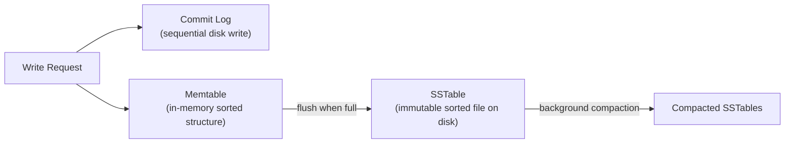

# Wide-Column Stores

## What it is

A wide-column store organizes data as rows with a row key, but each row can have a different set of columns. Columns are grouped into **column families**. The data model is optimized for write-heavy workloads, massive scale, and time-series or sequential read patterns.

Think of it as a distributed, sorted map:
```
Map<RowKey, SortedMap<ColumnKey, Value>>
```

## Cassandra

The dominant wide-column store. Designed for linear horizontal scale with no single point of failure. Used by Netflix, Discord, Instagram, and Apple.

### Key design principles

1. **Write-optimized:** Writes are appended to an in-memory structure (Memtable) and a commit log. No random I/O on write.
2. **Distributed by design:** Consistent hashing ring — no master, every node is equal.
3. **Tuneable consistency:** Choose between strong and eventual consistency per-query.
4. **Schema required:** Unlike document stores, Cassandra has a defined schema — but it's a wide-column schema, not a relational one.

### Data model

```sql
-- CQL (Cassandra Query Language)
CREATE TABLE messages (
    conversation_id UUID,         -- Partition key
    message_id      TIMEUUID,     -- Clustering key (determines sort order)
    sender_id       UUID,
    content         TEXT,
    sent_at         TIMESTAMP,
    PRIMARY KEY (conversation_id, message_id)
) WITH CLUSTERING ORDER BY (message_id DESC);
```

**Partition key** → determines which node holds the data (hash)  
**Clustering key** → determines sort order within the partition  
**Primary key** = Partition key + Clustering key

### Query patterns

Cassandra is **query-first design**. You model your table around the query, not the data.

```sql
-- Works: uses partition key
SELECT * FROM messages WHERE conversation_id = ?;

-- Works: partition key + clustering key (range query)
SELECT * FROM messages 
WHERE conversation_id = ? AND message_id > ? 
LIMIT 50;

-- FAILS: no partition key filter (full scan)
SELECT * FROM messages WHERE sender_id = ?;

-- Solution: create a separate table for this access pattern
CREATE TABLE messages_by_sender (
    sender_id       UUID,
    sent_at         TIMESTAMP,
    message_id      TIMEUUID,
    conversation_id UUID,
    PRIMARY KEY (sender_id, sent_at, message_id)
) WITH CLUSTERING ORDER BY (sent_at DESC);
```

**Rule:** Every query must include the full partition key. Filtering by non-key columns requires `ALLOW FILTERING` (full partition scan — avoid).

### Write path



**Why writes are fast:**
- Commit log is sequential (appended), not random I/O
- Memtable is in-memory
- No locks — writes go to the node, not coordinated

### Read path

```
Read → Check Memtable (in-memory)
     → Check Row Cache (if enabled)
     → Check Bloom Filter for each SSTable (probabilistic "is this key here?")
     → Check SSTable Key Cache
     → Read from SSTables (merged with reconciliation)
```

Reads are slower than writes in Cassandra — plan accordingly.

### Consistency levels

```
Write/Read consistency levels (N = replication factor):

ONE     → fastest, least consistent (1 node must ack)
QUORUM  → majority must ack: ceil(N/2) + 1 = 2 for N=3
ALL     → all replicas must ack (strongest, slowest)
LOCAL_QUORUM → quorum within local DC only (for multi-DC)

Strong consistency: R + W > N
Example: N=3, QUORUM reads + QUORUM writes = 2+2=4 > 3 ✓
```

### Compaction strategies

**STCS (Size-Tiered):** Merges SSTables of similar size. Good for write-heavy. More temporary disk space needed.

**LEVELED (LCS):** Organizes SSTables into size-constrained levels. Better read performance, less temporary disk. Good for read-heavy.

**TWCS (Time-Window):** Groups SSTables by time window. Ideal for time-series data with TTLs. Expired data is dropped by discarding entire SSTables.

### Anti-patterns

| Anti-pattern | Problem | Solution |
|---|---|---|
| Large partitions | > 100MB partition hits performance cliffs | Use bucket pattern (add time bucket to PK) |
| Too many tombstones | Deletes create tombstones; too many slow reads | Design for time-based TTL, not explicit deletes |
| Unbounded clustering | No limit on rows per partition | Add time bucket to clustering key |
| `ALLOW FILTERING` | Full partition scan | Design a table/materialized view for the query |

### Time-series with Cassandra

```sql
CREATE TABLE sensor_readings (
    sensor_id  TEXT,
    bucket     TEXT,       -- YYYY-MM-DD (limit partition size)
    read_at    TIMESTAMP,
    value      DOUBLE,
    PRIMARY KEY ((sensor_id, bucket), read_at)
) WITH CLUSTERING ORDER BY (read_at DESC)
  AND default_time_to_live = 2592000;  -- 30-day TTL
```

## HBase

Apache HBase is the Hadoop ecosystem's wide-column store — built on HDFS, designed for analytical and batch workloads. Less common for operational use cases than Cassandra.

| | Cassandra | HBase |
|---|---|---|
| Architecture | Leaderless ring | Leader (HMaster) + RegionServers |
| Consistency | Tuneable | Strong (ZooKeeper coordination) |
| Fault tolerance | Excellent (no SPOF) | Good (HMaster failover) |
| Use case | Operational, high-QPS | Analytical, batch, Hadoop integration |
| Write throughput | Extremely high | High |
| Consistency | AP (default) | CP |

## When to use wide-column stores

| Good fit | Bad fit |
|---|---|
| Time-series data (metrics, events, logs) | Complex queries with multiple filters |
| Append-heavy workloads (chat, activity feeds) | ACID transactions across rows |
| Massive write throughput (> 100K writes/sec) | Ad-hoc analytics (use Redshift/BigQuery) |
| Geographic distribution / multi-DC | Small scale (overkill) |
| Known, fixed query patterns | Frequently changing query patterns |

## AWS equivalent

| Service | Notes |
|---|---|
| Amazon Keyspaces | Cassandra-compatible, fully managed, serverless |
| DynamoDB | Not wide-column but similar use cases at AWS scale |
| Amazon EMR + HBase | Self-managed HBase on AWS Hadoop |

## Interview angle

!!! tip "What interviewers are testing"
    They want to see you distinguish Cassandra from generic NoSQL, and understand the write-optimized model.

**Strong answer pattern:**
1. Identify the access pattern — is it sequential writes with time-ordered reads?
2. Explain the query-first design — "I'd model one table per query"
3. Show you understand partition key design — avoid hot partitions
4. Mention tuneable consistency — `LOCAL_QUORUM` for multi-DC
5. Note the tradeoff — Cassandra is write-optimized, reads cost more

**Common follow-up:** *"Why not just use DynamoDB instead of Cassandra?"*
> DynamoDB is a better choice on AWS for most operational workloads — managed, auto-scaling, no ops overhead. Cassandra is preferred when you need cross-cloud, on-prem, multi-region active-active with full control over compaction strategy, or when you're already in the Cassandra ecosystem.

## Related topics

- [SQL vs NoSQL](sql-vs-nosql.md) — decision framework
- [Replication](../patterns/replication.md) — Cassandra's leaderless replication model
- [Consistent Hashing](../patterns/consistent-hashing.md) — how Cassandra distributes data
- [Time-Series Databases](time-series-databases.md) — dedicated TSDBs vs Cassandra for metrics
