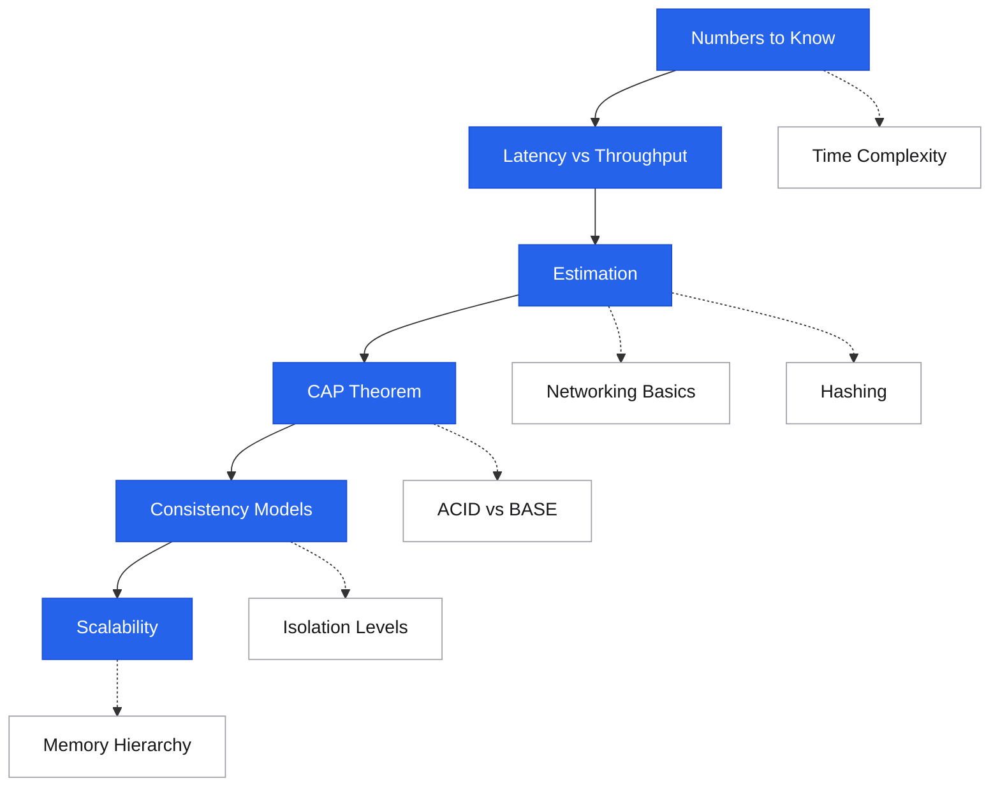

# Readability & Information-Architecture Overhaul — Implementation Plan

> **For agentic workers:** Steps use checkbox (`- [ ]`) syntax for tracking. This is a **docs-site** plan (MkDocs Material), not an application — there is no pytest. The verification gate for every task is:
> 1. `mkdocs build --strict` exits 0 (no broken links, no orphan pages — this is what CI runs), and
> 2. a visual check via `mkdocs serve -a 127.0.0.1:8000 --dirty`.
>
> **We are doing this step by step, NOT all at once.** Each Phase (A → B → C → D) is an independent, shippable unit with a STOP/review gate at its end. Do not start the next phase until the previous one is committed and the user has reviewed.

**Goal:** Make the System Design Encyclopedia easy to enter and navigate — one obvious starting point, a coherent section structure, a consistent and scannable per-section landing template, and roadmap.sh-style visual learning paths.

**Architecture:** Pure content + theme changes. Markdown in `docs/`, navigation in `mkdocs.yml`, styling in `docs/stylesheets/extra.css`, clickable-diagram behavior already provided by `docs/javascripts/diagrams.js`. No new build dependencies, no plugins added.

**Tech Stack:** MkDocs Material, `md_in_html` + `attr_list` (already enabled), `grid cards` Material component, Mermaid (via `pymdownx.superfences`), the existing `sd-mermaid-links` clickable-node system.

**Visual source of truth:** the approved local mockups in `.mockups/homepage-redesign.html` (Phase A) and `.mockups/inside-pages.html` (Phases C + D — toggle between "Section landing" and "Concept page").

**Decisions already locked by the user:**
- Keep the current **nested** sidebar (do NOT flatten to one level).
- **No** reading-time hints (ignore the `7m` pills in the mockups).
- "Start Here" becomes a top-level nav tab.
- **Match the mockups closely.** Build the mockups' *bespoke* components (homepage doors with icon tiles + hover reveal, section hero bands, concept-page callouts, Related-as-cards) as custom HTML (`md_in_html`) + CSS in `extra.css` — do NOT settle for Material's default `grid cards` look where the mockup shows something richer. Proven feasible: the homepage doors were rebuilt 1:1 from `.mockups/homepage-redesign.html` and render correctly in MkDocs (see commit `feat(home): bespoke intent doors`). The ONE exception is the **roadmap**, which is built with **Mermaid** (for clickable nodes via `sd-mermaid-links` + maintainability), so it uses the mockup's palette/idea but Mermaid's auto-layout — close, not pixel-identical.

**Authoring convention for bespoke components (since "match closely" is locked):**
- Put all visual styling in `docs/stylesheets/extra.css`, keyed off semantic classes (`.door`, `.sec-hero`, `.sd-symptom`, `.sd-related`, …). Keep per-page HTML minimal — just the class'd `<div>` scaffold.
- Use **raw HTML blocks** (no `markdown` attribute) when the component contains nested links or needs exact structure (e.g. the homepage doors) — this avoids Material wrapping links in `<p>` or injecting heading permalinks. Use `md_in_html` with `markdown` only when the inner content is plain prose.
- Reuse existing CSS variables (`--md-primary-fg-color`, `--md-default-fg-color*`, `--md-accent-fg-color`, `--sd-*`) so light/dark both work. Verify every new component in BOTH palettes.
- Inline SVG icons (stroke `currentColor`) are acceptable for full control where Material's `:material-*:` icons fight the layout; otherwise prefer Material icons for consistency.

---

## Conventions for every task in this plan

- **Branch:** work on `main` is fine for docs per repo norms, but create a branch per phase if you prefer isolation: `git checkout -b docs/phase-a-quick-wins`.
- **Verify command (the "test"):**
  ```bash
  mkdocs build --strict
  ```
  Expected: `INFO - Documentation built in ...` and exit code 0. ANY `WARNING` fails `--strict` (treat as failure).
- **Visual check:** `mkdocs serve -a 127.0.0.1:8000 --dirty` then open the changed page. If serve hangs at "Building documentation…", use the documented workaround: `mkdocs build` then `cd site && python3 -m http.server 8000 --bind 127.0.0.1`.
- **Commit cadence:** one commit per task. End commit messages with the repo's required trailer:
  ```
  Co-Authored-By: Claude Opus 4.8 (1M context) <noreply@anthropic.com>
  ```
- **Never commit `site/`** (gitignored).
- **Mermaid gotcha:** any node label containing a colon MUST be quoted — `D4["CAP Theorem"]`, and `D9["Consensus: Raft and Paxos"]`. An unquoted colon silently breaks clickable-node mapping for the whole diagram.
- **`sd-mermaid-links` gotcha:** `data-links` keys must match the node's visible text after `canon()` (lowercased, alphanumerics only).

---

# PHASE A — Quick Wins (homepage + Start Here tab + typography)

**Outcome:** The "lost in a sea of information" entry problem is solved. Low risk, ~half a day. Then a STOP gate.

**Progress (branch `docs/readability-overhaul`):**
- [x] A1 — Start Here top-level tab + `paths/index.md` landing (commit `9594624`)
- [x] A2 — homepage hero-CTA / browse-chip CSS (commit `a7818ed`)
- [x] A3 — homepage rewrite: hero + CTA + chips (commit `00d3f56`)
- [x] A4 — body `0.96rem` + H2 `1.6em`/`3.2em` air (commit `92ce00a`)
- [x] A5 — bespoke intent doors (commit `2f8ad90`) — added per "match closely" decision
- [ ] A6 — (optional) gradient hero headline to fully match the mockup hero

---

### Task A1: Promote "Start Here" to a top-level nav tab

**Files:**
- Modify: `mkdocs.yml` (the `nav:` block — currently `paths/`, `reference/symptom-lookup.md`, `reference/decision-flowcharts.md` live under the final `Reference` tab, lines ~440–462)
- Create: `docs/paths/index.md` (new landing page for the tab)

- [ ] **Step 1: Create the Start Here landing page** `docs/paths/index.md`

```markdown
---
hide:
  - toc
tags:
  - applied
---

# Start Here

You don't have to read 300 pages in order. Pick the lane that matches what you're trying to do right now.

## Learn it — ordered routes

<div class="grid cards" markdown>

-   :material-map-marker-path:{ .lg .middle } **The Curriculum: Zero → Staff**

    ---

    The full course. 6 levels, a clickable roadmap, checkpoints per level. Start here if you're learning, not looking up.

    [:octicons-arrow-right-24: Start](curriculum.md)

-   :material-robot-outline:{ .lg .middle } **The AI Engineer Path**

    ---

    Zero → production AI engineer. 8 levels with a clickable roadmap.

    [:octicons-arrow-right-24: Start](ai-engineer.md)

-   :material-school-outline:{ .lg .middle } **Just the Essentials**

    ---

    The 12 concepts every backend engineer should know cold. ~3 hours.

    [:octicons-arrow-right-24: Start](essentials.md)

-   :material-message-question-outline:{ .lg .middle } **Interview Prep (1 Week)**

    ---

    25 pages covering the senior+ interview canon. ~1 hour a day.

    [:octicons-arrow-right-24: Start](interview-prep.md)

-   :material-rocket-launch-outline:{ .lg .middle } **Building a SaaS**

    ---

    18 pages, stack choice to multi-region.

    [:octicons-arrow-right-24: Start](building-saas.md)

-   :material-call-split:{ .lg .middle } **Monolith → Microservices**

    ---

    15 pages on the migration, without big-bang rewrites.

    [:octicons-arrow-right-24: Start](monolith-to-microservices.md)

-   :material-earth:{ .lg .middle } **Scaling Beyond One Region**

    ---

    10 pages on going global: multi-region, edge, data residency.

    [:octicons-arrow-right-24: Start](scaling-beyond-region.md)

</div>

## Find your way — by intent

<div class="grid cards" markdown>

-   :material-stethoscope:{ .lg .middle } **I have a symptom at work**

    ---

    ~115 real-world symptoms mapped to the concept that explains them.

    [:octicons-arrow-right-24: Symptom → Concept Lookup](../reference/symptom-lookup.md)

-   :material-source-branch-check:{ .lg .middle } **Help me pick**

    ---

    Decision flowcharts for the 10 most common design choices.

    [:octicons-arrow-right-24: Decision Flowcharts](../reference/decision-flowcharts.md)

</div>
```

- [ ] **Step 2: Add the `Start Here` tab to `mkdocs.yml`**

Insert this block immediately AFTER the `- Home: index.md` line and BEFORE the `# ─── Foundations ───` comment:

```yaml
  # ─── Start Here ────────────────────────────────────────────
  - Start Here:
    - paths/index.md
    - Reading Paths:
      - "The Curriculum: Zero → Staff": paths/curriculum.md
      - "The AI Engineer Path: Zero → Production": paths/ai-engineer.md
      - Just the Essentials: paths/essentials.md
      - Interview Prep (1 Week): paths/interview-prep.md
      - Building a SaaS: paths/building-saas.md
      - Monolith → Microservices: paths/monolith-to-microservices.md
      - Scaling Beyond One Region: paths/scaling-beyond-region.md
    - Find Your Way:
      - Symptom → Concept Lookup: reference/symptom-lookup.md
      - Decision Flowcharts: reference/decision-flowcharts.md
```

- [ ] **Step 3: Remove the moved entries from the `Reference` tab**

In the `- Reference:` block (end of nav), DELETE the entire `- Reading Paths:` sub-block (the 7 path entries) and the two lines `- Symptom → Concept Lookup: reference/symptom-lookup.md` and `- Decision Flowcharts: reference/decision-flowcharts.md`. The `Reference` tab should retain ONLY: `Tags`, `Practical Examples` (the `examples/` group), `Interview Guide`, and `Glossary`. Each of `symptom-lookup.md`, `decision-flowcharts.md`, and the path pages must appear EXACTLY ONCE in the nav (a page listed twice, or not at all, fails `--strict` as a warning).

- [ ] **Step 4: Verify**

Run: `mkdocs build --strict`
Expected: exit 0, no warnings. If you see `WARNING - The following pages exist in the docs directory, but are not included in the nav` → a path page got orphaned; re-check Step 2/3. If you see a "page is in nav multiple times"-style warning → the page is listed in both Start Here and Reference; remove the duplicate.

- [ ] **Step 5: Visual check** — serve, confirm `Start Here` is the 2nd tab, its landing page renders the two card groups, and the Reference tab no longer shows paths.

- [ ] **Step 6: Commit**

```bash
git add mkdocs.yml docs/paths/index.md
git commit -m "feat(nav): promote Reading Paths to a top-level Start Here tab"
```

---

### Task A2: Add homepage + Start Here CSS components

**Files:**
- Modify: `docs/stylesheets/extra.css` (append a new clearly-commented block at the END of the file)

These classes back the new homepage (Task A3). Adding CSS first means A3's markdown renders correctly on first serve. Colors reuse existing CSS variables already defined in this file (`--md-primary-fg-color`, `--md-default-fg-color`, `--md-default-fg-color--light`, `--md-default-fg-color--lightest`).

- [ ] **Step 1: Append the homepage component styles**

```css
/* ════════════════════════════════════════════════════════════
   Homepage redesign — hero CTA, intent doors, browse chips
   (see .mockups/homepage-redesign.html for the visual target)
   ════════════════════════════════════════════════════════════ */

/* Single dominant call-to-action */
.md-typeset .hero-cta-row {
  display: flex; flex-wrap: wrap; align-items: center; gap: 1.1rem;
  margin: 2rem 0 1.4rem;
}
.md-typeset a.hero-cta {
  display: inline-flex; align-items: center; gap: .7rem; text-decoration: none;
  background: var(--md-primary-fg-color); color: #fff; font-weight: 600;
  font-size: 1.02rem; letter-spacing: -.01em; padding: .9rem 1.6rem; border-radius: 12px;
  box-shadow: 0 12px 28px -8px color-mix(in srgb, var(--md-primary-fg-color) 55%, transparent);
  transition: transform .18s cubic-bezier(.2,.7,.3,1), box-shadow .18s;
}
.md-typeset a.hero-cta:hover { transform: translateY(-2px); }
.md-typeset a.hero-cta .sub { font-weight: 400; font-size: .82rem; opacity: .85; }
.md-typeset a.hero-ghost {
  text-decoration: none; color: var(--md-default-fg-color--light);
  font-size: .92rem; font-weight: 500;
}
.md-typeset a.hero-ghost:hover { color: var(--md-primary-fg-color); }
.md-typeset .hero-meta {
  display: flex; flex-wrap: wrap; gap: .4rem 1.4rem;
  font-size: .78rem; color: var(--md-default-fg-color--lighter);
  font-family: var(--md-code-font, monospace); margin-top: .4rem;
}
.md-typeset .hero-meta b { color: var(--md-default-fg-color--light); font-weight: 600; }

/* Demoted "browse by topic" chip cloud */
.md-typeset .browse-chips { display: flex; flex-wrap: wrap; gap: .55rem; margin: 1rem 0; }
.md-typeset a.browse-chip {
  text-decoration: none; font-size: .85rem; color: var(--md-default-fg-color--light);
  font-weight: 500; background: var(--md-default-bg-color);
  border: 1px solid var(--md-default-fg-color--lightest); border-radius: 999px;
  padding: .4rem .9rem; transition: .15s;
}
.md-typeset a.browse-chip:hover {
  border-color: var(--md-primary-fg-color); color: var(--md-primary-fg-color);
  transform: translateY(-1px);
}
```

- [ ] **Step 2: Verify** — `mkdocs build --strict` (CSS-only change; build must stay green).

- [ ] **Step 3: Commit**

```bash
git add docs/stylesheets/extra.css
git commit -m "feat(theme): add homepage hero-CTA, intent-door and browse-chip styles"
```

---

### Task A3: Rewrite the homepage

**Files:**
- Modify: `docs/index.md` (full replacement of body content below the frontmatter)

Replaces the three stacked equal-weight grids (31 cards) with: one hero + one dominant CTA, three intent doors (reusing Material `grid cards`), a demoted browse chip cloud, and removes the "Page contract" + "How to read this site" tables from the homepage (they move to a quiet link).

- [ ] **Step 1: Replace `docs/index.md` body** with:

```markdown
---
hide:
  - navigation
---

# System Design Encyclopedia

<div class="home-hero" markdown>
<p class="subtitle">Concepts, patterns, and the real scenarios where they fit — 300+ pages built for recognition, not just reading. One path takes you from zero to staff-level.</p>
</div>

<div class="hero-cta-row" markdown>
[Start the Curriculum <span class="sub">zero → staff · 6 levels</span> :octicons-arrow-right-24:](paths/curriculum.md){ .hero-cta }
[or just the 12 essentials (~3 hrs) →](paths/essentials.md){ .hero-ghost }
</div>

<p class="hero-meta"><span><b>303</b> pages</span><span><b>15</b> full case studies</span><span><b>115</b> symptoms mapped</span><span>press <b>⌘K</b> to search anything</span></p>

---

## What are you here to do?

<div class="grid cards" markdown>

-   :material-school-outline:{ .lg .middle } **Learn it**

    ---

    Follow an ordered route instead of a flat index. Build real intuition, level by level.

    [:octicons-arrow-right-24: Reading paths](paths/index.md)

-   :material-magnify:{ .lg .middle } **Look something up**

    ---

    A symptom at work, or a decision to make right now? Jump straight to the answer.

    [:octicons-arrow-right-24: Symptom lookup](reference/symptom-lookup.md) ·
    [Decision flowcharts](reference/decision-flowcharts.md) ·
    [Glossary](glossary.md)

-   :material-presentation:{ .lg .middle } **Prep for an interview**

    ---

    The framework, what interviewers test for, and 15 worked end-to-end designs.

    [:octicons-arrow-right-24: Interview guide](interview-guide.md) ·
    [Case studies](case-studies/index.md)

</div>

---

## Or browse by topic

<div class="browse-chips" markdown>
[Fundamentals](fundamentals/index.md){ .browse-chip }
[Software Design](software-design/index.md){ .browse-chip }
[Architecture](architecture/index.md){ .browse-chip }
[Distributed Systems](distributed/index.md){ .browse-chip }
[Storage](storage/index.md){ .browse-chip }
[Caching](caching/index.md){ .browse-chip }
[Networking](networking/index.md){ .browse-chip }
[API Design](api/index.md){ .browse-chip }
[Messaging](messaging/index.md){ .browse-chip }
[Patterns](patterns/index.md){ .browse-chip }
[Observability](observability/index.md){ .browse-chip }
[Security](security/index.md){ .browse-chip }
[Infrastructure](infrastructure/index.md){ .browse-chip }
[IaC](iac/index.md){ .browse-chip }
[CI/CD](cicd/index.md){ .browse-chip }
[AI Agents](agents/index.md){ .browse-chip }
[AI Engineering](ai/index.md){ .browse-chip }
[Fintech](fintech/index.md){ .browse-chip }
[AWS Mapping](aws/index.md){ .browse-chip }
</div>

Every concept page follows the same shape — definition, where you'll see it, mechanics, tradeoffs, interview angle, related. *Press `Cmd/Ctrl+K` to full-text search anything.*
```

> NOTE on the chip links: `{ .browse-chip }` attaches the class via `attr_list` (already enabled). Confirm rendering — if Material wraps each link in its own `<p>`, the flex layout still works because `.browse-chips` is the flex container. If chips stack vertically, wrap the links in the div WITHOUT `markdown` and write raw `<a class="browse-chip" href="...">` instead (md_in_html is enabled). Pick whichever renders as a horizontal cloud.

- [ ] **Step 2: Verify** — `mkdocs build --strict`. Expected exit 0. Every link target above already exists; a typo'd relative path will surface as a warning.

- [ ] **Step 3: Visual check** — serve `/`. Confirm: one large blue CTA button dominates; exactly three intent-door cards; a horizontal chip cloud (not a vertical list); no "Page contract" or "How to read this site" tables remain.

- [ ] **Step 4: Commit**

```bash
git add docs/index.md
git commit -m "feat(home): single-CTA hero + three intent doors + demoted topic chips"
```

---

### Task A4: Bump body type and give H2s more air

**Files:**
- Modify: `docs/stylesheets/extra.css` (edit the existing `.md-typeset` body rule ~line 94–98 and the `h2` rule ~line 121–145)

- [ ] **Step 1: Increase body font size.** Find the `.md-typeset` rule that sets `font-size: 0.92rem; line-height: 1.7;` and change to:

```css
  font-size: 0.96rem;
  line-height: 1.72;
```

(Conservative bump; the site has dense tables, so 0.96rem balances readability against table width. Do NOT go to 1rem in one step.)

- [ ] **Step 2: Make H2 section breaks louder.** In the existing `.md-typeset h2` rule, change `font-size: 1.45em;` to `font-size: 1.6em;` and increase the top margin so sections breathe. Add (or adjust) the margin to:

```css
  margin-top: 3rem;
```

Keep the existing `::before` gradient bar and `letter-spacing`. Do not touch h1/h3.

- [ ] **Step 3: Verify** — `mkdocs build --strict` stays green.

- [ ] **Step 4: Visual check** — open any long concept page (e.g. `patterns/saga-pattern.md`). Confirm body text is slightly larger and H2s are clearly separated with whitespace above. Check both light and dark palettes (toggle top-right).

- [ ] **Step 5: Commit**

```bash
git add docs/stylesheets/extra.css
git commit -m "feat(theme): larger body text and more air above H2 section breaks"
```

---

### Task A5: Bespoke intent doors (DONE — recorded for completeness)

**Files:** `docs/index.md` (replace the `## What are you here to do?` grid-cards block), `docs/stylesheets/extra.css` (append `.doors`/`.door` styles).

Replaced Material `grid cards` with the mockup's door design: a `.doors` 3-col grid of `.door` cards, each a raw-HTML block (no `markdown` attr → avoids `<p>`-wrapped links) containing an inline-SVG `.door-icon` tile, an `<h3>`, a `<p>`, and a `<ul>` of real internal links. CSS adds the hover lift, the `::before` top-border gradient reveal, the icon tile (`color-mix` on `--md-primary-fg-color`), and a dashed divider above the link list. Verified in light + dark, `--strict` green. This is the proof that bespoke components match the mockups in real MkDocs.

### 🛑 PHASE A GATE
Stop. Serve the site, click through Home → Start Here → a topic → a concept page. Confirm with the user before starting Phase B. Phase A is independently shippable.

---

# PHASE B — Information-Architecture Cleanup

**Progress (branch `docs/readability-overhaul`):**
- [x] B1 — Distributed Systems → Foundations; rename theory subsection (commit `6c530f0`)
- [x] B2 — split Patterns (Resilience / Data & Scaling); rename Operations tab (commit `f6162aa`)
- [x] B3 — canonical-home deferral notes for CQRS/ES + Agents (commit `22e90ee`)
- [x] B4 — differentiate Practical Examples vs Case Studies (commit `d53b6d7`)

**Outcome:** Coherent sections; no topic with two homes. This phase touches `mkdocs.yml` structure and a handful of cross-link/deferral notes. Medium risk (mostly that `--strict` catches a moved/renamed path). No page content is rewritten — pages are RE-HOMED and given short "canonical home" deferral notes.

> **This phase changes site structure. Each task below is a reviewable unit — commit and eyeball the nav after each.** The four problems being fixed (from the review): (1) distributed theory split across two tabs, (2) "Operations" is a weak umbrella, (3) "Patterns" is a grab-bag, (4) CQRS/event-sourcing and agents each have two homes.

---

### Task B1: Give Distributed Systems a single, clear home

**Problem:** `Fundamentals` has a "Distributed Systems Theory" sub-section (CAP, consistency, ACID, isolation, scalability, availability, fault-tolerance, failure-modes, concurrency, hot-partitions) AND there is a full `Distributed Systems` section under `Architecture` (consensus, leader election, locks, clocks, CRDTs, gossip, etc.). Two homes, fuzzy boundary.

**Resolution:** Keep the *properties/theory* in Fundamentals but RENAME the sub-section so it no longer collides with the section name; move the *mechanisms* section to sit directly under `Foundations` (it is bedrock theory, not architecture).

**Files:** `mkdocs.yml`; plus a one-line note at the top of `docs/distributed/index.md` and `docs/fundamentals/index.md`.

- [ ] **Step 1:** In `mkdocs.yml`, rename the Fundamentals sub-section heading `Distributed Systems Theory:` → `Reliability & Consistency Theory:` (keep all its child pages unchanged).

- [ ] **Step 2:** Move the entire `- Distributed Systems:` block out of the `Architecture` tab and into the `Foundations` tab, placed AFTER the `Fundamentals` block and BEFORE `Software Design`. (Cut the YAML block, paste it; indentation must match the other second-level sections under Foundations.)

- [ ] **Step 3:** Add a deferral note. At the top of `docs/distributed/index.md` (after the H1), add:

```markdown
!!! info "Where this fits"
    This section covers distributed-systems **mechanisms** (consensus, leader election, locks, clocks, CRDTs). For the **properties** they provide — CAP, consistency models, ACID vs BASE — see [Reliability & Consistency Theory](../fundamentals/index.md#reliability-consistency-theory).
```

And reciprocally, in `docs/fundamentals/index.md`, under the renamed sub-section's intro line, add: `For the mechanisms that implement these properties, see [Distributed Systems](../distributed/index.md).`

- [ ] **Step 4: Verify** `mkdocs build --strict`. The anchor `#reliability-consistency-theory` must match the rendered heading slug — if the build warns about a broken anchor, fix the fragment to match the actual generated slug.

- [ ] **Step 5: Commit** — `git commit -m "refactor(nav): single home for Distributed Systems under Foundations"`

---

### Task B2: Split "Patterns" and rename "Operations"

**Problem:** `Operations` holds `Patterns` (a grab-bag) + `Observability` + `Security`. `Patterns` mixes resilience patterns with data/scaling patterns.

**Resolution:** Split the `Patterns` nav group into **Resilience Patterns** and **Data & Scaling Patterns**. Rename the `Operations` tab to **Reliability & Operations**. Files do NOT move on disk (they stay in `docs/patterns/`); only the nav grouping changes.

**Files:** `mkdocs.yml`; `docs/patterns/index.md` (update its intro to describe the two families).

- [ ] **Step 1:** Rename tab `- Operations:` → `- Reliability & Operations:`.

- [ ] **Step 2:** Replace the single `- Patterns:` nav group with TWO groups:

```yaml
    - Resilience Patterns:
      - patterns/index.md
      - Rate Limiting: patterns/rate-limiting.md
      - Circuit Breaker: patterns/circuit-breaker.md
      - Retry & Timeout: patterns/retry-timeout.md
      - Backoff Strategies: patterns/backoff.md
      - Bulkhead: patterns/bulkhead.md
      - Idempotency: patterns/idempotency.md
      - Saga Pattern: patterns/saga-pattern.md
      - Outbox Pattern: patterns/outbox.md
      - Durable Workflows (Temporal / Step Functions): patterns/durable-workflows.md
      - Unhappy-Path Engineering: patterns/unhappy-path-engineering.md
      - Boring Technology: patterns/boring-tech.md
    - Data & Scaling Patterns:
      - CQRS: patterns/cqrs.md
      - Event Sourcing: patterns/event-sourcing.md
      - Consistent Hashing: patterns/consistent-hashing.md
      - Sharding: patterns/sharding.md
      - Querying Sharded Data: patterns/querying-sharded-data.md
      - Sharding Best Practices: patterns/sharding-best-practices.md
      - Sharding Tooling (Vitess / Citus): patterns/sharding-tooling.md
      - Replication: patterns/replication.md
      - Read Replicas: patterns/read-replicas.md
      - Connection Pooling: patterns/connection-pooling.md
```

(`patterns/index.md` stays once, under Resilience Patterns, since `navigation.indexes` is enabled. Every `patterns/*.md` page must appear exactly once across the two groups — cross-check against the file list so none is dropped.)

- [ ] **Step 3:** Update `docs/patterns/index.md` intro to name the two families and link both groups. Keep its existing table content but add a one-paragraph orientation at the top.

- [ ] **Step 4: Verify** `mkdocs build --strict` — watch specifically for any `patterns/*.md` that is now orphaned (not in nav) or listed twice.

- [ ] **Step 5: Commit** — `git commit -m "refactor(nav): split Patterns into Resilience and Data/Scaling; rename Operations tab"`

---

### Task B3: De-duplicate the two-home topics (CQRS/Event-Sourcing, Agents)

**Problem:** CQRS + Event Sourcing exist as both `patterns/cqrs.md`/`patterns/event-sourcing.md` AND `architecture/cqrs-event-sourcing-architecture.md`. Agents exist as the whole `agents/` tab AND `ai/agents-and-tool-use.md` + `ai/agentic-patterns.md`.

**Resolution:** Do not merge/delete pages. Designate a canonical page per topic and add a short deferral admonition to the others so the relationship is explicit.

**Files:** `docs/architecture/cqrs-event-sourcing-architecture.md`, `docs/patterns/cqrs.md`, `docs/patterns/event-sourcing.md`, `docs/ai/agents-and-tool-use.md`, `docs/ai/agentic-patterns.md`, `docs/agents/index.md`.

- [ ] **Step 1:** At the top of `docs/architecture/cqrs-event-sourcing-architecture.md` add:

```markdown
!!! abstract "Scope of this page"
    This is the **architecture-level** view — when CQRS/Event Sourcing reshape a whole system. For the pattern mechanics in isolation, see [CQRS](../patterns/cqrs.md) and [Event Sourcing](../patterns/event-sourcing.md).
```

- [ ] **Step 2:** At the top of both `docs/patterns/cqrs.md` and `docs/patterns/event-sourcing.md`, add a reciprocal one-liner: `> Pattern mechanics here; for the system-wide architectural view see [CQRS & Event Sourcing as Architecture](../architecture/cqrs-event-sourcing-architecture.md).`

- [ ] **Step 3:** Decide the canonical Agents home = the dedicated `agents/` tab (deeper, with examples). In `docs/ai/agents-and-tool-use.md` and `docs/ai/agentic-patterns.md`, add at the top:

```markdown
!!! info "See also"
    This page is the LLM-engineering view of agents. For the full treatment — fundamentals, multi-agent systems, reliability, and worked examples — see the [AI Agents](../agents/index.md) section.
```

- [ ] **Step 4: Verify** `mkdocs build --strict` (relative links resolve).

- [ ] **Step 5: Commit** — `git commit -m "docs: add canonical-home deferral notes for CQRS/ES and Agents"`

---

### Task B4: Clarify examples/ vs case-studies/

**Problem:** `examples/` (6 multi-concept scenarios, under Reference) and `case-studies/` (15 full designs, top-level tab) read as two names for "applied."

**Resolution:** Keep both, but differentiate in their index intros and cross-link. (Lower priority — do only if the user wants it.)

**Files:** `docs/examples/index.md`, `docs/case-studies/index.md`.

- [ ] **Step 1:** In `docs/examples/index.md` intro, add a sentence: "These are *short, concept-weaving scenarios*. For full end-to-end system designs, see [Case Studies](../case-studies/index.md)."
- [ ] **Step 2:** Reciprocal sentence in `docs/case-studies/index.md`.
- [ ] **Step 3: Verify** + **Commit** — `git commit -m "docs: differentiate Practical Examples from Case Studies"`

---

### 🛑 PHASE B GATE
Stop. Serve the site; walk the full tab bar and every renamed/moved group. Confirm no orphan-page or duplicate-page warnings. Review with the user before Phase C.

---

# PHASE C — Section-Landing Template

**Progress (branch `docs/readability-overhaul`):**
- [x] C1 — bespoke section + concept-page component CSS (commit `fdcab8b`)
- [x] C2 — Fundamentals landing as the proof (commit `43fc306`)
- [x] C3 — rolled out to all 20 remaining section indexes (commit `42cbd28`), verified: 420 card/data-link targets resolve.
- [ ] **Concept-page components NOT rolled out** — the `.sd-symptom`/`.sd-related` styles exist in CSS but are not yet applied to the ~250 concept pages. This is the deliberately-deferred incremental work (see scope note below). Recommend option 1 (going-forward) or 2 (interview-canon pages only).

**Outcome:** Each major section index opens with a dark hero band + scannable topic cards (the "Section landing" view in `.mockups/inside-pages.html`), instead of dense link tables. Establish the pattern on Fundamentals first, then roll out.

---

### Task C1: Add section-landing AND concept-page bespoke CSS components

Per the "match closely" decision, this task lands ALL the bespoke component styles from `.mockups/inside-pages.html` (both the "Section landing" and "Concept page" views), so later content tasks only add class'd HTML scaffold.

**Files:** Modify `docs/stylesheets/extra.css` (append a commented block at the end).

- [ ] **Step 1:** Append the section-landing styles:

```css
/* ════════════════════════════════════════════════════════════
   Section-landing template — hero band
   (see .mockups/inside-pages.html → "Section landing")
   ════════════════════════════════════════════════════════════ */
.md-typeset .sec-hero {
  background: linear-gradient(135deg, #0f172a, #1e293b);
  color: #e2e8f0; border-radius: 16px; padding: 2rem 2.2rem; margin: 0 0 2rem;
}
.md-typeset .sec-hero .ey {
  font-family: var(--md-code-font, monospace); font-size: .72rem;
  letter-spacing: .12em; text-transform: uppercase; color: #93c5fd; margin-bottom: .6rem;
  display: block;
}
.md-typeset .sec-hero p,
.md-typeset .sec-hero { color: #cbd5e1; }
.md-typeset .sec-hero strong { color: #fff; }
[data-md-color-scheme="slate"] .md-typeset .sec-hero {
  background: linear-gradient(135deg, #1e293b, #0a0a0d);
}
```

For section **topic cards**: build them as bespoke `.pcard` cards (matching the mockup's two-up cards with a quiet description), NOT plain Material grid cards, since the mockup shows a richer card. Reuse the `.door`-style hover (lift + border). Add:

```css
/* Section topic cards */
.md-typeset .pcards { display: grid; grid-template-columns: 1fr 1fr; gap: .7rem; margin: 1.2rem 0; }
.md-typeset a.pcard {
  text-decoration: none; border: 1px solid var(--md-default-fg-color--lightest);
  border-radius: 11px; padding: .9rem 1.1rem; background: var(--md-default-bg-color);
  display: flex; flex-direction: column; gap: .2rem; transition: .15s;
}
.md-typeset a.pcard:hover {
  border-color: var(--md-primary-fg-color); transform: translateY(-2px);
  box-shadow: 0 14px 28px -18px color-mix(in srgb, var(--md-primary-fg-color) 40%, transparent);
}
.md-typeset a.pcard .t { font-weight: 650; color: var(--md-default-fg-color); font-size: .95rem; }
.md-typeset a.pcard .d { font-size: .83rem; color: var(--md-default-fg-color--lighter); line-height: 1.5; }
@media screen and (max-width: 44.9375em) { .md-typeset .pcards { grid-template-columns: 1fr; } }
```

- [ ] **Step 2:** Append the concept-page component styles (lede, "You'll see this when" callout, Related-as-cards):

```css
/* ════════════════════════════════════════════════════════════
   Concept-page components (see .mockups/inside-pages.html → "Concept page")
   ════════════════════════════════════════════════════════════ */
/* "You'll see this when…" recognition callout */
.md-typeset .sd-symptom {
  margin: 1.8rem 0; border: 1px solid color-mix(in srgb, var(--md-accent-fg-color) 35%, transparent);
  background: color-mix(in srgb, var(--md-accent-fg-color) 6%, var(--md-default-bg-color));
  border-radius: 14px; padding: 1.2rem 1.5rem;
}
.md-typeset .sd-symptom > .h {
  display: flex; align-items: center; gap: .5rem; font-weight: 700;
  color: var(--md-accent-fg-color); margin-bottom: .4rem; font-size: .95rem;
}
/* Related-as-cards */
.md-typeset .sd-related { display: grid; grid-template-columns: 1fr 1fr; gap: .8rem; margin-top: 1rem; }
.md-typeset a.sd-relcard {
  text-decoration: none; border: 1px solid var(--md-default-fg-color--lightest);
  border-radius: 11px; padding: .9rem 1.1rem; background: var(--md-default-bg-color); transition: .15s;
}
.md-typeset a.sd-relcard:hover {
  border-color: var(--md-primary-fg-color); transform: translateY(-2px);
  box-shadow: 0 14px 28px -18px color-mix(in srgb, var(--md-primary-fg-color) 40%, transparent);
}
.md-typeset a.sd-relcard .t { font-weight: 650; color: var(--md-default-fg-color); font-size: .95rem; }
.md-typeset a.sd-relcard .d { font-size: .82rem; color: var(--md-default-fg-color--lighter); }
@media screen and (max-width: 44.9375em) { .md-typeset .sd-related { grid-template-columns: 1fr; } }
```

> NOTE: the "Test yourself" `???`/`!!! tip` interview admonition and the diagram zoom toolbar are already styled in `extra.css` / `diagrams.js` — do NOT rebuild those. Only the symptom callout, related-cards, section hero, and topic cards are new.

- [ ] **Step 3: Verify** `mkdocs build --strict`. **Visual check** both palettes. **Commit** — `git commit -m "feat(theme): bespoke section-landing + concept-page component styles"`

---

### Task C2: Apply the template to Fundamentals (the proof)

**Files:** Modify `docs/fundamentals/index.md`.

- [ ] **Step 1:** Replace the plain `# Fundamentals` + intro paragraph with a hero band using `md_in_html`:

```markdown
# Fundamentals

<div class="sec-hero" markdown>
<span class="ey">Foundations · the bedrock</span>
The concepts every other section builds on — numbers, hardware, OS, networking, data structures, distributed theory. Without working intuition here, every higher-level decision (which database, which cache, which protocol) is guessing.
</div>
```

- [ ] **Step 2:** Convert the existing theme link-tables into bespoke `.pcards` (from Task C1), one `.pcard` per page, two-up — NOT Material grid cards. Each card: `<a class="pcard" href="..."><span class="t">Title</span><span class="d">one-line description</span></a>`, wrapped in `<div class="pcards">`. Keep the existing "Suggested reading order", "Reading paths", and "Interview shortlist" sections below the cards. (Reuse the exact page titles/links already present in the file so no links break.)

- [ ] **Step 3: Verify** `mkdocs build --strict` + visual check against the mockup.

- [ ] **Step 4: Commit** — `git commit -m "feat(fundamentals): apply section-landing template (hero + topic cards)"`

---

### 🛑 PHASE C GATE
Stop. Show the user the new Fundamentals landing. Get explicit approval BEFORE rolling the template across other sections.

---

### Task C3: Roll out the template to remaining major sections

**Repeatable procedure** — apply the SAME two edits from Task C2 (hero band + grid-card conversion) to each index below. One commit per section (or batch of 3–4). Do NOT touch sub-section nav or page content; only the index landing.

Target index pages (the ~16 that map to homepage chips):
`software-design`, `architecture`, `distributed`, `storage`, `caching`, `networking`, `api`, `messaging`, `patterns`, `observability`, `security`, `infrastructure`, `iac`, `cicd`, `agents`, `ai`, `aws`, `fintech`, `case-studies`.

For each: pick an `ey` eyebrow label matching its parent tab, write a one-paragraph hero intro, convert link tables to `.pcards`. Verify `mkdocs build --strict` after each. Commit message pattern: `feat(<section>): apply section-landing template`.

**Scope note on the concept-page components (symptom callout + Related-as-cards):** these are ~250 pages. Applying the bespoke `.sd-symptom`/`.sd-related` markup to every page is a large, separate, INCREMENTAL effort — NOT part of the C3 rollout. Options, to decide with the user when we get here:
1. **Going-forward convention** — apply bespoke components only to new/edited pages; old pages keep their current `## You'll see this when...` heading + Related list (which still render fine, just less styled).
2. **Targeted rollout** — convert only the high-traffic pages (the ~25 interview-canon pages) to the bespoke callout/cards.
3. **Full rollout** — all pages, done in section-sized batches over time.
Do NOT attempt a 250-page rewrite in one task. Recommend option 1 or 2.

---

# PHASE D — roadmap.sh-style Visual Paths

**Progress (branch `docs/readability-overhaul`):**
- [x] D1 — Fundamentals roadmap (committed with C2, `43fc306`)
- [x] D2 — roadmaps on 19 sections (committed with C3, `42cbd28`). aws picker section intentionally has no roadmap (reference, not a learning path). Verified: every roadmap node label matches its `data-links` key under `canon()`, so all nodes are clickable.

**Outcome:** Major sections open with a clickable Mermaid roadmap (the "Foundations roadmap" in `.mockups/inside-pages.html`). Build over the FINAL (post-Phase-B) structure.

> **Maintenance note:** each roadmap is hand-curated and must be updated when pages move. That is why this phase comes LAST — after the IA is settled.

---

### Task D1: Add the Mermaid roadmap + classDef styling to Fundamentals

**Files:** Modify `docs/fundamentals/index.md` (insert roadmap directly under the hero band); modify `docs/stylesheets/extra.css` if Mermaid `classDef` colors need theming.

- [ ] **Step 1:** Insert a Mermaid flowchart with a core spine + branch nodes, immediately after the hero band:

````markdown
## Roadmap



<div class="sd-mermaid-links" data-links='{
  "Numbers to Know": "numbers-to-know/",
  "Latency vs Throughput": "latency-throughput/",
  "Estimation": "estimation/",
  "CAP Theorem": "cap-theorem/",
  "Consistency Models": "consistency-models/",
  "Scalability": "scalability/",
  "Time Complexity": "time-complexity/",
  "Networking Basics": "networking-basics/",
  "Hashing": "hashing/",
  "ACID vs BASE": "acid-vs-base/",
  "Isolation Levels": "isolation-levels/",
  "Memory Hierarchy": "memory-hierarchy/"
}'></div>
````

- [ ] **Step 2:** Verify clickable nodes work — serve, open Fundamentals, click each core node; it must navigate to the right page. If a node doesn't link, the `data-links` key doesn't match `canon()` of the rendered label — align them (lowercased alphanumerics). Watch the colon-quoting rule for any future node with a colon.

- [ ] **Step 3: Verify** `mkdocs build --strict` (Mermaid fences don't break the build) + visual.

- [ ] **Step 4: Commit** — `git commit -m "feat(fundamentals): add clickable roadmap.sh-style learning path"`

---

### 🛑 PHASE D GATE
Stop. Confirm the Mermaid rendering, the core/branch color coding, and click-through behavior with the user before rolling roadmaps to other sections.

---

### Task D2: Roll out roadmaps to remaining major sections

**Repeatable procedure** — for each major section (same list as Task C3, excluding pure-reference ones like `aws` pickers and `case-studies` where a linear roadmap doesn't fit), author a `## Roadmap` Mermaid `flowchart TD` with a core spine + dashed branch nodes, plus a matching `sd-mermaid-links` map. Reuse the `core`/`opt` classDefs from D1. Verify clickable nodes + `--strict` after each. One commit per section: `feat(<section>): add roadmap`.

Skip sections where a single learning spine is artificial (e.g. `aws/` pickers) — note the skip in the commit rather than forcing a roadmap.

---

## Self-Review checklist (done at plan-write time)

- **Spec coverage:** Homepage ✅ (A1–A4), Start Here tab ✅ (A1), typography ✅ (A4), IA division critique → fixes ✅ (B1–B4), section-landing template ✅ (C1–C3), roadmaps ✅ (D1–D2). All four named IA problems have tasks.
- **No orphans introduced:** every nav move (A1, B1, B2) has an explicit `mkdocs build --strict` verify step that catches orphan/duplicate pages.
- **Naming consistency:** CSS classes are defined before the markdown that uses them (A2 before A3; C1 before C2; D1 classDefs reused in D2). The `Reliability & Consistency Theory` rename (B1) is referenced consistently in the anchor link.
- **No deletions of content:** no page is deleted; de-duplication (B3) is done via deferral notes, not removal — honoring "look at the target before overwriting."

## Sequencing summary

| Phase | What | Risk | Gate |
|---|---|---|---|
| A | Homepage · Start Here tab · typography | Low | After A4 |
| B | IA reorg (distributed home · split Patterns · dedup) | Medium | After B4 |
| C | Section-landing template (Fundamentals first) | Low–Med | After C2, then C3 |
| D | Roadmaps (Fundamentals first) | Med (maintenance) | After D1, then D2 |

Do them in order. Each phase ships on its own.
